# 12 - Using color in plots


``` r
library(tidyverse)
library(gcookbook)
library(patchwork)
```

[Source](https://r-graphics.org/)

# Using color in plots

## Setting the color of objects

``` r
library(MASS)

p1 <- ggplot(birthwt, aes(x = bwt)) +
  geom_histogram(fill = "red", color = "black")

p2 <- ggplot(mtcars, aes(x = wt, y = mpg)) +
  geom_point(colour = "red")

p1 + p2
```

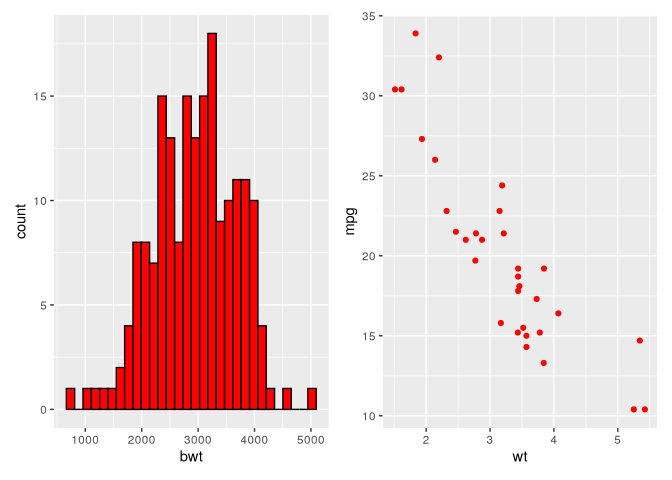

## Representing variables with colors

``` r
p1 <- ggplot(cabbage_exp, aes(x = Date, y = Weight, fill = Cultivar)) +
  geom_col(colour = "black", position = "dodge")

# Or

p2 <- ggplot(cabbage_exp, aes(x = Date, y = Weight)) +
  geom_col(aes(fill = Cultivar), colour = "black", position = "dodge")

p1 + p2
```

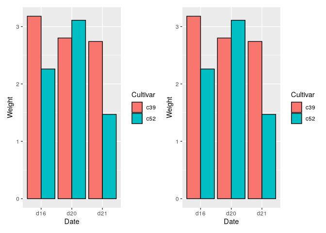

``` r
p1 <- ggplot(mtcars, aes(x = wt, y = mpg, colour = cyl)) +
  geom_point()

# Or

p2 <- ggplot(mtcars, aes(x = wt, y = mpg)) +
  geom_point(aes(colour = cyl))

p1 + p2
```

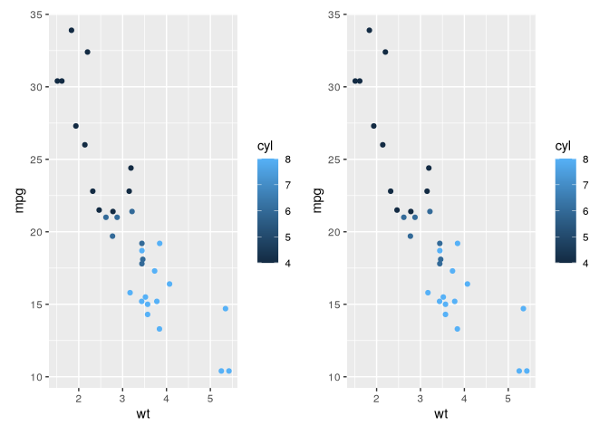

> To treat `cyl` as a factor and remove the intermediate, non- existent
> values 7 and 5

``` r
p1 <- ggplot(mtcars, aes(x = wt, y = mpg, color = factor(cyl))) +
  geom_point()

# Or

p2 <- mtcars |> 
  mutate(cyl = as.factor(cyl)) |> 
  ggplot(aes(x = wt, y = mpg, color = cyl)) +
  geom_point()

p1 + p2
```

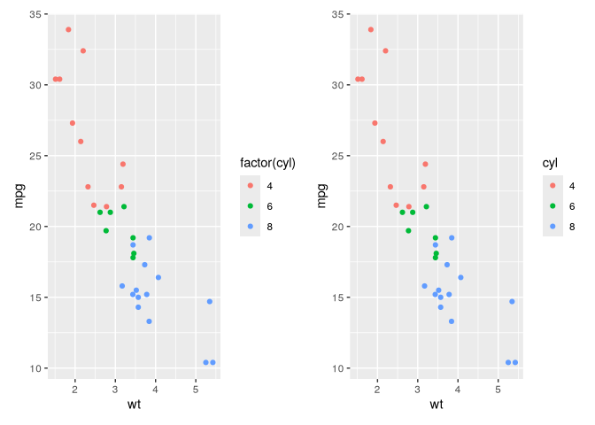

## Colorblind-friendly palettes

> `scale_fill_viridis_c` for continuous, `scale_fill_viridis_d` for
> discrete

``` r
uspopage_plot <- ggplot(uspopage, aes(x = Year, y = Thousands, fill = AgeGroup)) +
  geom_area()

uspopage_plot +
  scale_fill_viridis_d()
```

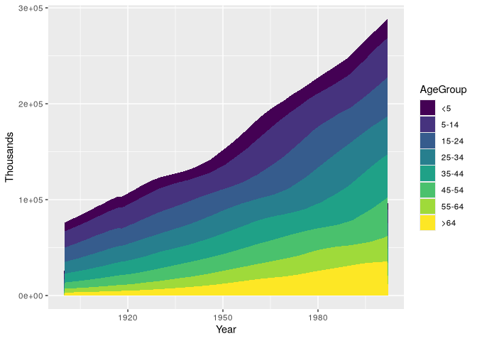

## Different palette for discrete variable

``` r
library(viridisLite)
```

``` r
uspopage_plot
```

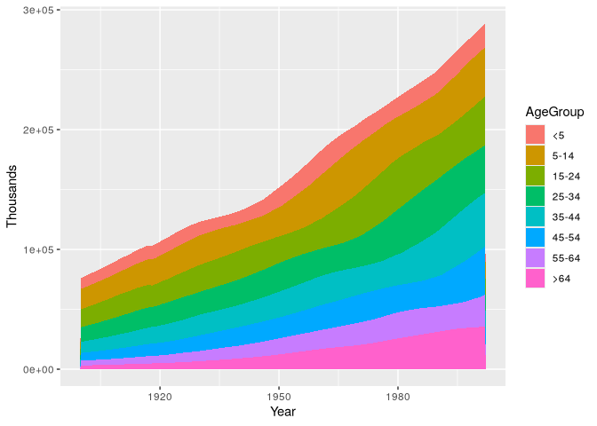

``` r
# uspopage_plot + scale_fill_discrete()
# uspopage_plot + scale_fill_hue()
# uspopage_plot + scale_color_viridis()
```

``` r
uspopage_plot + 
  scale_fill_brewer()
```

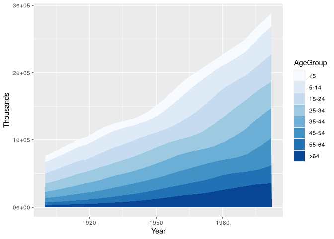

> adjust the luminosity for points to make colors darker

``` r
hw_splot <- ggplot(heightweight, aes(x = ageYear, y = heightIn, colour = sex)) +
  geom_point()

p2 <- hw_splot +
  scale_color_hue(l = 45)

hw_splot + p2
```

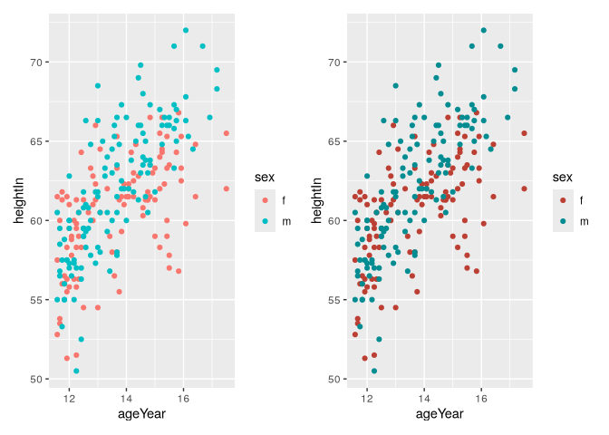

``` r
library(RColorBrewer)
display.brewer.all()
```

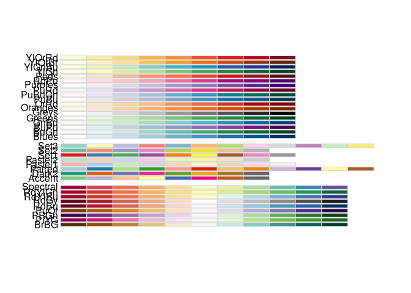

``` r
hw_splot +
  scale_colour_brewer(palette = "Oranges") +
  theme_bw()
```

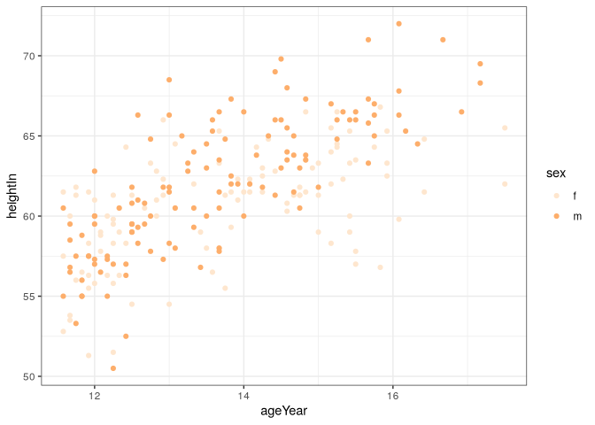

> Greyscale

``` r
p1 <- hw_splot + scale_color_grey()

p2 <- hw_splot + scale_color_grey(start = 0.7, end = 0)

p1 + p2
```

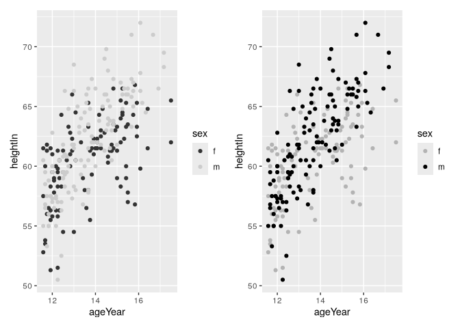

## Manual palette for discrete variables

``` r
hw_plot <- ggplot(heightweight, aes(x = ageYear, y = heightIn, colour = sex)) +
  geom_point()

p1 <- hw_plot +
  scale_colour_manual(values = c("red", "blue"))

p2 <- hw_plot +
  scale_colour_manual(values = c("#CC6666", "#7777DD"))

# Using RGB values based on the viridis color scale
p3 <- hw_plot +
  scale_colour_manual(values = c("#440154FF", "#FDE725FF")) +
  theme_bw()

p1 + p2 + p3 +
  plot_layout(ncol = 2)
```

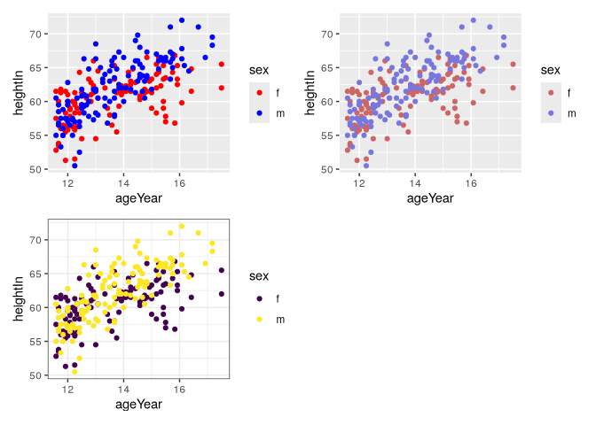

``` r
(p1 + p2) / (plot_spacer() + p3 + plot_spacer())
```

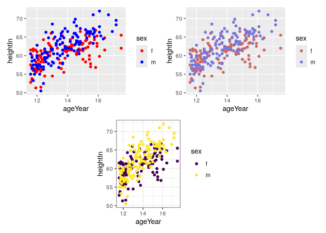

> get n number of colors from viridis

``` r
viridis(2)
```

    [1] "#440154FF" "#FDE725FF"

``` r
inferno(5)
```

    [1] "#000004FF" "#56106EFF" "#BB3754FF" "#F98C0AFF" "#FCFFA4FF"

## Manual palette for continuous variables

``` r
hw_plot <- ggplot(heightweight, aes(x = ageYear, y = heightIn, colour = weightLb)) +
  geom_point(size = 3)
```

> a gradient with a white midpoint

``` r
p2 <- hw_plot +
  scale_color_gradient2(
    low = scales::muted("red"),
    mid = "white",
    high = scales::muted("blue"),
    midpoint = 110
  )
```

> a gradient between two colors

``` r
p3 <- hw_plot +
  scale_color_gradient(low = "black", high = "white")
```

> a gradient of n colors

``` r
p4 <- hw_plot +
  scale_color_gradientn(colors = c("darkred", "orange", "yellow", "white"))

(hw_plot + p2) / (p3 + p4)
```

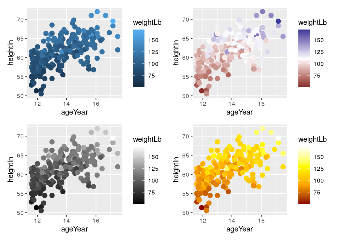

## Coloring shaded region

``` r
climate_mod <- climate |> 
  filter(Source == "Berkeley") |> 
  mutate(valence = if_else(Anomaly10y >= 0, "pos", "neg"))

head(climate_mod)
```

        Source Year Anomaly1y Anomaly5y Anomaly10y Unc10y valence
    1 Berkeley 1800        NA        NA     -0.435  0.505     neg
    2 Berkeley 1801        NA        NA     -0.453  0.493     neg
    3 Berkeley 1802        NA        NA     -0.460  0.486     neg
    4 Berkeley 1803        NA        NA     -0.493  0.489     neg
    5 Berkeley 1804        NA        NA     -0.536  0.483     neg
    6 Berkeley 1805        NA        NA     -0.541  0.475     neg

``` r
ggplot(climate_mod, aes(x = Year, y = Anomaly10y)) +
  geom_area(aes(fill = valence)) +
  geom_line() +
  geom_hline(yintercept = 0)
```

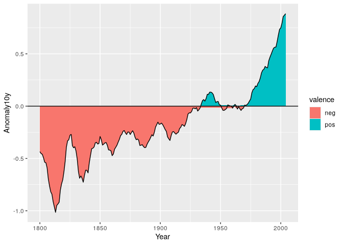

> to clean up the shaded portions near zero

``` r
interp <- approx(climate_mod$Year, climate_mod$Anomaly10y, n = 1000)

cbi <- data.frame(Year = interp$x, Anomaly10y = interp$y) |> 
  mutate(valence = if_else(Anomaly10y >= 0, "pos", "neg"))
```

``` r
ggplot(cbi, aes(x = Year, y = Anomaly10y)) +
  geom_area(aes(fill = valence), alpha = 0.4) +
  geom_line() +
  geom_hline(yintercept = 0) +
  scale_fill_manual(values = c("#cceeff", "#ffdddd"), guide = "none") +
  scale_x_continuous(expand = c(0,0))
```

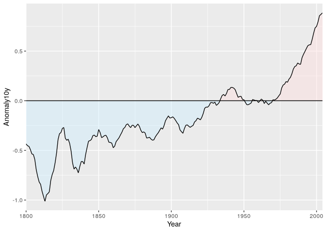
