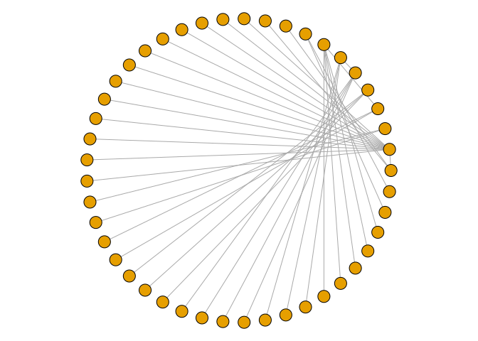
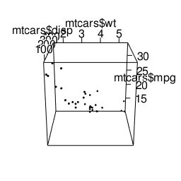

# 13 - Miscellaneous graphs


``` r
library(tidyverse)
library(gcookbook)
library(patchwork)
```

[Source](https://r-graphics.org/)

# Miscellaneous graphs

## Correlation matrix

``` r
library(corrplot)
mtcars |> head()
```

                       mpg cyl disp  hp drat    wt  qsec vs am gear carb
    Mazda RX4         21.0   6  160 110 3.90 2.620 16.46  0  1    4    4
    Mazda RX4 Wag     21.0   6  160 110 3.90 2.875 17.02  0  1    4    4
    Datsun 710        22.8   4  108  93 3.85 2.320 18.61  1  1    4    1
    Hornet 4 Drive    21.4   6  258 110 3.08 3.215 19.44  1  0    3    1
    Hornet Sportabout 18.7   8  360 175 3.15 3.440 17.02  0  0    3    2
    Valiant           18.1   6  225 105 2.76 3.460 20.22  1  0    3    1

> in order to exclude NA from correlation, use `use="complete.obs"` or
> `use="pairwise.complete.obs`

``` r
mcor <- cor(mtcars)
round(mcor, digits = 2)
```

           mpg   cyl  disp    hp  drat    wt  qsec    vs    am  gear  carb
    mpg   1.00 -0.85 -0.85 -0.78  0.68 -0.87  0.42  0.66  0.60  0.48 -0.55
    cyl  -0.85  1.00  0.90  0.83 -0.70  0.78 -0.59 -0.81 -0.52 -0.49  0.53
    disp -0.85  0.90  1.00  0.79 -0.71  0.89 -0.43 -0.71 -0.59 -0.56  0.39
    hp   -0.78  0.83  0.79  1.00 -0.45  0.66 -0.71 -0.72 -0.24 -0.13  0.75
    drat  0.68 -0.70 -0.71 -0.45  1.00 -0.71  0.09  0.44  0.71  0.70 -0.09
    wt   -0.87  0.78  0.89  0.66 -0.71  1.00 -0.17 -0.55 -0.69 -0.58  0.43
    qsec  0.42 -0.59 -0.43 -0.71  0.09 -0.17  1.00  0.74 -0.23 -0.21 -0.66
    vs    0.66 -0.81 -0.71 -0.72  0.44 -0.55  0.74  1.00  0.17  0.21 -0.57
    am    0.60 -0.52 -0.59 -0.24  0.71 -0.69 -0.23  0.17  1.00  0.79  0.06
    gear  0.48 -0.49 -0.56 -0.13  0.70 -0.58 -0.21  0.21  0.79  1.00  0.27
    carb -0.55  0.53  0.39  0.75 -0.09  0.43 -0.66 -0.57  0.06  0.27  1.00

``` r
corrplot(mcor)
```


``` r
corrplot(mcor, method = "shade", shade.col = NA,
         tl.col = "black", tl.srt = 45)
```


> with labels (and a lighter palette)

``` r
col <- colorRampPalette(c("#BB4444", "#EE9988", "#FFFFFF", "#77AADD", "#4477AA"))

corrplot(mcor, method = "shade", shade.col = NA,
         tl.col = "black", tl.srt = 45,
         col = col(200), addCoef.col = "black", cl.pos = "n", order = "AOE")
```


``` r
library(ggcorrplot)
ggcorrplot(mcor)
```


``` r
ggcorrplot(mcor, method = "circle")
```


``` r
ggcorrplot(mcor, lab = TRUE, lab_size = 3)
```


## Plotting functions

``` r
p <- ggplot(data.frame(x = c(-3, 3)), aes(x = x))

p1 <- p + stat_function(fun = dnorm)

# t-distribution
p2 <- p + stat_function(fun = dt, args = list(df = 2))

p1 + p2
```


> Custom function. Default is to calculate 101 points along the x range

``` r
myfun <- function(xvar) {
  1 / (1 + exp(-xvar + 10))
}

ggplot(data.frame(x = c(0, 20)), aes(x = x)) +
  stat_function(fun = myfun)
```


## Shading subregion under function curve

``` r
dnorm_limit <- function(x) {
  y <- dnorm(x)
  y[x < 0 | x > 2] <- NA
  y
}

ggplot(data.frame(x = c(-3, 3)), aes(x = x)) +
  stat_function(fun = dnorm_limit, geom = "area",
                fill = "blue", alpha = 0.3) +
  stat_function(fun = dnorm)
```


> Range limit function: an example of a closure in R

``` r
limitRange <- function(fun, min, max) {
  function(x) {
    y <- fun(x)
    y[x < min | x > max] <- NA
    y
  }
}
```

``` r
dlimit <- limitRange(dnorm, 0, 2)
dlimit(-2:4)
```

    [1]         NA         NA 0.39894228 0.24197072 0.05399097         NA         NA

``` r
ggplot(data.frame(x = c(-3, 3)), aes(x = x)) +
  stat_function(fun = dnorm) +
  stat_function(fun = dlimit, geom = "area", 
                fill = "blue", alpha = 0.2)
```


## Network graph

> `make_graph()` from directed edges

``` r
library(igraph)

gd <- make_graph(c(1,2, 2,3, 2,4, 1,4, 5,5, 3,6))
plot(gd)
```


> undirected

``` r
gu <- make_graph(c(1,2, 2,3, 2,4, 1,4, 5,5, 3,6), directed = F)
plot(gu, vertex.label = NA)
```


``` r
gd
```

    IGRAPH a9d3408 D--- 6 6 -- 
    + edges from a9d3408:
    [1] 1->2 2->3 2->4 1->4 5->5 3->6

> Make repeatable

``` r
set.seed(229)
plot(gu)
```


> Graph from data frame

``` r
head(madmen2)
```

                     Name1        Name2
    1          Abe Drexler  Peggy Olson
    2              Allison   Don Draper
    3          Arthur Case Betty Draper
    4 Bellhop in Baltimore   Sal Romano
    5     Bethany Van Nuys   Don Draper
    6         Betty Draper   Don Draper

``` r
g <- graph_from_data_frame(madmen2, directed = T)

# Remove margins
par(mar = c(0,0,0,0))
plot(g, layout = layout.fruchterman.reingold, vertex.size = 8,
     edge.arrow.size = 0.5, vertex.label = NA)
```


``` r
g <- graph_from_data_frame(madmen, directed = FALSE)
par(mar = c(0,0,0,0))
plot(g, layout = layout.circle, vertex.size = 8,
     vertex.label = NA)
```



## Text labels with network graph

``` r
m <- madmen[1:nrow(madmen) %% 2 == 1, ]

g <- graph_from_data_frame(m, directed=FALSE)

V(g)$name
```

     [1] "Betty Draper"      "Don Draper"        "Harry Crane"      
     [4] "Joan Holloway"     "Lane Pryce"        "Peggy Olson"      
     [7] "Pete Campbell"     "Roger Sterling"    "Sal Romano"       
    [10] "Henry Francis"     "Allison"           "Candace"          
    [13] "Faye Miller"       "Megan Calvet"      "Rachel Menken"    
    [16] "Suzanne Farrell"   "Hildy"             "Franklin"         
    [19] "Rebecca Pryce"     "Abe Drexler"       "Duck Phillips"    
    [22] "Playtex bra model" "Ida Blankenship"   "Mirabelle Ames"   
    [25] "Vicky"             "Kitty Romano"     

``` r
par(mar = c(0,0,0,0))
plot(g, layout = layout.fruchterman.reingold,
     vertex.size = 4, 
     vertex.label = V(g)$name,
     vertex.label.cex = 0.8,
     vertex.label.dist = 0.4, # label offset
     vertex.label.color = "black"
     )
```


> Alternatively, modify the plot object

``` r
V(g)$size        <- 4
V(g)$label       <- V(g)$name
V(g)$label.cex   <- 0.8
V(g)$label.dist  <- 0.4
V(g)$label.color <- "black"

g$layout <- layout.fruchterman.reingold

par(mar = c(0,0,0,0))
plot(g)
```


> Setting edge properties

``` r
E(g)
```

    + 20/20 edges from 84abcc6 (vertex names):
     [1] Betty Draper  --Henry Francis     Don Draper    --Allison          
     [3] Betty Draper  --Don Draper        Don Draper    --Candace          
     [5] Don Draper    --Faye Miller       Don Draper    --Megan Calvet     
     [7] Don Draper    --Rachel Menken     Don Draper    --Suzanne Farrell  
     [9] Harry Crane   --Hildy             Joan Holloway --Franklin         
    [11] Joan Holloway --Roger Sterling    Lane Pryce    --Rebecca Pryce    
    [13] Peggy Olson   --Abe Drexler       Peggy Olson   --Duck Phillips    
    [15] Peggy Olson   --Pete Campbell     Pete Campbell --Playtex bra model
    [17] Roger Sterling--Ida Blankenship   Roger Sterling--Mirabelle Ames   
    [19] Roger Sterling--Vicky             Sal Romano    --Kitty Romano     

``` r
E(g)$color <- "grey70"
E(g)[c(2,11,19)]$color <- "red"

par(mar = c(0,0,0,0))
plot(g)
```


## Heat map

> `geom_tile()` or `geom_raster()`

``` r
class(presidents)
```

    [1] "ts"

``` r
str(presidents)
```

     Time-Series [1:120] from 1945 to 1975: NA 87 82 75 63 50 43 32 35 60 ...

``` r
pres_rating <- data.frame(
  rating = as.numeric(presidents),
  year = as.numeric(floor(time(presidents))),
  quarter = as.numeric(cycle(presidents))
)

head(pres_rating)
```

      rating year quarter
    1     NA 1945       1
    2     87 1945       2
    3     82 1945       3
    4     75 1945       4
    5     63 1946       1
    6     50 1946       2

``` r
p <- ggplot(pres_rating, aes(x = year, y = quarter, fill = rating))

p1 <- p + geom_tile()
p2 <- p + geom_raster() # same appearance, more efficient

p1 / p2
```


> customize appearance

``` r
p +
  geom_tile() +
  scale_x_continuous(breaks = seq(1940, 1976, by = 4), expand = c(0, 0)) +
  scale_y_reverse(expand = c(0, 0)) +
  scale_fill_gradient2(midpoint = 50, mid = "grey70", limits = c(0, 100))
```


## Three dimensional scatter plot

``` r
library(rgl)
```

``` r
plot3d(mtcars$wt, mtcars$disp, mtcars$mpg,
       type = "s", size = 0.75, lit = FALSE)
```


``` r
# Function to interleave the elements of two vectors
interleave <- function(v1, v2)  as.vector(rbind(v1,v2))

plot3d(mtcars$wt, mtcars$disp, mtcars$mpg,
       xlab = "Weight", ylab = "Displacement", zlab = "MPG",
       size = .75, type = "s", lit = FALSE)


segments3d(interleave(mtcars$wt,   mtcars$wt),
           interleave(mtcars$disp, mtcars$disp),
           interleave(mtcars$mpg,  min(mtcars$mpg)),
           alpha = 0.4, col = "blue")
```


``` r
plot3d(mtcars$wt, mtcars$disp, mtcars$mpg,
       xlab = "", ylab = "", zlab = "",
       axes = FALSE,
       size = .75, type = "s", lit = FALSE)

segments3d(interleave(mtcars$wt,   mtcars$wt),
           interleave(mtcars$disp, mtcars$disp),
           interleave(mtcars$mpg,  min(mtcars$mpg)),
           alpha = 0.4, col = "blue")

# Draw the box.
rgl.bbox(color = "grey50",          # grey60 surface and black text
         emission = "grey50",       # emission color is grey50
         xlen = 0, ylen = 0, zlen = 0)  # Don't add tick marks

# Set default color of future objects to black
rgl.material(color = "black")

# Add axes to specific sides. Possible values are "x--", "x-+", "x+-", and "x++".
axes3d(edges = c("x--", "y+-", "z--"),
       ntick = 6,                       # Attempt 6 tick marks on each side
       cex = .75)                       # Smaller font

# Add axis labels. 'line' specifies how far to set the label from the axis.
mtext3d("Weight",       edge = "x--", line = 2)
mtext3d("Displacement", edge = "y+-", line = 3)
mtext3d("MPG",          edge = "z--", line = 3)
```


## Adding a prediction surface to 3d plot

> utility functions

``` r
predictgrid <- function(model, xvar, yvar, zvar, res = 16, type = NULL) {
  # Find the range of the predictor variable. This works for lm and glm
  # and some others, but may require customization for others.
  xrange <- range(model$model[[xvar]])
  yrange <- range(model$model[[yvar]])

  newdata <- expand.grid(x = seq(xrange[1], xrange[2], length.out = res),
                         y = seq(yrange[1], yrange[2], length.out = res))
  names(newdata) <- c(xvar, yvar)
  newdata[[zvar]] <- predict(model, newdata = newdata, type = type)
  newdata
}
```

> convert long-style data frame with x, y, z into a list with x and y as
> row/col values and z as a matrix

``` r
df2mat <- function(p, xvar = NULL, yvar = NULL, zvar = NULL) {
  if (is.null(xvar)) xvar <- names(p)[1]
  if (is.null(yvar)) yvar <- names(p)[2]
  if (is.null(zvar)) zvar <- names(p)[3]
  
  x <- unique(p[[xvar]])
  y <- unique(p[[yvar]])
  z <- matrix(p[[zvar]], nrow = length(y), ncol = length(x))
  
  m <- list(x, y, z)
  names(m) <- c(xvar, yvar, zvar)
  m
}
```

``` r
# Function to interleave the elements of two vectors
interleave <- function(v1, v2)  as.vector(rbind(v1,v2))
```

``` r
# Make a copy of the data set
m <- mtcars

# Generate a linear model
mod <- lm(mpg ~ wt + disp + wt:disp, data = m)

# Get predicted values of mpg from wt and disp
m$pred_mpg <- predict(mod)

# Get predicted mpg from a grid of wt and disp
mpgrid_df <- predictgrid(mod, "wt", "disp", "mpg")
mpgrid_list <- df2mat(mpgrid_df)

# Make the plot with the data points
plot3d(m$wt, m$disp, m$mpg, type = "s", size = 0.5, lit = FALSE)

# Add the corresponding predicted points (smaller)
spheres3d(m$wt, m$disp, m$pred_mpg, alpha = 0.4, type = "s", size = 0.5, lit = FALSE)

# Add line segments showing the error
segments3d(interleave(m$wt,   m$wt),
           interleave(m$disp, m$disp),
           interleave(m$mpg,  m$pred_mpg),
           alpha = 0.4, col = "red")

# Add the mesh of predicted values
surface3d(mpgrid_list$wt, mpgrid_list$disp, mpgrid_list$mpg,
          alpha = 0.4, front = "lines", back = "lines")
```

> Changing the appearance

``` r
plot3d(mtcars$wt, mtcars$disp, mtcars$mpg,
       xlab = "", ylab = "", zlab = "",
       axes = FALSE,
       size = .5, type = "s", lit = FALSE)

# Add the corresponding predicted points (smaller)
spheres3d(m$wt, m$disp, m$pred_mpg, alpha = 0.4, type = "s", size = 0.5, lit = FALSE)

# Add line segments showing the error
segments3d(interleave(m$wt,   m$wt),
           interleave(m$disp, m$disp),
           interleave(m$mpg,  m$pred_mpg),
           alpha = 0.4, col = "red")

# Add the mesh of predicted values
surface3d(mpgrid_list$wt, mpgrid_list$disp, mpgrid_list$mpg,
          alpha = 0.4, front = "lines", back = "lines")

# Draw the box
bbox3d(color = "grey50",          # grey60 surface and black text
         emission = "grey50",       # emission color is grey50
         xlen = 0, ylen = 0, zlen = 0)  # Don't add tick marks

# Set default color of future objects to black
material3d(color = "black")

# Add axes to specific sides. Possible values are "x--", "x-+", "x+-", and "x++".
axes3d(edges = c("x--", "y+-", "z--"),
       ntick = 6,                       # Attempt 6 tick marks on each side
       cex = .75)                       # Smaller font

# Add axis labels. 'line' specifies how far to set the label from the axis.
mtext3d("Weight",       edge = "x--", line = 2)
mtext3d("Displacement", edge = "y+-", line = 3)
mtext3d("MPG",          edge = "z--", line = 3)
```

## Saving a 3d plot

``` r
plot3d(mtcars$wt, mtcars$disp, mtcars$mpg, type = "s", size = 0.75, lit = FALSE)

view <- par3d("userMatrix")

# restore
par3d(userMatrix = view)
rgl.snapshot('3dplot.png', fmt = 'png')
```



``` r
dput(view)
```

    structure(c(1, 0, 0, 0, 0, 0.342020143325668, -0.939692620785909, 
    0, 0, 0.939692620785909, 0.342020143325668, 0, 0, 0, 0, 1), dim = c(4L, 
    4L))

``` r
view <- structure(c(0.573942482471466, 0.411120474338531, -0.70821613073349, 
0, -0.818895578384399, 0.288455933332443, -0.496188700199127, 
0, 0.000295788049697876, 0.864738762378693, 0.502221822738647, 
0, 0, 0, 0, 1), dim = c(4L, 4L))
```

## Animating 3d plot

``` r
plot3d(mtcars$wt, mtcars$disp, mtcars$mpg, type = "s", size = 0.75, lit = FALSE)

play3d(spin3d())
```

``` r
plot3d(mtcars$wt, mtcars$disp, mtcars$mpg, type = "s", size = 0.75, lit = FALSE)
play3d(spin3d(axis = c(1,0,0), rpm = 4), duration = 20)
```

``` r
plot3d(mtcars$wt, mtcars$disp, mtcars$mpg, type = "s", size = 0.75, lit = FALSE)
movie3d(spin3d(axis = c(0,0,1), rpm = 4), duration = 15, fps = 50)
```

## Dendograms

> `hclust()`

``` r
set.seed(392)

c2 <- countries |> 
  filter(Year == 2009) |> 
  drop_na() |> 
  sample_n(25)
head(c2)
```

                  Name Code Year        GDP laborrate  healthexp infmortality
    1 Egypt, Arab Rep.  EGY 2009  2370.7111      48.8  113.29717         20.0
    2            Haiti  HTI 2009   656.7792      69.9   39.60249         59.3
    3           Belize  BLZ 2009  4056.1224      64.1  217.15214         14.9
    4     Bahamas, The  BHS 2009 20916.2842      73.3 1557.65512         14.0
    5    Guinea-Bissau  GNB 2009   562.4150      71.5   18.35889         93.1
    6         Suriname  SUR 2009  6255.2800      52.2  429.12629         27.3

> it is necessary to use row names

``` r
rownames(c2) <- c2$Name
# drop all non-numeric colums
c2 <- c2[, 4:7]
head(c2)
```

                            GDP laborrate  healthexp infmortality
    Egypt, Arab Rep.  2370.7111      48.8  113.29717         20.0
    Haiti              656.7792      69.9   39.60249         59.3
    Belize            4056.1224      64.1  217.15214         14.9
    Bahamas, The     20916.2842      73.3 1557.65512         14.0
    Guinea-Bissau      562.4150      71.5   18.35889         93.1
    Suriname          6255.2800      52.2  429.12629         27.3

> scale the data because of the order of magnitude difference between
> gdp and infmortality

``` r
c3 <- scale(c2)
head(c3)
```

                            GDP    laborrate    healthexp infmortality
    Egypt, Arab Rep. -0.6183699 -1.564089832 -0.646308538 -0.238743554
    Haiti            -0.6882421  0.602552464 -0.679743334  1.098574243
    Belize           -0.5496604  0.006982544 -0.599190220 -0.412288611
    Bahamas, The      0.1376812  0.951679659  0.008987176 -0.442914210
    Guinea-Bissau    -0.6920891  0.766847614 -0.689381414  2.248735606
    Suriname         -0.4600069 -1.214962637 -0.503018944  0.009664078

``` r
hc <- hclust(dist(c3))

plot(hc)
```


> Aligned text

``` r
plot(hc, hang = -1)
```


## Vector field

> `geom_segment()`

``` r
str(isabel)
```

    'data.frame':   156250 obs. of  8 variables:
     $ x    : num  -83 -83 -83 -83 -83 -83 -83 -83 -83 -83 ...
     $ y    : num  41.7 41.6 41.4 41.3 41.1 ...
     $ z    : num  0.035 0.035 0.035 0.035 0.035 0.035 0.035 0.035 0.035 0.035 ...
     $ vx   : num  NA NA NA NA NA NA NA NA NA NA ...
     $ vy   : num  NA NA NA NA NA NA NA NA NA NA ...
     $ vz   : num  NA NA NA NA NA NA NA NA NA NA ...
     $ t    : num  NA NA NA NA NA NA NA NA NA NA ...
     $ speed: num  NA NA NA NA NA NA NA NA NA NA ...

The height (`z`) ranges from 0.035 km to 18.035 km. For this example,
we’ll just use the lowest slice of data.

``` r
islice <- filter(isabel, z == min(z))

ggplot(islice, aes(x = x, y = y)) +
  geom_segment(aes(xend = x + vx/50, yend = y + vy/50),
               size = 0.25) # .25 mm thick
```

    Warning: Using `size` aesthetic for lines was deprecated in ggplot2 3.4.0.
    ℹ Please use `linewidth` instead.

    Warning: Removed 3745 rows containing missing values or values outside the scale range
    (`geom_segment()`).


> Reduce resolution and supply arrows for flow direction

``` r
every_n <- function(x, by = 2) {
  x <- sort(x)
  x[seq(1, length(x), by = by)]
}

keepx <- every_n(unique(isabel$x), by = 4)
keepy <- every_n(unique(isabel$y), by = 4)

islicesub <- filter(islice, x %in% keepx & y %in% keepy)
```

``` r
library(grid)

ggplot(islicesub, aes(x = x, y = y)) +
  geom_segment(aes(xend = x+vx/50, yend = y + vy/50),
               arrow = arrow(length = unit(0.1, "cm")), size = 0.25)
```

    Warning: Removed 248 rows containing missing values or values outside the scale range
    (`geom_segment()`).


> Map the speed to alpha

``` r
islicesub$speedxy <- sqrt(islicesub$vx^2 + islicesub$vy^2)

ggplot(islicesub, aes(x = x, y = y)) +
    geom_segment(aes(xend = x+vx/50, yend = y+vy/50, alpha = speed),
                 arrow = arrow(length = unit(0.1,"cm")), size = 0.6)
```

    Warning: Removed 248 rows containing missing values or values outside the scale range
    (`geom_segment()`).


> Map speed to color

``` r
usa <- map_data("usa")

ggplot(islicesub, aes(x = x, y = y)) +
  geom_segment(aes(xend = x+vx/50, yend = y+vy/50, colour = speed),
                 arrow = arrow(length = unit(0.1,"cm")), size = 0.6) +
  scale_color_continuous(low = "grey80", high = "darkred") +
  geom_path(aes(x = long, y = lat, group = group), data = usa) +
  coord_cartesian(xlim = range(islicesub$x), ylim = range(islicesub$y))
```

    Warning: Removed 248 rows containing missing values or values outside the scale range
    (`geom_segment()`).


> Make faceted graph of three dimensions

``` r
keepx <- every_n(unique(isabel$x), by = 5)
keepy <- every_n(unique(isabel$y), by = 5)
keepz <- every_n(unique(isabel$z), by = 2)

isub <- filter(isabel, x %in% keepx & y %in% keepy & z %in% keepz)

ggplot(isub, aes(x = x, y = y)) +
  geom_segment(aes(xend = x+vx/50, yend = y+vy/50, colour = speed),
                 arrow = arrow(length = unit(0.1,"cm")), size = 0.5) +
  scale_colour_continuous(low = "grey80", high = "darkred") +
  facet_wrap( ~ z)
```

    Warning: Removed 151 rows containing missing values or values outside the scale range
    (`geom_segment()`).


## QQ Plot

> Compare empirical to normal distribution

``` r
p1 <- ggplot(heightweight, aes(sample = heightIn)) +
  geom_qq() +
  geom_qq_line()

p2 <- ggplot(heightweight, aes(sample = ageYear)) +
  geom_qq() +
  geom_qq_line()

p1 + p2
```


## Graph ECDF

> Empirical cumulative distribution function

``` r
p1 <- ggplot(heightweight, aes(x = heightIn)) +
  stat_ecdf()

p2 <- ggplot(heightweight, aes(x = ageYear)) +
  stat_ecdf()

p1 + p2
```


## Mosaic plot

> UCBAdmission is a 3D contingency table

``` r
UCBAdmissions
```

    , , Dept = A

              Gender
    Admit      Male Female
      Admitted  512     89
      Rejected  313     19

    , , Dept = B

              Gender
    Admit      Male Female
      Admitted  353     17
      Rejected  207      8

    , , Dept = C

              Gender
    Admit      Male Female
      Admitted  120    202
      Rejected  205    391

    , , Dept = D

              Gender
    Admit      Male Female
      Admitted  138    131
      Rejected  279    244

    , , Dept = E

              Gender
    Admit      Male Female
      Admitted   53     94
      Rejected  138    299

    , , Dept = F

              Gender
    Admit      Male Female
      Admitted   22     24
      Rejected  351    317

``` r
ftable(UCBAdmissions)
```

                    Dept   A   B   C   D   E   F
    Admit    Gender                             
    Admitted Male        512 353 120 138  53  22
             Female       89  17 202 131  94  24
    Rejected Male        313 207 205 279 138 351
             Female       19   8 391 244 299 317

``` r
dimnames(UCBAdmissions)
```

    $Admit
    [1] "Admitted" "Rejected"

    $Gender
    [1] "Male"   "Female"

    $Dept
    [1] "A" "B" "C" "D" "E" "F"

``` r
library(vcd)

mosaic( ~ Admit + Gender + Dept, data = UCBAdmissions)
```


> Different order and formatting

``` r
mosaic( ~ Dept + Gender + Admit, data = UCBAdmissions,
        highlighting = "Admit", highlighting_fill = c("lightblue", "pink"),
        direction = c("v","h","v"))
```


``` r
# Another possible set of splitting directions
mosaic( ~ Dept + Gender + Admit, data = UCBAdmissions,
       highlighting = "Admit", highlighting_fill = c("lightblue", "pink"),
       direction = c("v", "v", "h"))
```


## Pie chart

``` r
library(MASS)

fold <- table(survey$Fold)
fold
```


     L on R Neither  R on L 
         99      18     120 

``` r
par(mar = c(1, 1, 1, 1))
pie(fold)
```


## Maps

``` r
library(maps)

states_map <- map_data("state")

ggplot(states_map, aes(x = long, y = lat, group = group)) +
  geom_polygon(fill = "white", color = "black")
```


``` r
ggplot(states_map, aes(x = long, y = lat, group = group)) +
  geom_path() +
  coord_map("mercator")
```


``` r
world_map <- map_data("world")
str(world_map)
```

    'data.frame':   99338 obs. of  6 variables:
     $ long     : num  -69.9 -69.9 -69.9 -70 -70.1 ...
     $ lat      : num  12.5 12.4 12.4 12.5 12.5 ...
     $ group    : num  1 1 1 1 1 1 1 1 1 1 ...
     $ order    : int  1 2 3 4 5 6 7 8 9 10 ...
     $ region   : chr  "Aruba" "Aruba" "Aruba" "Aruba" ...
     $ subregion: chr  NA NA NA NA ...

> Search for region name

``` r
sort(unique(world_map$region)) |> head()
```

    [1] "Afghanistan"    "Albania"        "Algeria"        "American Samoa"
    [5] "Andorra"        "Angola"        

``` r
east_asia <- map_data("world", 
                      region = c("Japan", "China", "North Korea", "South Korea"))

ggplot(east_asia, aes(x = long, y = lat, group = group, fill = region)) +
  geom_polygon(colour = "black") +
  scale_fill_brewer(palette = "Set2")
```


> Some regions have higher resolution data sets like New Zealand

``` r
nz1 <- map_data("world", region = "New Zealand") |> 
  filter(long > 0 & lat > -48)   

p1 <- ggplot(nz1, aes(x = long, y = lat, group = group)) +
  geom_path()

nz2 <- map_data("nz")
p2 <- ggplot(nz2, aes(x = long, y = lat, group = group)) +
  geom_path()

p1 + p2
```


## Choropleth map

``` r
crimes <- data.frame(state = tolower(rownames(USArrests)), USArrests)
head(crimes)
```

                    state Murder Assault UrbanPop Rape
    Alabama       alabama   13.2     236       58 21.2
    Alaska         alaska   10.0     263       48 44.5
    Arizona       arizona    8.1     294       80 31.0
    Arkansas     arkansas    8.8     190       50 19.5
    California california    9.0     276       91 40.6
    Colorado     colorado    7.9     204       78 38.7

``` r
states_map <- map_data("state")

crime_map <- merge(states_map, crimes,
                   by.x = "region", by.y = "state")
head(crime_map)
```

       region      long      lat group order subregion Murder Assault UrbanPop Rape
    1 alabama -87.46201 30.38968     1     1      <NA>   13.2     236       58 21.2
    2 alabama -87.48493 30.37249     1     2      <NA>   13.2     236       58 21.2
    3 alabama -87.95475 30.24644     1    13      <NA>   13.2     236       58 21.2
    4 alabama -88.00632 30.24071     1    14      <NA>   13.2     236       58 21.2
    5 alabama -88.01778 30.25217     1    15      <NA>   13.2     236       58 21.2
    6 alabama -87.52503 30.37249     1     3      <NA>   13.2     236       58 21.2

``` r
crime_map <- arrange(crime_map, group, order)
head(crime_map)
```

       region      long      lat group order subregion Murder Assault UrbanPop Rape
    1 alabama -87.46201 30.38968     1     1      <NA>   13.2     236       58 21.2
    2 alabama -87.48493 30.37249     1     2      <NA>   13.2     236       58 21.2
    3 alabama -87.52503 30.37249     1     3      <NA>   13.2     236       58 21.2
    4 alabama -87.53076 30.33239     1     4      <NA>   13.2     236       58 21.2
    5 alabama -87.57087 30.32665     1     5      <NA>   13.2     236       58 21.2
    6 alabama -87.58806 30.32665     1     6      <NA>   13.2     236       58 21.2

``` r
ggplot(crime_map, aes(x = long, y = lat, group = group, fill = Assault)) +
  geom_polygon(color = "black") +
  coord_map("polyconic")
```


> with `geom_map()`

``` r
ggplot(crimes, aes(map_id = state, fill = Assault)) +
  geom_map(map = states_map) +
  expand_limits(x = states_map$long, y = states_map$lat) +
  coord_map("polyconic")
```


> For color scale diverging from white middle

``` r
crime_p <- ggplot(crimes, aes(map_id = state, fill = Assault)) +
  geom_map(map = states_map, colour = "black") +
  expand_limits(x = states_map$long, y = states_map$lat) +
  coord_map("polyconic")

crime_p +
  scale_fill_gradient2(low = "#559999", mid = "grey90", high = "#BB650B",
                       midpoint = median(crimes$Assault))
```


``` r
crime_p +
    scale_fill_viridis_c()
```


> Use discrete values instead

``` r
qa <- quantile(crimes$Assault, c(0, 0.2, 0.4, 0.6, 0.8, 1.0))
qa
```

       0%   20%   40%   60%   80%  100% 
     45.0  98.8 135.0 188.8 254.2 337.0 

``` r
crimes$Assault_q <- cut(crimes$Assault, qa,
                        labels = c("0-20%", "20-40%", "40-60%", "60-80%", "80-100%"),
                        include.lowest = TRUE)
head(crimes)
```

                    state Murder Assault UrbanPop Rape Assault_q
    Alabama       alabama   13.2     236       58 21.2    60-80%
    Alaska         alaska   10.0     263       48 44.5   80-100%
    Arizona       arizona    8.1     294       80 31.0   80-100%
    Arkansas     arkansas    8.8     190       50 19.5    60-80%
    California california    9.0     276       91 40.6   80-100%
    Colorado     colorado    7.9     204       78 38.7    60-80%

``` r
pal <- colorRampPalette(c("#559999", "grey80", "#bb650b"))(5)
pal
```

    [1] "#559999" "#90B2B2" "#CCCCCC" "#C3986B" "#BB650B"

``` r
ggplot(crimes, aes(map_id = state, fill = Assault_q)) +
  geom_map(map = states_map, colour = "black") +
  scale_fill_manual(values = pal) +
  expand_limits(x = states_map$long, y = states_map$lat) +
  coord_map("polyconic") +
  labs(fill = "Assault Rate\nPercentile")
```


## Map with clean background

``` r
ggplot(crimes, aes(map_id = state, fill = Assault_q)) +
  geom_map(map = states_map, colour = "black") +
  scale_fill_manual(values = pal) +
  expand_limits(x = states_map$long, y = states_map$lat) +
  coord_map("polyconic") +
  labs(fill = "Assault Rate\nPercentile") +
  theme_void()
```


## Map from shapefile

``` r
library(sf)

taiwan_shp <- st_read("fig/TWN_adm/TWN_adm2.shp")
```

    Reading layer `TWN_adm2' from data source 
      `/home/biscotty/Learning/DS/ggplot/fig/TWN_adm/TWN_adm2.shp' 
      using driver `ESRI Shapefile'
    Simple feature collection with 22 features and 11 fields
    Geometry type: MULTIPOLYGON
    Dimension:     XY
    Bounding box:  xmin: 116.71 ymin: 20.6975 xmax: 122.1085 ymax: 25.63431
    Geodetic CRS:  WGS 84

``` r
ggplot(taiwan_shp) +
  geom_sf()
```


``` r
# Remove rows for which ENGTYPE_2 is NA; otherwise NA will show in the legend
taiwan_shp_mod <- taiwan_shp
taiwan_shp_mod <- taiwan_shp[!is.na(taiwan_shp$ENGTYPE_2), ]

ggplot(taiwan_shp_mod) +
  geom_sf(aes(fill = ENGTYPE_2))
```


