# 5 - Scatter Plots


``` r
library(tidyverse)
library(gcookbook)
library(patchwork)
```

[Source](https://r-graphics.org/RECIPE-LINE-GRAPH-LINE-APPEARANCE.html)

# Scatter Plots

## Basic

``` r
str(heightweight)
```

    'data.frame':   236 obs. of  5 variables:
     $ sex     : Factor w/ 2 levels "f","m": 1 1 1 1 1 1 1 1 1 1 ...
     $ ageYear : num  11.9 12.9 12.8 13.4 15.9 ...
     $ ageMonth: int  143 155 153 161 191 171 185 142 160 140 ...
     $ heightIn: num  56.3 62.3 63.3 59 62.5 62.5 59 56.5 62 53.8 ...
     $ weightLb: num  85 105 108 92 112 ...

``` r
ggplot(heightweight, aes(x = ageYear, y = heightIn)) +
  geom_point()
```

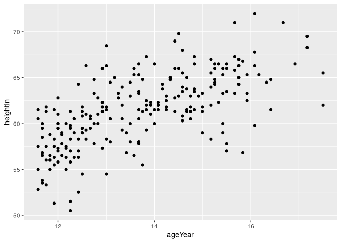

> Shape and size

``` r
p1 <- ggplot(heightweight, aes(x = ageYear, y = heightIn)) +
  geom_point(shape = 21)

p2 <- ggplot(heightweight, aes(x = ageYear, y = heightIn)) +
  geom_point(size = 1.5)

p1 + p2
```

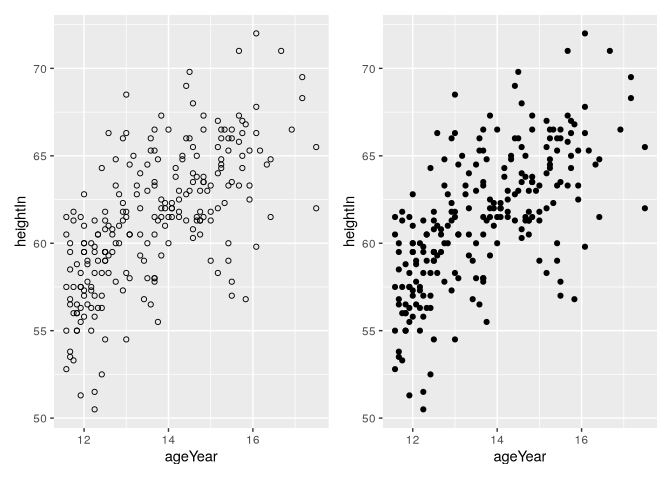

## Grouping with shapes and colors

``` r
ggplot(heightweight, aes(x = ageYear, y = heightIn, shape = sex, colour = sex)) +
  geom_point()
```

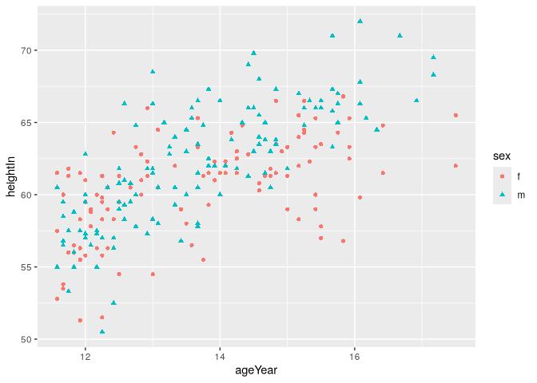

> Manually selecting shapes and colors

``` r
ggplot(heightweight, aes(x = ageYear, y = heightIn, shape = sex, colour = sex)) +
  geom_point() +
  scale_shape_manual(values = c(1,2)) +
  scale_colour_brewer(palette = "Set1")
```

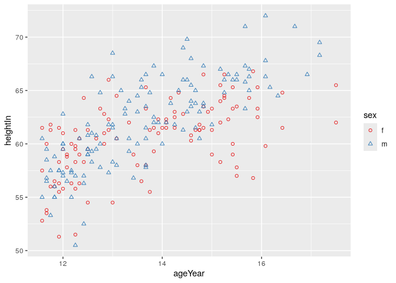

## Using different point shapes

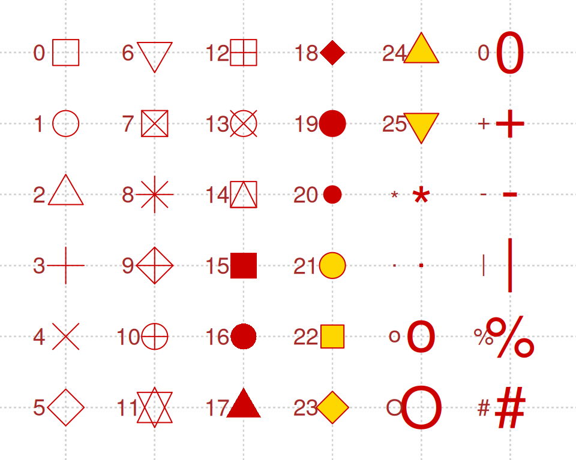

``` r
p1 <- ggplot(heightweight, aes(x = ageYear, y = heightIn)) +
  geom_point(shape = 3)

p2 <- ggplot(heightweight, aes(x = ageYear, y = heightIn, shape = sex)) +
  geom_point(size = 3) +
  scale_shape_manual(values = c(1, 4))

p1 + p2
```

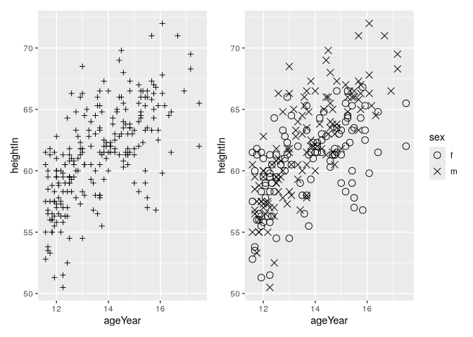

> It’s possible to have one variable represented by the shape of a
> point, and and another variable represented by the fill (empty or
> filled) of the point. To do this, you need to first choose point
> shapes that have both colour and fill, and set these in
> `scale_shape_manual`. You then need to choose a fill palette that
> includes `NA` and another color (the `NA` will result in a hollow
> shape) and use these in `scale_fill_manual()`.

``` r
hw <- heightweight |> 
  mutate(weightgroup = ifelse(weightLb < 100, "< 100", ">= 100"))

ggplot(hw, aes(x = ageYear, y = heightIn, shape = sex, fill = weightgroup)) +
  geom_point(size = 2.5) +
  scale_shape_manual(values = c(21, 24)) +
  scale_fill_manual(
    values = c(NA, "black"),
    guide = guide_legend(override.aes = list(shape = 21))
  )
```

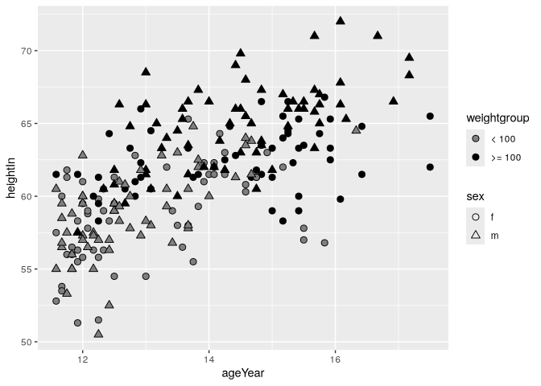

## Continuous variables to color and size

``` r
p1 <- ggplot(heightweight, aes(x = ageYear, y = heightIn, colour = weightLb)) +
  geom_point()

p2 <- ggplot(heightweight, aes(x = ageYear, y = heightIn, size = weightLb)) +
  geom_point()

p1 + p2
```

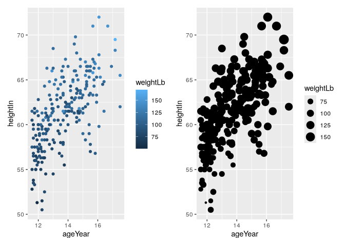

> To ensure size acurately reflects proportion, choose either diameter
> or area

``` r
range(heightweight$weightLb)
```

    [1]  50.5 171.5

``` r
size_range <- range(heightweight$weightLb) / max(heightweight$weightLb) * 6
size_range
```

    [1] 1.766764 6.000000

``` r
p1 <- ggplot(heightweight, aes(x = ageYear, y = heightIn, size = weightLb)) +
  geom_point() +
  scale_size_continuous(range = size_range)

p2 <- ggplot(heightweight, aes(x = ageYear, y = heightIn, size = weightLb)) +
  geom_point() +
  scale_size_area()

p1 + p2
```

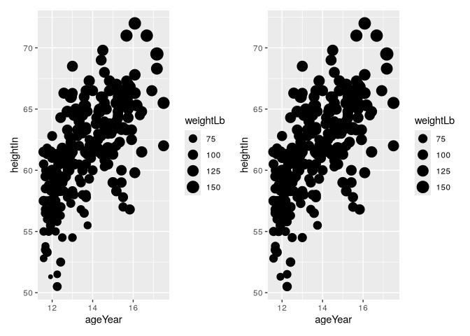

## Large data sets and overplotting

> dataset with 54,000 points

``` r
diamonds_sp <- ggplot(diamonds, aes(x = carat, y = price))

diamonds_sp +
  geom_point()
```

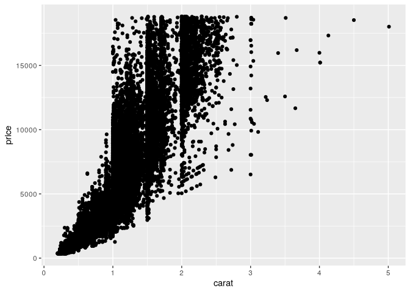

> Using transparence

``` r
p1 <- diamonds_sp + 
  geom_point(alpha = .1)

p2 <- diamonds_sp + 
  geom_point(alpha = .01)

p1 + p2
```

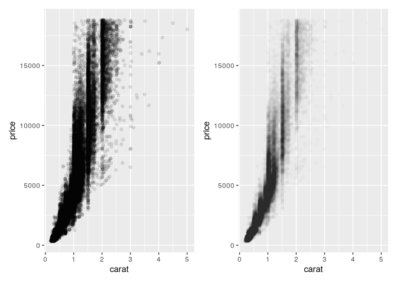

> Using bins

``` r
p1 <- diamonds_sp +
  stat_bin2d()

p2 <- diamonds_sp +
  stat_bin2d(bins = 50) +
  scale_fill_gradient(low = "lightblue", high = "red", limits = c(0, 6000))

p1 + p2
```

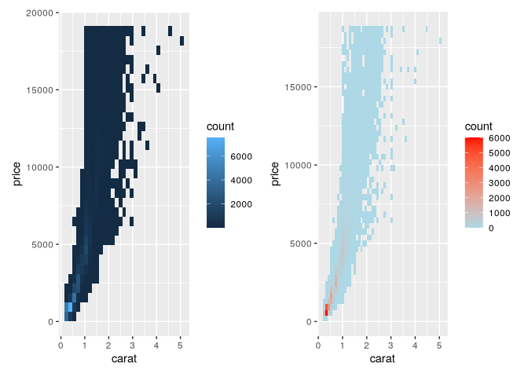

> Binning with hexagons instead of rectangles

``` r
library(hexbin)

p1 <- diamonds_sp +
  stat_binhex() +
  scale_fill_gradient(low = "lightblue", high = "red", limits = c(0, 8000))

p2 <- diamonds_sp +
  stat_binhex() +
  scale_fill_gradient(low = "lightblue", high = "red", limits = c(0, 5000))

p1 + p2
```

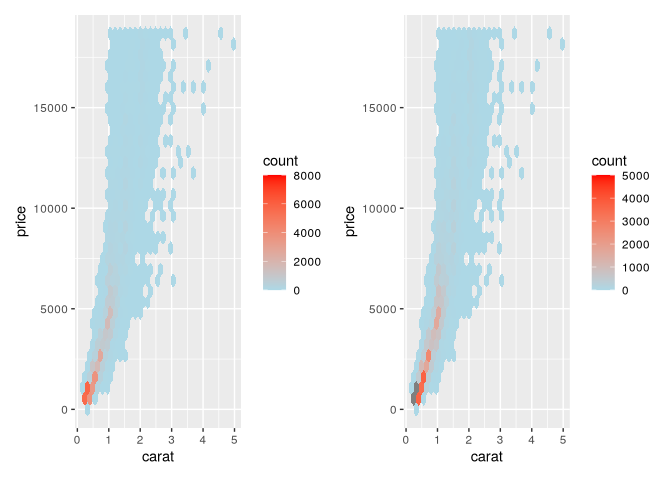

> with discrete data, use `position_jitter()`

``` r
cw_sp <- ggplot(ChickWeight, aes(x = Time, y = weight))

p1 <- cw_sp +
  geom_point()

p2 <- cw_sp +
  geom_jitter()

p3 <- cw_sp +
  geom_point(position = position_jitter(width = .5, height = 0))

(p1 + p2) / p3
```

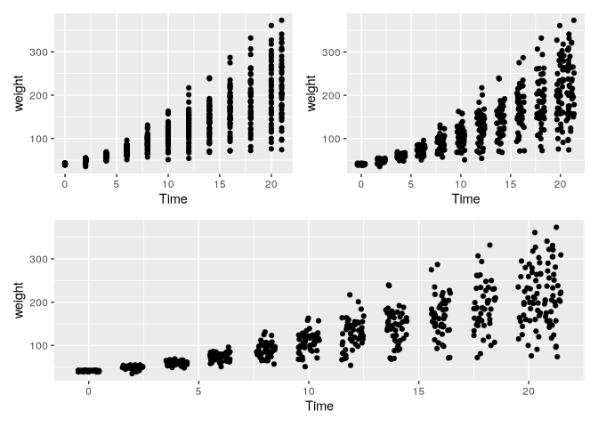

> Importance of grouping with boxplots

``` r
p1 <- cw_sp +
  geom_boxplot(aes(group = Time))

p2 <- cw_sp +
  geom_boxplot()

p1 + p2
```

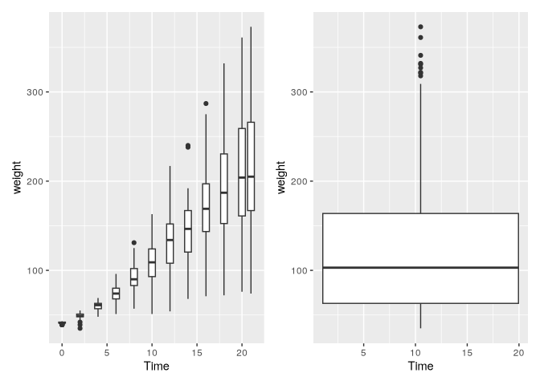

## Adding regression lines

> `stat_smooth()`

``` r
ggplot(heightweight, aes(x = ageYear, y = heightIn)) +
  geom_point() +
  stat_smooth(method = lm)
```

    `geom_smooth()` using formula = 'y ~ x'


> modify confidence region

``` r
conf_99 <- ggplot(heightweight, aes(x = ageYear, y = heightIn)) +
  geom_point() +
  stat_smooth(method = lm, level = 0.99)

conf_non <- ggplot(heightweight, aes(x = ageYear, y = heightIn)) +
  geom_point() +
  stat_smooth(method = lm, se = FALSE)

conf_99 + conf_non
```

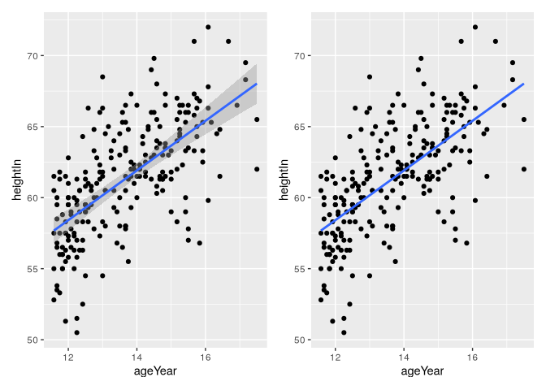

``` r
ggplot(heightweight, aes(x = ageYear, y = heightIn)) +
  geom_point(colour = "grey60") +
  stat_smooth(method = lm, se = F, colour = "black")
```

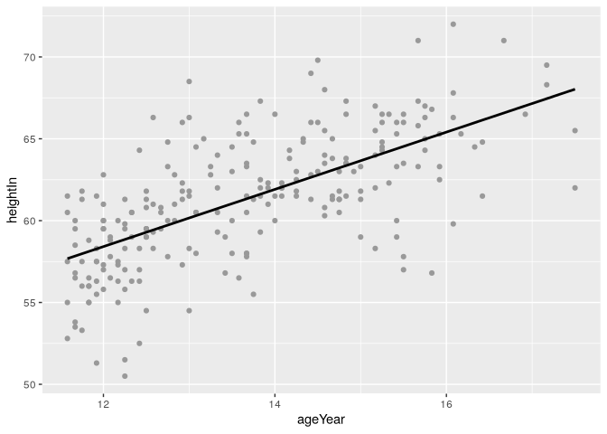

> `stat_smooth()` defaults to LOESS (locally weighted polynomial)

``` r
ggplot(heightweight, aes(x = ageYear, y = heightIn)) +
  geom_point() +
  stat_smooth() # usess loess
```

    `geom_smooth()` using method = 'loess' and formula = 'y ~ x'

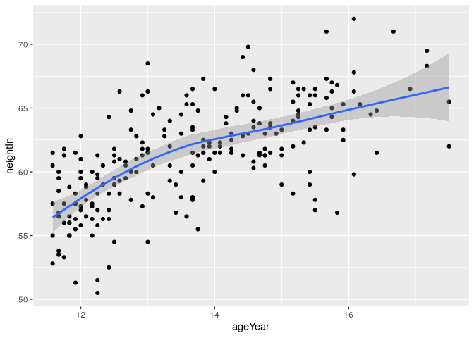

> Logistic regression
>
> Another common type of model fit is a logistic regression. Logistic
> regression isn’t appropriate for `heightweight`, but it’s perfect for
> the `biopsy` data set in the `MASS` package. In the `biopsy` data,
> there are nine different measured attributes of breast cancer
> biopsies, as well as the class of the tumor, which is either benign or
> malignant. To prepare the data for logistic regression, we must
> convert the factor `class`, with the levels `benign` and `malignant`,
> to a vector with numeric values of 0 and 1. We’ll make a copy of the
> `biopsy` data frame called `biopsy_mod`, then store the numeric coded
> `class` in a column called `classn`:

``` r
library(MASS)

biopsy_mod <- biopsy |> 
  mutate(classn = recode(class, benign = 0, malignant = 1))

head(biopsy_mod)
```

           ID V1 V2 V3 V4 V5 V6 V7 V8 V9     class classn
    1 1000025  5  1  1  1  2  1  3  1  1    benign      0
    2 1002945  5  4  4  5  7 10  3  2  1    benign      0
    3 1015425  3  1  1  1  2  2  3  1  1    benign      0
    4 1016277  6  8  8  1  3  4  3  7  1    benign      0
    5 1017023  4  1  1  3  2  1  3  1  1    benign      0
    6 1017122  8 10 10  8  7 10  9  7  1 malignant      1

> V1 is clump thickness

``` r
ggplot(biopsy_mod, aes(x = V1, y = classn)) +
  geom_point(
    position = position_jitter(width = 0.3, height = 0.06),
    alpha = 0.4, shape = 21, size = 1.5
  ) +
  stat_smooth(method = glm, method.args = list(family = binomial))
```

    `geom_smooth()` using formula = 'y ~ x'

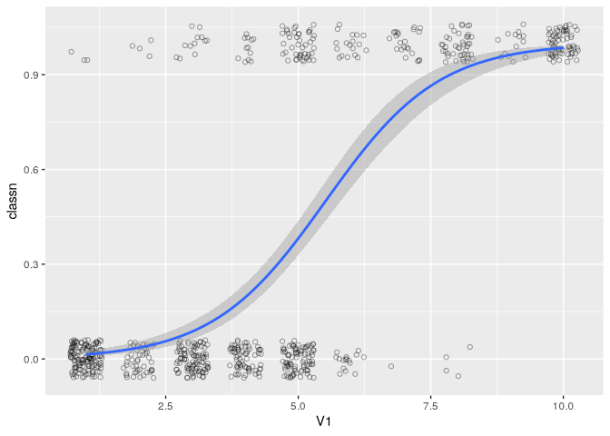

> Multiple lines if grouped by a factor

``` r
ggplot(heightweight, aes(x = ageYear, y = heightIn, colour = sex)) +
  geom_point() +
  scale_color_brewer(palette = "Set1") +
  geom_smooth()
```

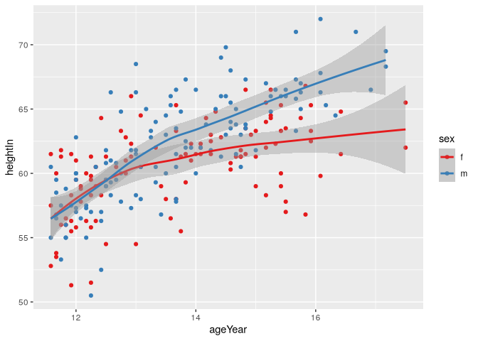

> The loess function cannot extrapolate, but lm can

``` r
ggplot(heightweight, aes(x = ageYear, y = heightIn, colour = sex)) +
  geom_point() +
  scale_color_brewer(palette = "Set1") +
  geom_smooth(method = lm, se = FALSE, fullrange = TRUE)
```

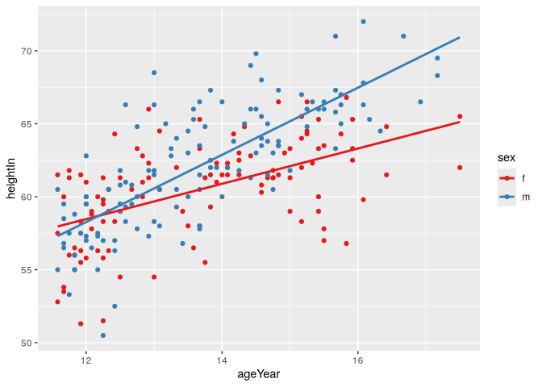

## Fitted lines from existing model

``` r
model <- lm(heightIn ~ ageYear + I(ageYear^2), heightweight)
model
```


    Call:
    lm(formula = heightIn ~ ageYear + I(ageYear^2), data = heightweight)

    Coefficients:
     (Intercept)       ageYear  I(ageYear^2)  
        -10.3136        8.6673       -0.2478  

> Create a data frame with ageYear column, interpolating across range

``` r
xmin <- min(heightweight$ageYear)
xmax <- max(heightweight$ageYear)
predicted <- data.frame(
  ageYear = seq(xmin, xmax, length.out = 100)
)
```

> Calculate predicted values

``` r
predicted$heightIn <- predict(model, predicted)
predicted |> head()
```

       ageYear heightIn
    1 11.58000 56.82624
    2 11.63980 57.00047
    3 11.69960 57.17294
    4 11.75939 57.34363
    5 11.81919 57.51255
    6 11.87899 57.67969

``` r
ggplot(heightweight, aes(x = ageYear, y = heightIn)) +
  geom_point(colour = "grey40") +
  geom_line(data = predicted, linewidth = 1)
```

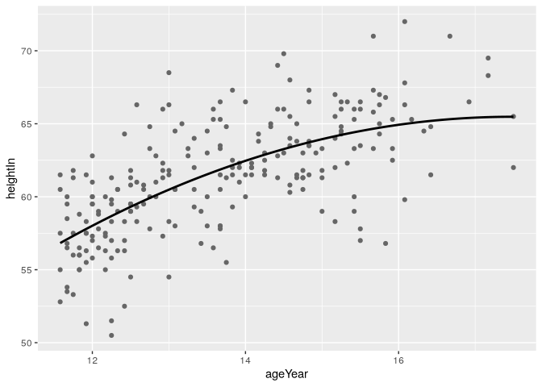

> Helper function

``` r
# Given a model, predict values of yvar from xvar
# This function supports one predictor and one predicted variable
# xrange: If NULL, determine the x range from the model object. If a vector with
#   two numbers, use those as the min and max of the prediction range.
# samples: Number of samples across the x range.
# ...: Further arguments to be passed to predict()
predictvals <- function(model, xvar, yvar, xrange = NULL, samples = 100, ...) {

  # If xrange isn't passed in, determine xrange from the models.
  # Different ways of extracting the x range, depending on model type
  if (is.null(xrange)) {
    if (any(class(model) %in% c("lm", "glm")))
      xrange <- range(model$model[[xvar]])
    else if (any(class(model) %in% "loess"))
      xrange <- range(model$x)
  }

  newdata <- data.frame(x = seq(xrange[1], xrange[2], length.out = samples))
  names(newdata) <- xvar
  newdata[[yvar]] <- predict(model, newdata = newdata, ...)
  newdata
}
```

``` r
modlinear <- lm(heightIn ~ ageYear, heightweight)
modloess <- loess(heightIn ~ ageYear, heightweight)

lm_predicted <- predictvals(modlinear, "ageYear", "heightIn")
loess_predicted <- predictvals(modloess, "ageYear", "heightIn")
```

``` r
ggplot(heightweight, aes(x = ageYear, y = heightIn)) +
  geom_point(colour = "grey40") +
  geom_line(data = lm_predicted, colour = "red", size = .8) +
  geom_line(data = loess_predicted, color = "blue", size = .8)
```

    Warning: Using `size` aesthetic for lines was deprecated in ggplot2 3.4.0.
    ℹ Please use `linewidth` instead.

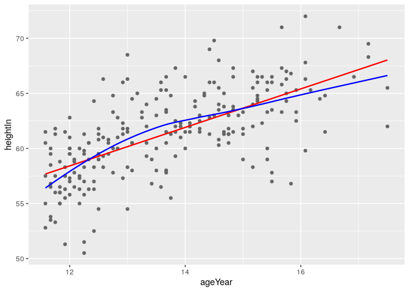

> for `glm` models, must specify `type = "response"` to return predicted
> values in the scale of the response variable

``` r
fit_logistic <- glm(classn ~ V1, biopsy_mod, family = binomial)

glm_predicted <- predictvals(fit_logistic, "V1", "classn", type = "response")
```

``` r
ggplot(biopsy_mod, aes(x = V1, y = classn)) +
  geom_point(
    position = position_jitter(width = .3, height = .08),
    alpha = 0.4,
    shape = 21,
    size = 1.5
  ) +
  geom_line(data = glm_predicted, colour = "#1177FF", size = 1)
```

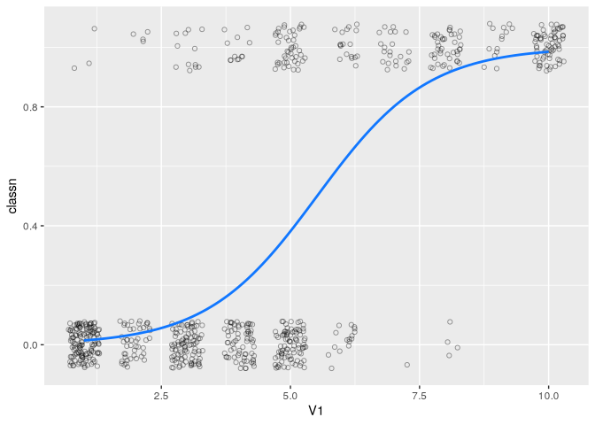

## Fitted lines from multiple models

> With the `heightweight` data set, we’ll make a linear model for each
> of the levels of `sex`. The model building is done for each subset of
> the data frame by specifying the model computation we want within the
> `do()` function.

``` r
models <- heightweight |> 
  group_by(sex) |> 
  do(model = lm(heightIn ~ ageYear, .)) |> 
  ungroup()

models
```

    # A tibble: 2 × 2
      sex   model 
      <fct> <list>
    1 f     <lm>  
    2 m     <lm>  

``` r
models$model
```

    [[1]]

    Call:
    lm(formula = heightIn ~ ageYear, data = .)

    Coefficients:
    (Intercept)      ageYear  
         43.963        1.209  


    [[2]]

    Call:
    lm(formula = heightIn ~ ageYear, data = .)

    Coefficients:
    (Intercept)      ageYear  
         30.658        2.301  

``` r
predvals <- models |> 
  group_by(sex) |> 
  do(predictvals(.$model[[1]], xvar = "ageYear", yvar = "heightIn"))
```

``` r
p1 <- ggplot(heightweight, aes(x = ageYear, y = heightIn, colour = sex)) +
  geom_point() +
  geom_line(data = predvals)

# with facts instead of color
p2 <- ggplot(heightweight, aes(x = ageYear, y = heightIn)) +
  geom_point() +
  geom_line(data = predvals) +
  facet_grid(. ~ sex)

p1 + p2
```

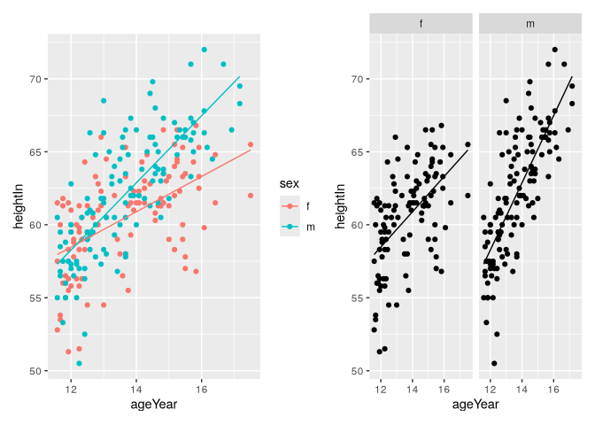

> ensure that both have the same range

``` r
predvals <- models |> 
  group_by(sex) |> 
  do(predictvals(.$model[[1]], 
                 xvar = "ageYear", yvar = "heightIn",
                 xrange = range(heightweight$ageYear)))
```

``` r
ggplot(heightweight, aes(x = ageYear, y = heightIn, colour = sex)) +
  geom_point() +
  geom_line(data = predvals)
```

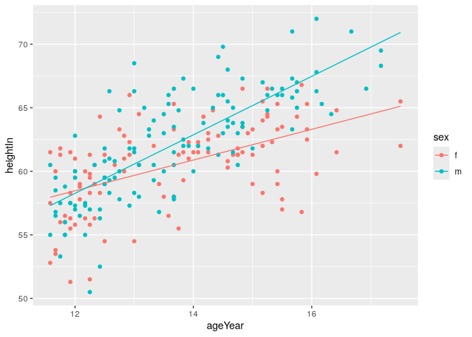

## Adding annotations with coefficients

``` r
model <- lm(heightIn ~ ageYear, heightweight)
summary(model)
```


    Call:
    lm(formula = heightIn ~ ageYear, data = heightweight)

    Residuals:
        Min      1Q  Median      3Q     Max 
    -8.3517 -1.9006  0.1378  1.9071  8.3371 

    Coefficients:
                Estimate Std. Error t value Pr(>|t|)    
    (Intercept)  37.4356     1.8281   20.48   <2e-16 ***
    ageYear       1.7483     0.1329   13.15   <2e-16 ***
    ---
    Signif. codes:  0 '***' 0.001 '**' 0.01 '*' 0.05 '.' 0.1 ' ' 1

    Residual standard error: 2.989 on 234 degrees of freedom
    Multiple R-squared:  0.4249,    Adjusted R-squared:  0.4225 
    F-statistic: 172.9 on 1 and 234 DF,  p-value: < 2.2e-16

``` r
pred <- predictvals(model, "ageYear", "heightIn")

hw_sp <- ggplot(heightweight, aes(x = ageYear, y = heightIn)) +
    geom_point() +
    geom_line(data = pred)
```

``` r
p1 <- hw_sp +
  annotate("text", x = 16.5, y = 52, label = "r^2 == 0.42")
p2 <- hw_sp +
  annotate("text", x = 16.5, y = 52, label = "r^2 == 0.42", parse = TRUE)
p1 + p2
```

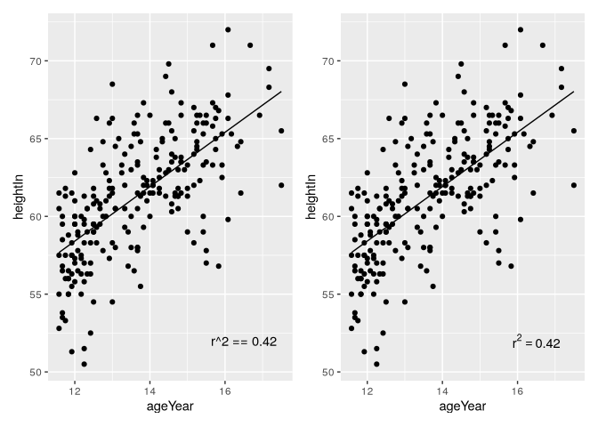

> construct string with `sprintf()`

``` r
eqn <- sprintf(
    "italic(y) == %.3g + %.3g * italic(x) * ',' ~~ italic(r)^2 ~ '=' ~ %.2g",
    coef(model)[1],
    coef(model)[2],
    summary(model)$r.squared
  )
eqn
```

    [1] "italic(y) == 37.4 + 1.75 * italic(x) * ',' ~~ italic(r)^2 ~ '=' ~ 0.42"

``` r
parse(text = eqn)
```

    expression(italic(y) == 37.4 + 1.75 * italic(x) * "," ~ ~italic(r)^2 ~ 
        "=" ~ 0.42)

``` r
hw_sp +
  annotate(
    "text",
    x = Inf, y = -Inf,
    label = eqn, parse = TRUE,
    hjust = 1.1, vjust = -.5
  )
```

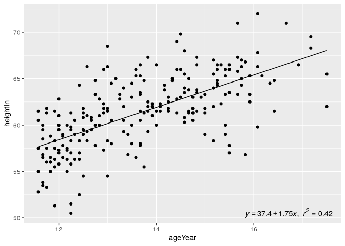

## Marginal rugs

> `geom_rug()`

``` r
ggplot(faithful, aes(x = eruptions, y = waiting)) +
  geom_point() +
  geom_rug()
```

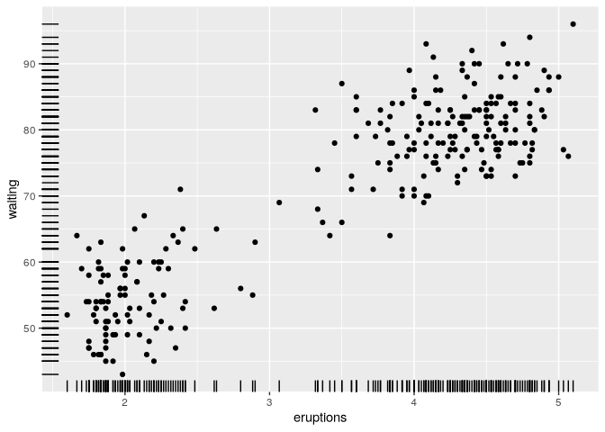

> there is a lot of overplotting, so jitter the lines

``` r
ggplot(faithful, aes(x = eruptions, y = waiting)) +
  geom_point() +
  geom_rug(position = "jitter", size = 0.2)
```

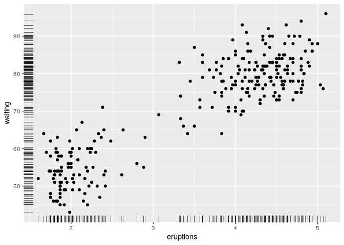

## Labeling points

``` r
countries_sub <- countries %>%
  filter(Year == 2009 & healthexp > 2000)
```

``` r
countries_sp <- ggplot(countries_sub, aes(x = healthexp, y = infmortality)) +
  geom_point()

countries_sp +
  annotate("text", x = 4350, y = 5.4, label = "Canada") +
  annotate("text", x = 7400, y = 6.8, label = "USA")
```

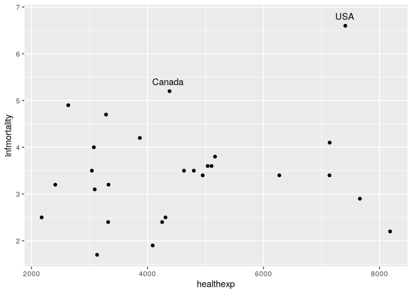

> Add labels from data

``` r
countries_sp +
  geom_text(aes(label = Name), size = 4)
```

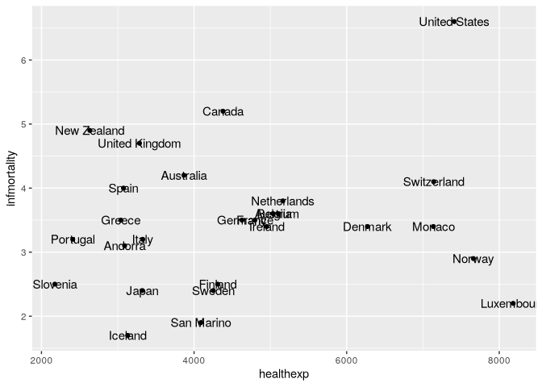

> Fix overlapping

``` r
library(ggrepel)
p1 <- countries_sp +
  geom_text_repel(aes(label = Name), size = 3)
p2 <- countries_sp +
  geom_label_repel(aes(label = Name), size = 3)
p1 + p2
```

    Warning: ggrepel: 2 unlabeled data points (too many overlaps). Consider
    increasing max.overlaps

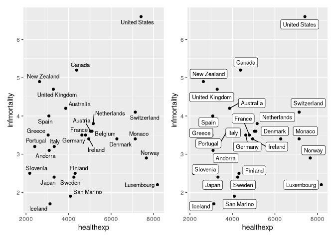

Setting `vjust = 0` will make the baseline of the text on the same level
as the point, and setting `vjust = 1` will make the top of the text
level with the point.

``` r
countries_sp +
  geom_text(aes(label = Name), size = 3, vjust = 0)
```


``` r
countries_sp +
  geom_text(aes(y = infmortality + .1, label = Name), size = 3)
```

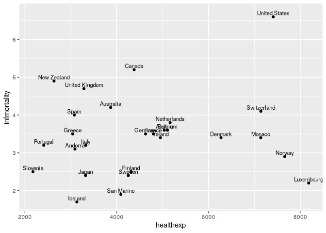

To left-justify, set `hjust = 0` and to right-justify, set `hjust = 1`

``` r
countries_sp +
  geom_text(
    aes(label = Name),
    size = 3,
    hjust = 0
  )
```

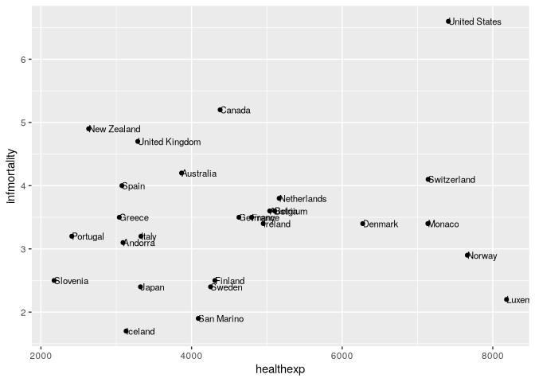

``` r
countries_sp +
  geom_text(
    aes(x = healthexp + 100, label = Name),
    size = 3,
    hjust = 0
  )
```


> **Note**
>
> If you are using a logarithmic axis, instead of adding to x or y,
> you’ll need to *multiply* the x or y value by a number to shift the
> labels a consistent amount.

> Adjust all with `position_nudge()`

``` r
countries_sp +
  geom_text(
    aes(x = healthexp + 100, label = Name),
    size = 3,
    hjust = 0
  )
```

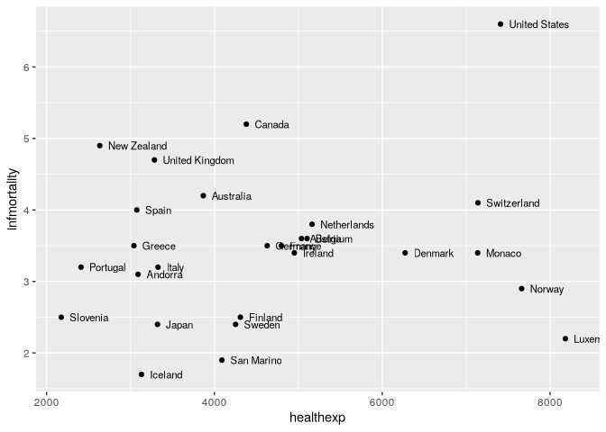

``` r
countries_sp +
  geom_text(
    aes(x = healthexp + 100, label = Name),
    size = 3,
    hjust = 0,
    position = position_nudge(x = 100, y = -0.2)
  )
```

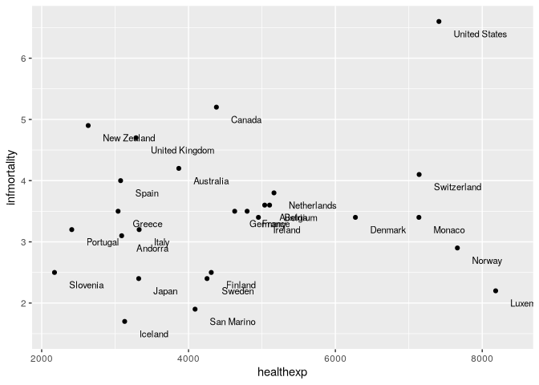

> Only label some points

``` r
cdf <- countries |> 
  filter(Year == 2009, healthexp > 2000) |> 
  mutate(plotname = as.character(Name))
cdf |> head()
```

           Name Code Year      GDP laborrate healthexp infmortality  plotname
    1   Andorra  AND 2009       NA        NA  3089.636          3.1   Andorra
    2 Australia  AUS 2009 42130.82      65.2  3867.429          4.2 Australia
    3   Austria  AUT 2009 45555.43      60.4  5037.311          3.6   Austria
    4   Belgium  BEL 2009 43640.20      53.5  5104.019          3.6   Belgium
    5    Canada  CAN 2009 39599.04      67.8  4379.761          5.2    Canada
    6   Denmark  DNK 2009 55933.35      65.4  6272.729          3.4   Denmark

``` r
country_list <- c("Canada", "Ireland", "United Kingdom", "United States",
  "New Zealand", "Iceland", "Japan", "Luxembourg", "Netherlands", "Switzerland")

cdf <- cdf |> 
  mutate(plotname = ifelse(plotname %in% country_list, plotname, ""))
```

``` r
ggplot(cdf, aes(x = healthexp, y = infmortality)) +
  geom_point() +
  geom_text(aes(x = healthexp + 100, label = plotname),
            size = 4, hjust = 0) +
  xlim(2000, 10000)
```

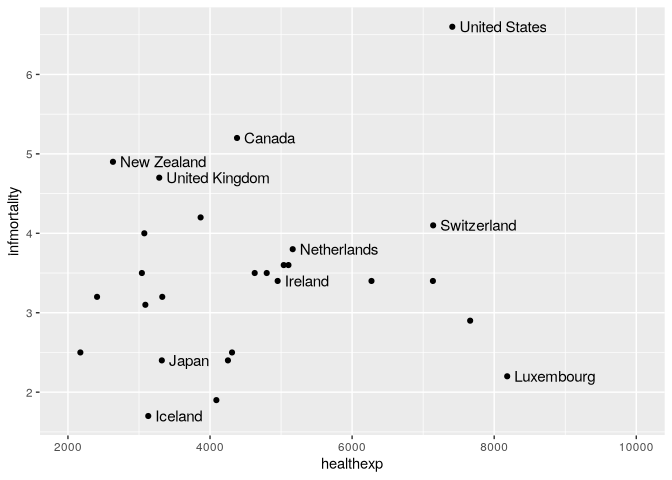

## Balloon Plot

``` r
cdf_sp <- ggplot(cdf, aes(x = healthexp, y = infmortality, size = GDP)) +
  geom_point(shape = 21, color = "black", fill = "cornsilk")
cdf_sp_2 <- cdf_sp +
  scale_size_area(max_size = 15)
cdf_sp + cdf_sp_2
```

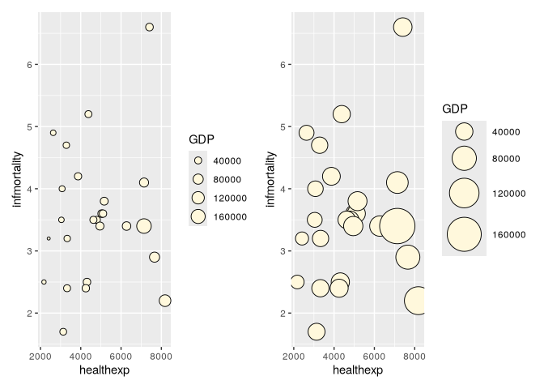

> Representing values on a grid with x and y both categorical.
>
> Must convert to long format with as.tibble

``` r
hec <- HairEyeColor |> 
  as_tibble() |> 
  group_by(Hair, Eye) |> 
  summarise(count = sum(n))

hec_sp <- ggplot(hec, aes(x = Eye, y = Hair)) +
  geom_point(aes(size = count), shape = 21,
             color = "black", fill = "cornsilk") +
  scale_size_area(max_size = 20, guide = "none") +
  geom_text(aes(
    y = as.numeric(as.factor(Hair)) - sqrt(count)/34, label = count),
    vjust = 1.3, color = "grey60", size = 4
  )
hec_sp
```

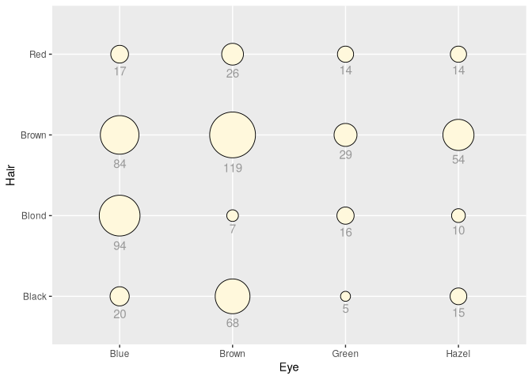

> Add guide points

``` r
hec_sp +
  geom_point(aes(y = as.numeric(as.factor(Hair)) - sqrt(count)/34),
             color = "red", size = 1)
```


## Scatter Plot Matrix

> use R base function `pairs()`

``` r
c2009 <- countries %>%
  filter(Year == 2009) %>%
  dplyr::select(Name, GDP, laborrate, healthexp, infmortality)
c2009 |> head()
```

                Name      GDP laborrate  healthexp infmortality
    1    Afghanistan       NA      59.8   50.88597        103.2
    2        Albania 3772.605      59.5  264.60406         17.2
    3        Algeria 4022.199      58.5  267.94653         32.0
    4 American Samoa       NA        NA         NA           NA
    5        Andorra       NA        NA 3089.63589          3.1
    6         Angola 4068.576      81.3  203.80787         99.9

``` r
c2009 |> 
  dplyr::select(-Name) |> 
  pairs()
```

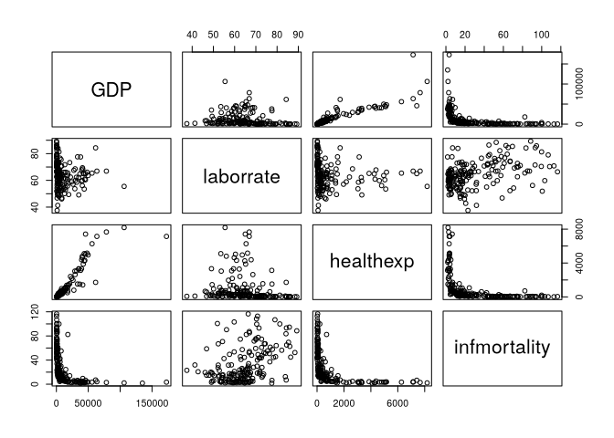

> Customize panel functions. These are from the `pairs()` help.

``` r
panel.cor <- function(x, y, digits = 2, prefix = "", cex.cor, ...) {
  usr <- par("usr")
  on.exit(par(usr))
  par(usr = c(0, 1, 0, 1))
  r <- abs(cor(x, y, use = "complete.obs"))
  txt <- format(c(r, 0.123456789), digits = digits)[1]
  txt <- paste(prefix, txt, sep = "")
  if (missing(cex.cor)) cex.cor <- 0.8/strwidth(txt)
  text(0.5, 0.5, txt, cex =  cex.cor * (1 + r) / 2)
}
panel.hist <- function(x, ...) {
  usr <- par("usr")
  on.exit(par(usr))
  par(usr = c(usr[1:2], 0, 1.5) )
  h <- hist(x, plot = FALSE)
  breaks <- h$breaks
  nB <- length(breaks)
  y <- h$counts
  y <- y/max(y)
  rect(breaks[-nB], 0, breaks[-1], y, col = "white", ...)
}
```

``` r
pairs(
  c2009 |> dplyr::select(-Name),
  upper.panel = panel.cor,
  diag.panel = panel.hist,
  lower.panel = panel.smooth
)
```

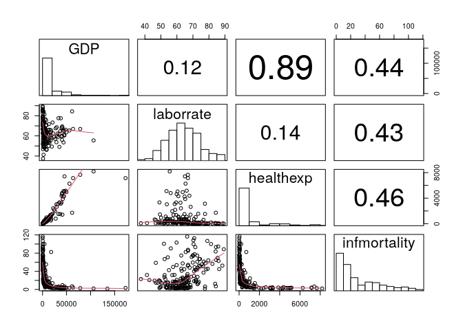

> using linear regression instead of loess

``` r
panel.lm <- function (x, y, col = par("col"), bg = NA, pch = par("pch"),
                      cex = 1, col.smooth = "black", ...) {
  points(x, y, pch = pch, col = col, bg = bg, cex = cex)
  abline(stats::lm(y ~ x),  col = col.smooth, ...)
}
```

``` r
pairs(
  c2009 |> dplyr::select(-Name),
  upper.panel = panel.cor,
  diag.panel  = panel.hist,
  lower.panel = panel.smooth,
  pch = "."
)
```

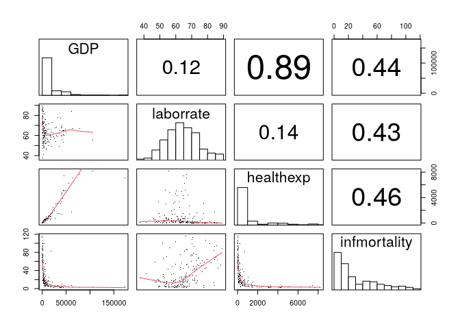
