# 6 - Summarized Data Distributions


``` r
library(tidyverse)
library(gcookbook)
library(patchwork)
```

[Source](https://r-graphics.org/RECIPE-LINE-GRAPH-LINE-APPEARANCE.html)

# Summarized Data Distributions

## Basic histogram

``` r
ggplot(faithful, aes(x = waiting)) +
  geom_histogram()
```

    `stat_bin()` using `bins = 30`. Pick better value with `binwidth`.

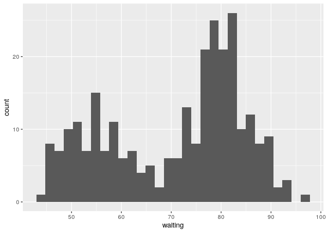

> Default grouping is 30 bins. Change with `binwidth` or `binsize`

``` r
ggplot(faithful, aes(x = waiting)) +
  geom_histogram(binwidth = 5, fill = "white", colour = "black")
```

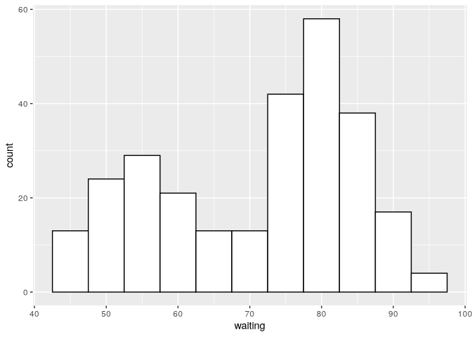

``` r
binsize <- diff(range(faithful$waiting))/15

ggplot(faithful, aes(x = waiting)) +
  geom_histogram(binwidth = binsize, fill = "white", colour = "black")
```

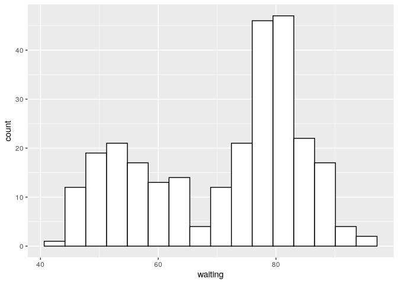

``` r
faithful_p <- ggplot(faithful, aes(x = waiting))

faithful_p +
  geom_histogram(binwidth = 8, fill = "white", colour = "black", boundary = 31)
```

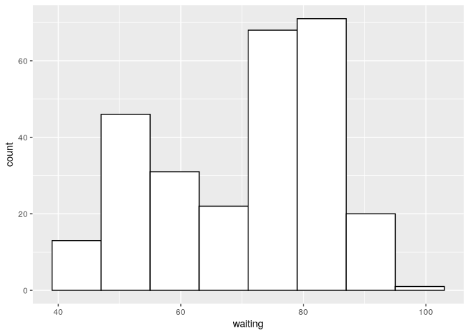

``` r
faithful_p +
  geom_histogram(binwidth = 8, fill = "white", colour = "black", boundary = 35)
```

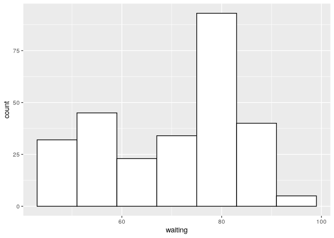

## Multiple Histograms from grouped data

``` r
library(MASS)

ggplot(birthwt, aes(x = bwt)) +
  geom_histogram(fill = "white", color = "black") +
  facet_grid(smoke ~ .)
```

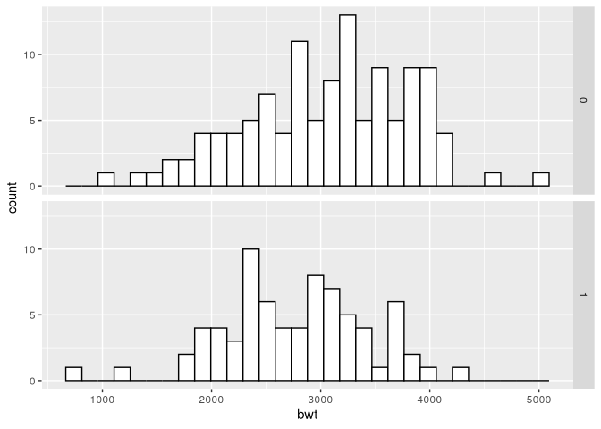

> Label the facets

``` r
birthwt_mod <- birthwt
birthwt_mod$smoke <- recode_factor(birthwt_mod$smoke, 
                                   '0' = 'No Smoke', 
                                   '1' = 'Smoke')

ggplot(birthwt_mod, aes(x = bwt)) +
  geom_histogram(fill = "white", color = "black") +
  facet_grid(smoke ~ .)
```

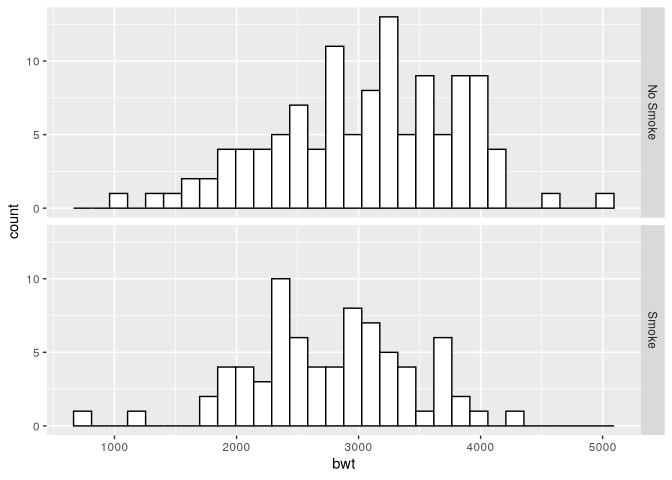

> If the groups have different size, the scales can be resized

``` r
ggplot(birthwt, aes(x = bwt)) +
  geom_histogram(fill = "white", colour = "black") +
  facet_grid(race ~ .)
```

    `stat_bin()` using `bins = 30`. Pick better value with `binwidth`.

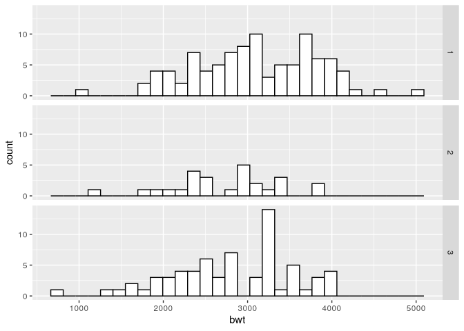

``` r
ggplot(birthwt, aes(x = bwt)) +
  geom_histogram(fill = "white", colour = "black") +
  facet_grid(race ~ ., scales = "free")
```

    `stat_bin()` using `bins = 30`. Pick better value with `binwidth`.

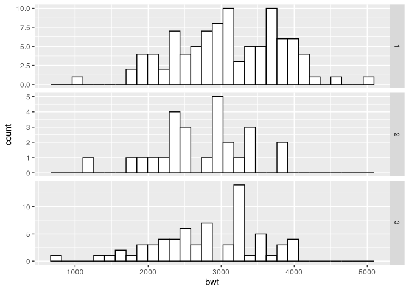

> Map the grouping variable to `fill`
>
> Specifying `position = "identity"` is important. Without it, ggplot
> will stack the histogram bars on top of each other vertically, making
> it much more difficult to see the distribution of each group.

``` r
ggplot(birthwt_mod, aes(x = bwt, fill = smoke)) +
  geom_histogram(position = "identity", alpha = 0.4)
```

    `stat_bin()` using `bins = 30`. Pick better value with `binwidth`.

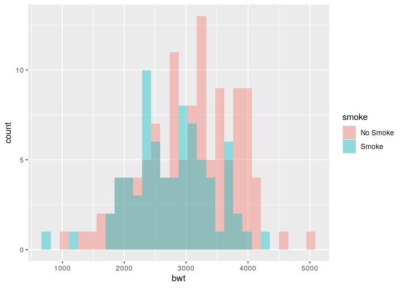

## Density curve

> `geom_density()`

``` r
ggplot(faithful, aes(x = waiting)) +
  geom_density()
```

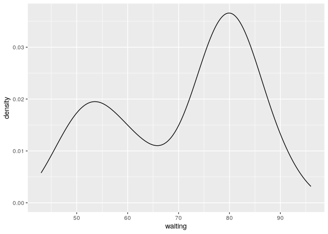

or

``` r
ggplot(faithful, aes(x = waiting)) +
  geom_line(stat = 'density') +
  expand_limits(y = 0)
```

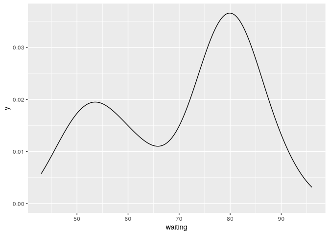

> Look at data not in a data frame

``` r
w <- faithful$waiting

ggplot(NULL, aes(x = w)) +
  geom_density()
```

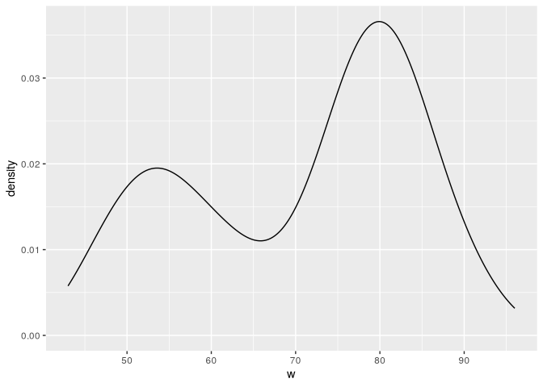

> adjust the bandwidth to change the smoothness

``` r
ggplot(faithful, aes(x = waiting)) +
  geom_line(stat = "density") +
  geom_line(stat = "density", adjust = .25, colour = "red") +
  geom_line(stat = "density", adjust = 2, colour = "blue")
```

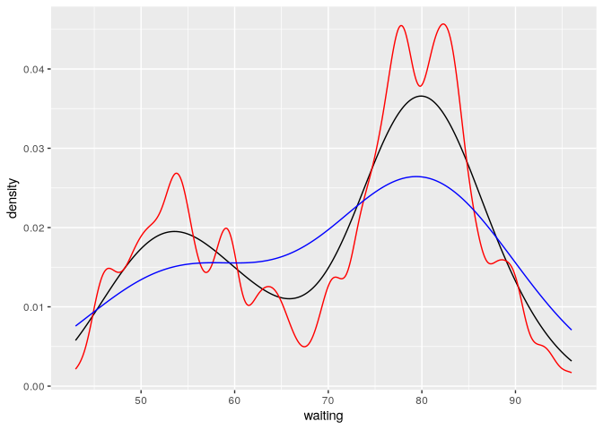

> To show more of the curve, set xlim

``` r
ggplot(faithful, aes(x = waiting)) +
  geom_density(fill = "blue", alpha = .2) +
  xlim(35, 105)
```

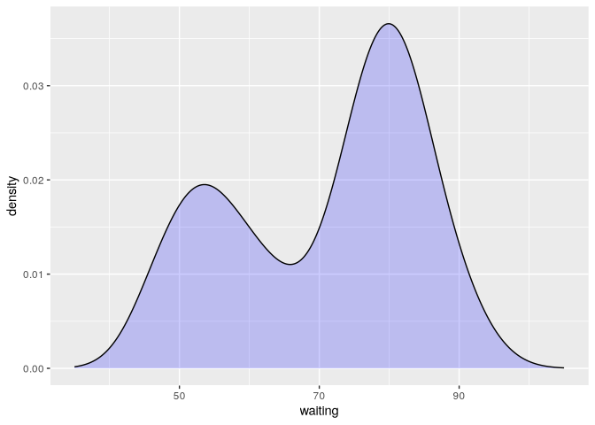

``` r
# This draws a blue polygon with geom_density(), then adds a line on top
ggplot(faithful, aes(x = waiting)) +
  geom_density(fill = "blue", alpha = .2, colour = NA) +
  xlim(35, 105) +
  geom_line(stat = "density")
```


> Overlay density and histogram

``` r
ggplot(faithful, aes(x = waiting, y = ..density..)) +
  geom_histogram(fill = "cornsilk", colour = "grey60", size = .2) +
  geom_density() +
  xlim(35, 105)
```

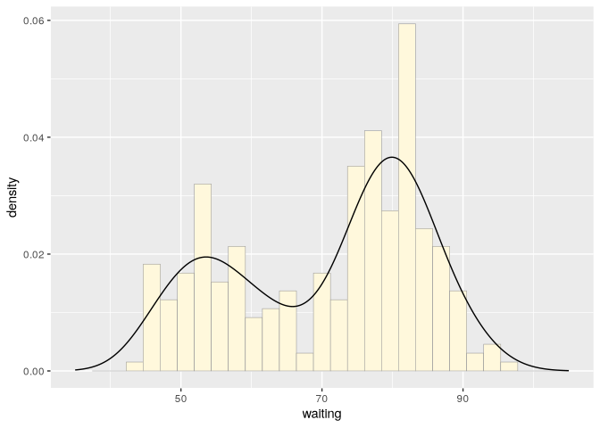

## Multiple density curves from grouped data

> use `geom_density` and map a grouping variable to color or fill
> aesthetic

``` r
birthwt_mod <- birthwt %>%
  mutate(smoke = as.factor(smoke))

ggplot(birthwt_mod, aes(x = bwt, colour = smoke)) +
  geom_density()
```

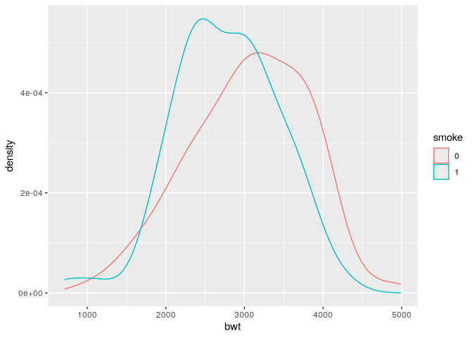

``` r
ggplot(birthwt_mod, aes(x = bwt, fill = smoke)) +
  geom_density(alpha = .3)
```

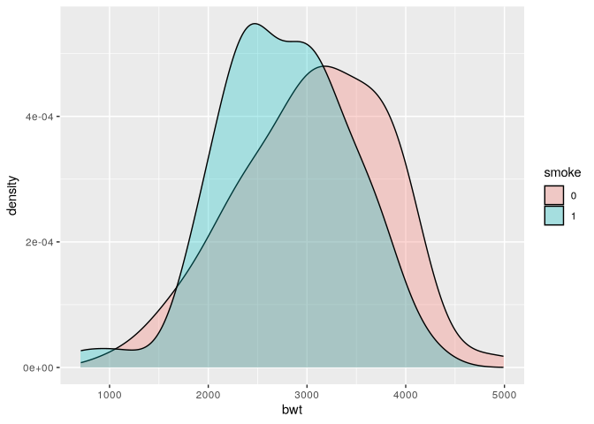

> Using facets

``` r
birthwt_mod$smoke <- recode(birthwt_mod$smoke, '0' = 'No Smoke', '1' = 'Smoke')
ggplot(birthwt_mod, aes(x = bwt)) +
  geom_density() +
  facet_grid(smoke ~ .)
```

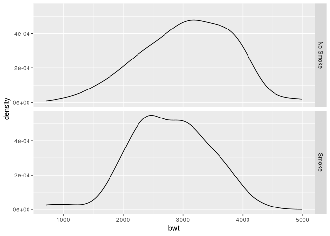

> Add a histogram, using `y = ..density..` to scale the histogram

``` r
ggplot(birthwt_mod, aes(x = bwt, y = ..density..)) +
  geom_histogram(binwidth = 200, fill = "cornsilk", colour = "grey60", size = .2) +
  geom_density() +
  facet_grid(smoke ~ .)
```

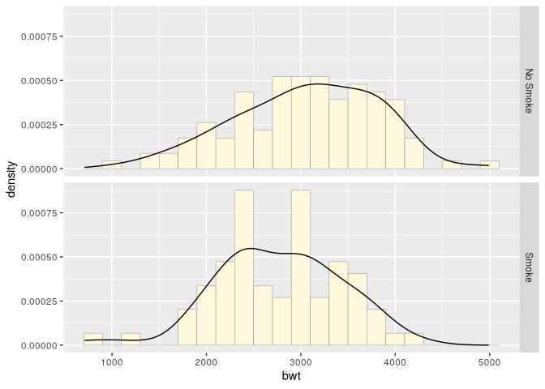

## Frequency polygon

> `geom_freqpoly()`

``` r
ggplot(faithful, aes(x=waiting)) +
  geom_freqpoly()
```

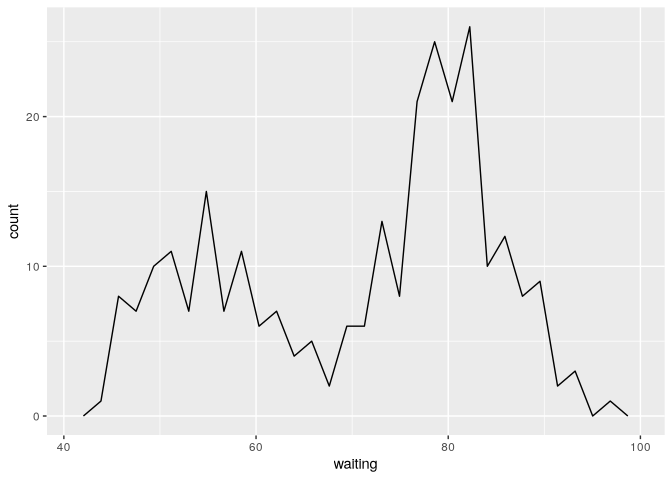

``` r
ggplot(faithful, aes(x=waiting)) +
  geom_freqpoly(binwidth = 4)
```

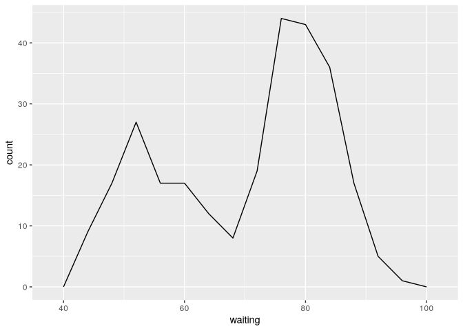

> or

``` r
binsize <- diff(range(faithful$waiting))/15

ggplot(faithful, aes(x = waiting)) +
  geom_freqpoly(binwidth = binsize)
```

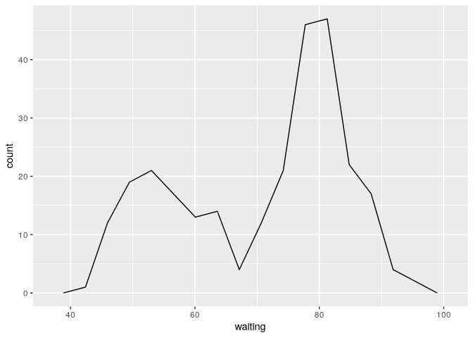

## Box plot

> `geom_boxplot()`

``` r
ggplot(birthwt, aes(x = factor(race), y = bwt)) +
  geom_boxplot()
```

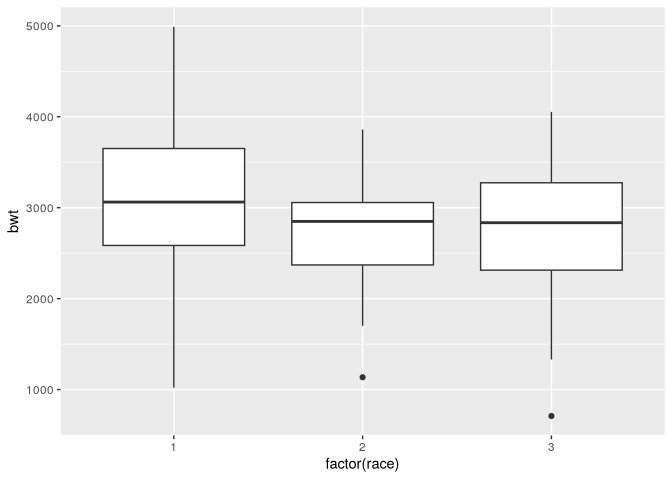

> set width

``` r
ggplot(birthwt, aes(x = factor(race), y = bwt)) +
  geom_boxplot(width = .5)
```

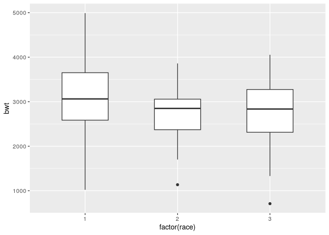

> outlier shape and size

``` r
ggplot(birthwt, aes(x = factor(race), y = bwt)) +
  geom_boxplot(outlier.size = 1.5, outlier.shape = 21)
```


> For a single group, must provide an arbitrary `x` value

``` r
ggplot(birthwt, aes(x = 1, y = bwt)) +
  geom_boxplot() +
  scale_x_continuous(breaks = NULL) +
  theme(axis.title.x = element_blank())
```


## Boxplot with notches

``` r
ggplot(birthwt, aes(x = factor(race), y = bwt)) +
  geom_boxplot(notch = TRUE)
```

    Notch went outside hinges
    ℹ Do you want `notch = FALSE`?

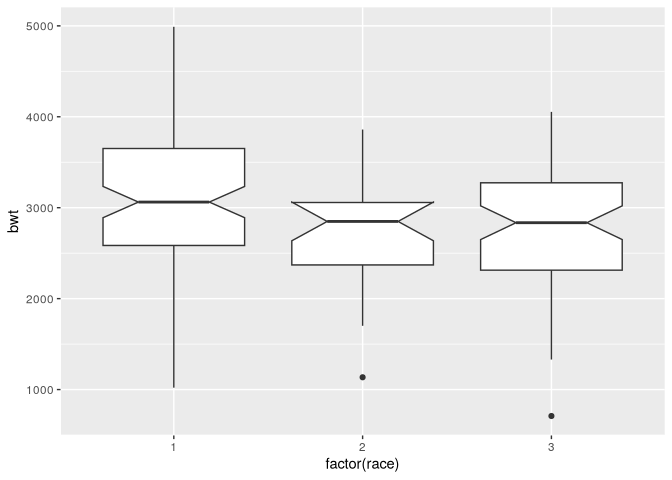

## Boxplot with mean averages

``` r
ggplot(birthwt, aes(x = factor(race), y = bwt)) +
  geom_boxplot() +
  stat_summary(fun = "mean", geom = "point",
               shape = 23, size = 3, fill = "white")
```


## Violin plot

> `geom_violin()`

``` r
hw_p <- ggplot(heightweight, aes(x = sex, y = heightIn))
```

``` r
hw_p + geom_violin()
```

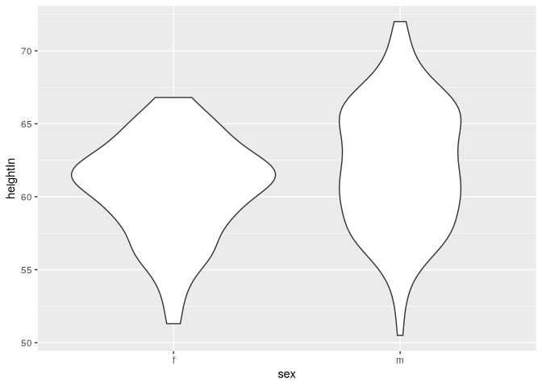

> With boxplot overlay

``` r
hw_p +
  geom_violin() +
  geom_boxplot(width = .1, fill = "navy", outlier.colour = NA) +
  stat_summary(fun = median, geom = "point", fill = "white",
               shape = 21, size = 2.5)
```

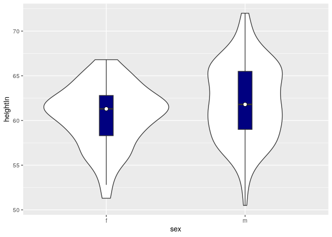

> Keep the tails

``` r
hw_p + geom_violin(trim = FALSE)
```

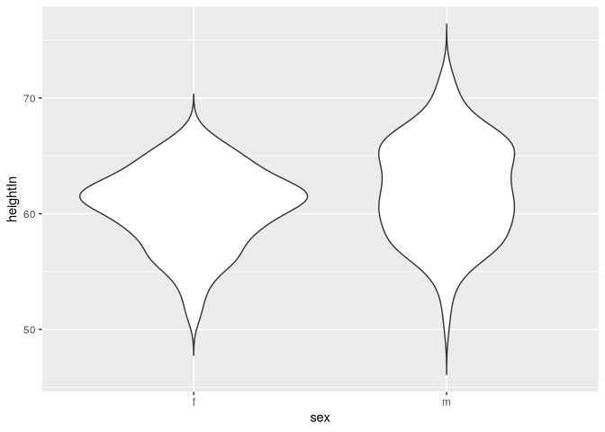

> Default is to scale to equal areas. To have the size represent the
> number of observations

``` r
hw_p + geom_violin(scale = "count")
```

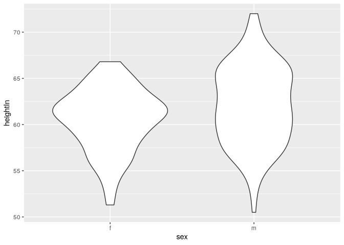

> Change the smooting

``` r
p1 <- hw_p + geom_violin(adjust = 2)
p2 <- hw_p + geom_violin(adjust = .5)
p1 + p2
```

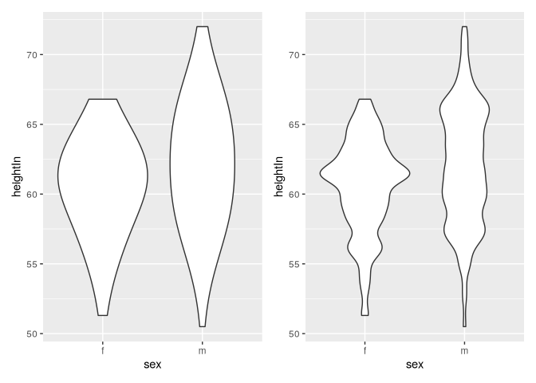

## Wilkinson dot plot

``` r
c2009 <- countries |> 
  filter(Year == 2009 & healthexp > 2000)

c2009_p <- ggplot(c2009, aes(x = infmortality))

c2009_p + 
  geom_dotplot()
```

    Bin width defaults to 1/30 of the range of the data. Pick better value with
    `binwidth`.

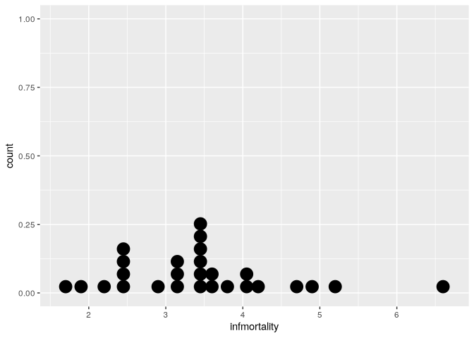

> y axis ticks should be removed as they aren’t meaningful.

``` r
c2009_p + 
  geom_dotplot(binwidth = .25) + 
  geom_rug() +
  scale_y_continuous(breaks = NULL) +
  theme(axis.title.y = element_blank())
```

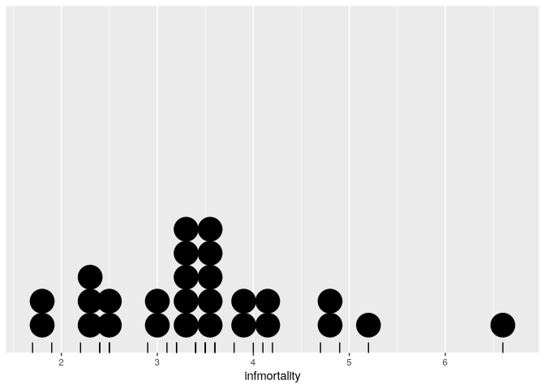

> To use regular intervals

``` r
c2009_p + 
  geom_dotplot(method = "histodot", binwidth = .25) + 
  geom_rug() +
  scale_y_continuous(breaks = NULL) +
  theme(axis.title.y = element_blank())
```

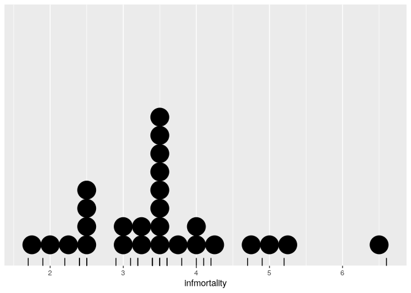

``` r
c2009_p + 
  geom_dotplot(stackdir = "center", binwidth = .25) + 
  geom_rug() +
  scale_y_continuous(breaks = NULL) +
  theme(axis.title.y = element_blank())
```


``` r
c2009_p + 
  geom_dotplot(stackdir = "centerwhole", binwidth = .25) + 
  geom_rug() +
  scale_y_continuous(breaks = NULL) +
  theme(axis.title.y = element_blank())
```

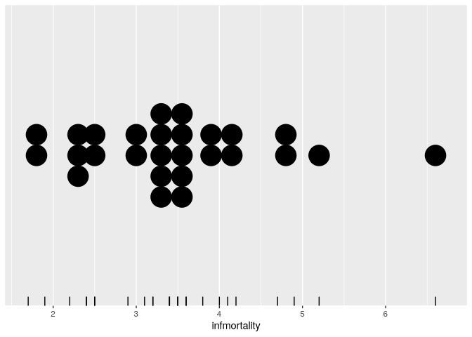

## Multiple dot plots for grouped data

``` r
ggplot(heightweight, aes(x = sex, y = heightIn)) +
  geom_dotplot(binaxis = "y", binwidth = .5, stackdir = "center")
```

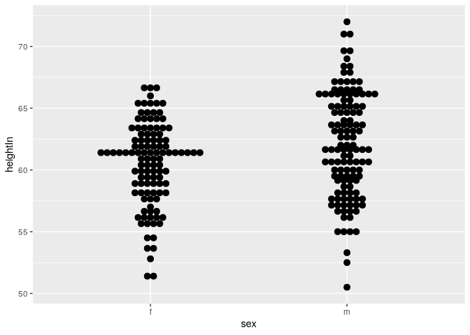

> with boxplot

``` r
ggplot(heightweight, aes(x = sex, y = heightIn)) +
  geom_boxplot(outlier.color = NA, width = .4) +
  geom_dotplot(binaxis = "y", binwidth = .5,
               stackdir = "center", fill = NA)
```

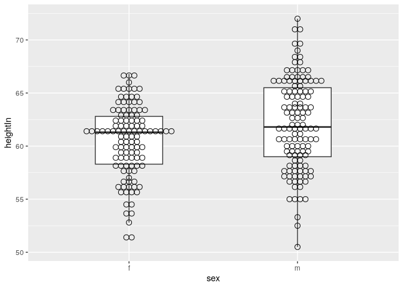

> boxplot and dotplot side-by-side

``` r
ggplot(heightweight, aes(x = sex, y = heightIn)) +
  geom_boxplot(aes(x = as.numeric(sex) + .2, group = sex), width = .25) +
  geom_dotplot(
    aes(x = as.numeric(sex) - .2, group = sex),
    binaxis = "y",
    binwidth = .5,
    stackdir = "center"
  ) +
  scale_x_continuous(
    breaks = 1:nlevels(heightweight$sex),
    labels = levels(heightweight$sex)
  )
```

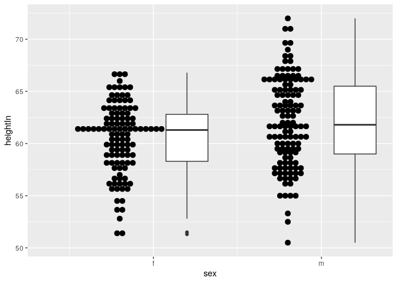

## Density plot of two-dimensional data

``` r
faithful_p <- ggplot(faithful, aes(x = eruptions, y = waiting))

faithful_p +
  geom_point() +
  stat_density2d()
```

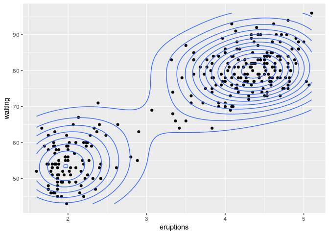

> Map the heith of the density curve

``` r
faithful_p +
  stat_density2d(aes(colour = ..level..))
```

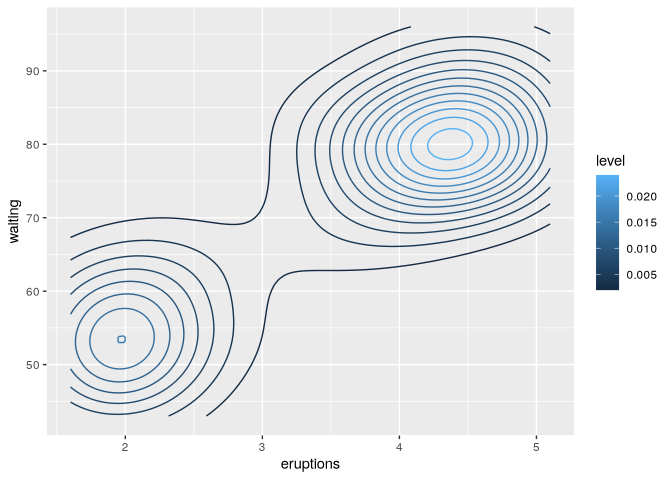

> With tiles instead of contours

``` r
faithful_p +
  stat_density2d(aes(fill = ..density..), geom = "raster", contour = F)
```

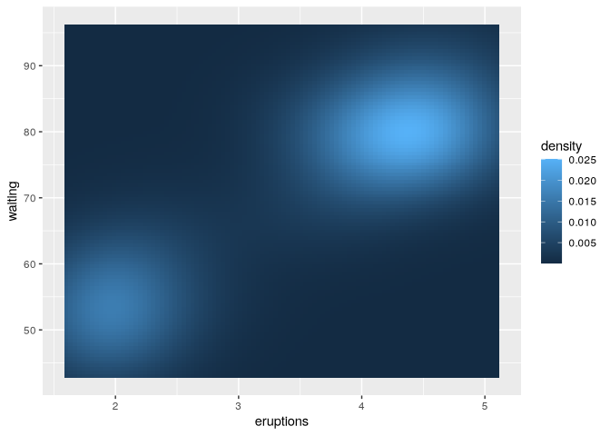

``` r
faithful_p +
  geom_point() +
  stat_density2d(aes(alpha = ..density..), geom = "tile", contour = F)
```

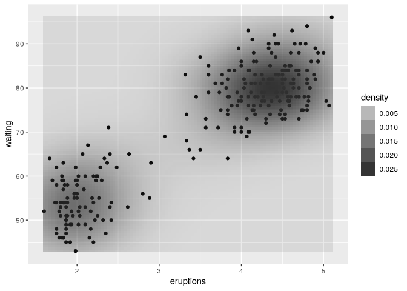

> Adjusting the bandwidth

``` r
faithful_p +
  stat_density2d(aes(fill = ..density..), 
                 geom = "raster", contour = F,
                 h = c(.5, 5)) # x and y
```

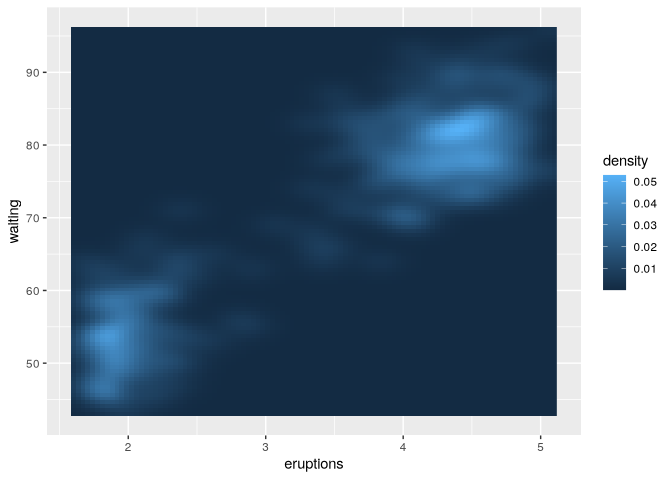
