# 7 - Annotations


``` r
library(tidyverse)
library(gcookbook)
library(patchwork)
```

[Source](https://r-graphics.org/RECIPE-LINE-GRAPH-LINE-APPEARANCE.html)

# Annotations

## Text

``` r
p <- ggplot(faithful, aes(x = eruptions, y = waiting)) +
  geom_point()

p +
  annotate("text", x = 3, y = 48, label = "Group 1") +
  annotate("text", x = 4.5, y = 66, label = "Group 2")
```

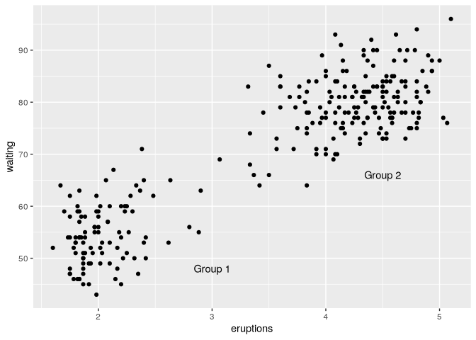

> With font formatting

``` r
p +
  annotate("text", x = 3, y = 48, label = "Group 1",
           family = "serif", fontface = "italic", 
           colour = "darkred", size = 3) +
  annotate("text", x = 4.5, y = 66, label = "Group 2",
           family = "serif", fontface = "italic", 
           colour = "darkred", size = 3)
```

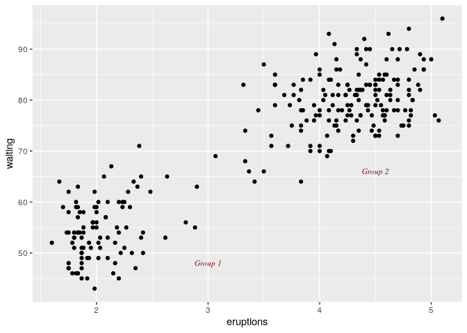

> for continuous axes, use `Inf` and `-Inf` for the edges. Calculated
> values can be used for placement.

``` r
p +
  annotate("text", x = -Inf, y = Inf, 
           label = "Upper left", 
           hjust = -.2, vjust = 2) +
  annotate("text", 
           x = mean(range(faithful$eruptions)), 
           y = -Inf, vjust = -0.4,
           label = "Bottom middle")
```

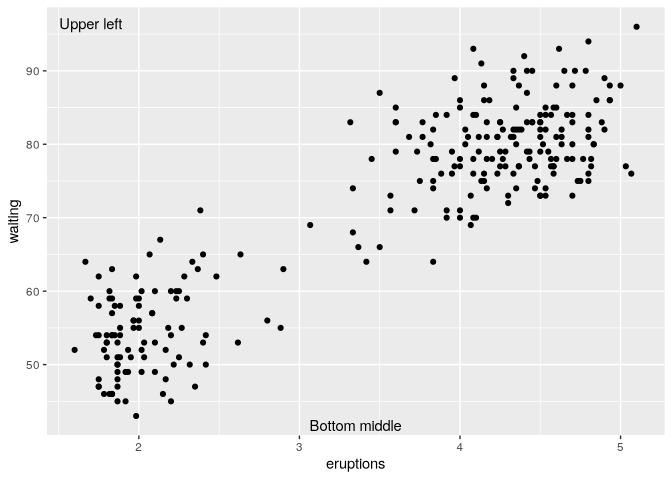

## Annotations with mathematical expression

> Reference `?plotmath`

``` r
p <- ggplot(data.frame(x = c(-3,3)), aes(x = x)) +
  stat_function(fun = dnorm)

p + 
  annotate("text", x = 2, y = 0.3, parse = TRUE,
           label = "frac(1, sqrt(2 * pi)) * e ^ {-x^2/2}")
```

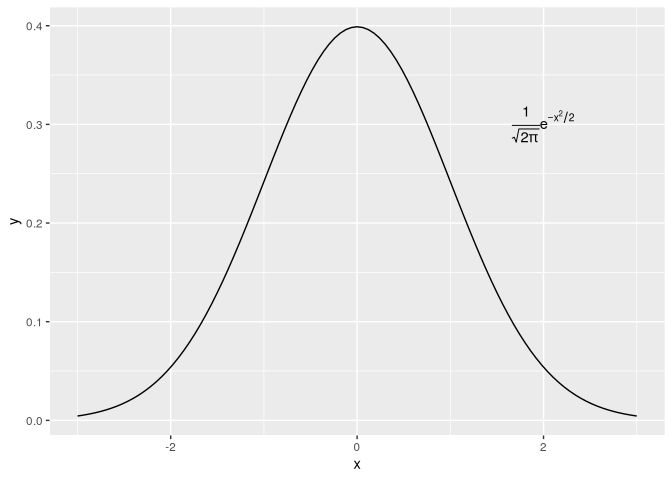

``` r
p +
  annotate("text", x = 0, y = 0.05, parse = TRUE, size = 4,
           label = "'Function:  ' * y==frac(1, sqrt(2*pi)) * e^{-x^2/2}")
```

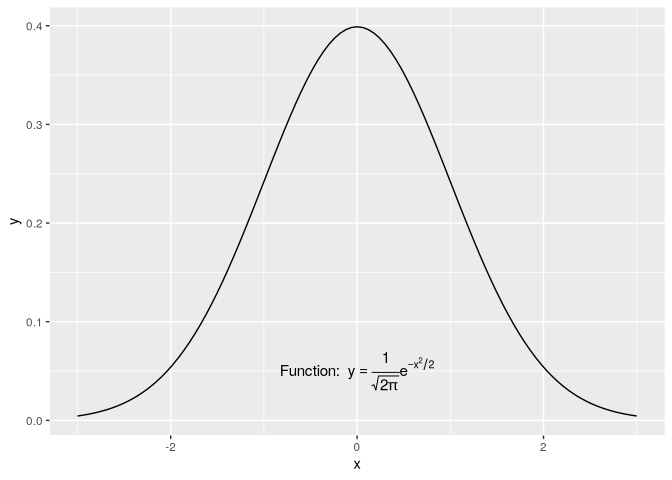

## Adding lines

> `geom_hline()`, `geom_vline()`, `geom_abline()`

``` r
hw_plot <- ggplot(heightweight, aes(x = ageYear, y = heightIn, colour = sex)) +
  geom_point()

hw_plot +
  geom_hline(yintercept = 60) +
  geom_vline(xintercept = 14)
```

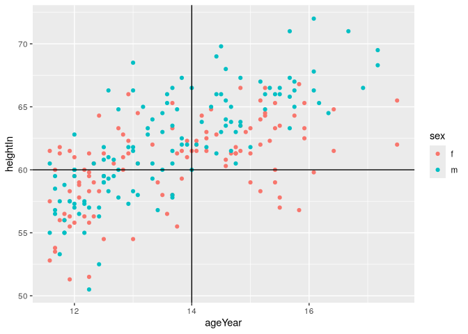

``` r
hw_plot +
  geom_abline(intercept = 37.4, slope = 1.75)
```

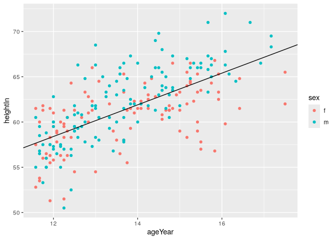

> draw lines from data frames

``` r
hw_means <- heightweight |> 
  group_by(sex) |> 
  summarise(heightIn = mean(heightIn))
hw_means
```

    # A tibble: 2 × 2
      sex   heightIn
      <fct>    <dbl>
    1 f         60.5
    2 m         62.1

``` r
hw_plot +
  geom_hline(
    data = hw_means,
    aes(yintercept = heightIn, colour = sex),
    linetype = "dashed",
    linewidth = 1
  )
```

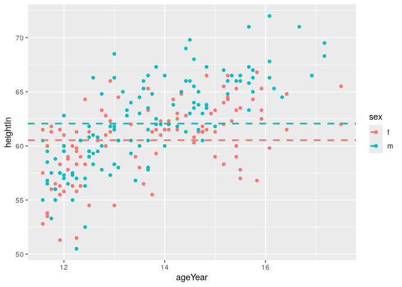

> For discrete variables, levels are numbered or access by name with
> `which(levels))`

``` r
pg_plot <- ggplot(PlantGrowth, aes(x = group, y = weight)) +
  geom_point()
```

``` r
pg_plot + 
  geom_vline(xintercept = 2)
```

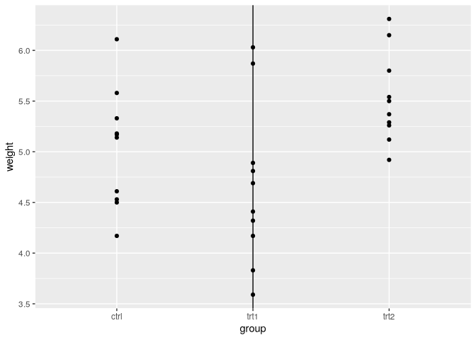

``` r
pg_plot +
  geom_vline(xintercept = which(levels(PlantGrowth$group) == "ctrl"))
```

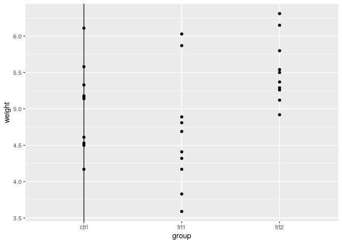

> Line segments and arrows
>
> \`annotate(“segment”)

``` r
p <- ggplot(filter(climate, Source == "Berkeley"), aes(x = Year, y = Anomaly10y)) +
  geom_line()
```

``` r
p +
  annotate("segment", x = 1950, xend = 1980, y = -.25, yend = -.25)
```

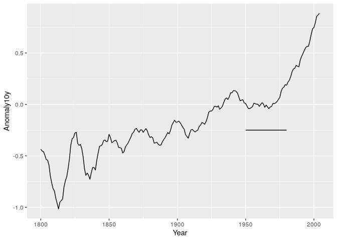

> Adding arrowheads or segment end lines

``` r
library(grid)

p +
  annotate("segment", x = 1850, xend = 1820, y = -.8, yend = -.95,
           color = "blue", linewidth = 2, arrow = arrow()) +
  annotate("segment", x = 1950, xend = 1980, y = -.25, yend = -.25,
           arrow = arrow(ends = "both", angle = 90, length = unit(.2, "cm")))
```

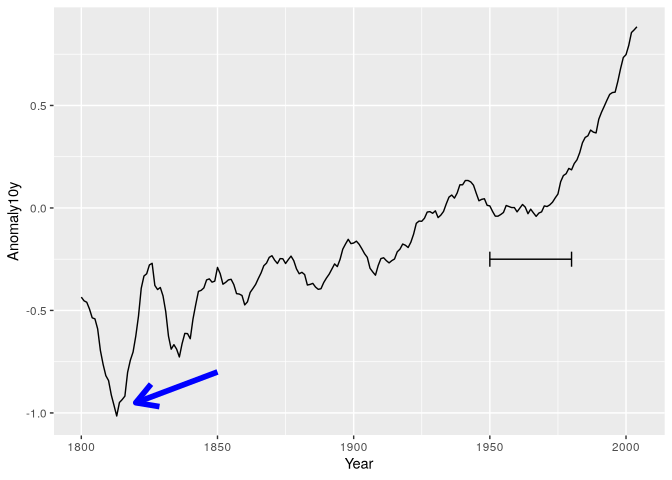

## Shaded rectangles

> `annotate("rect")`

``` r
p <- ggplot(filter(climate, Source == "Berkeley"), aes(x = Year, y = Anomaly10y)) +
  geom_line()

p +
  annotate("rect", xmin = 1950, xmax = 1980, ymin = -1, ymax = 1,
           alpha = .1, fill = "blue")
```

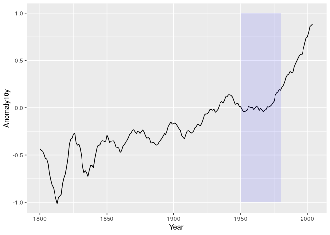

## Highlighting items

``` r
pg_mod <- PlantGrowth |> 
  mutate(hl = recode(group, "ctrl" = "no", "trt1" = "no", "trt2" = "yes"))
```

``` r
ggplot(pg_mod, aes(x = group, y = weight, fill = hl)) +
  geom_boxplot() +
  scale_fill_manual(values = c("gray85", "#ffddcc"), guide = "none")
```

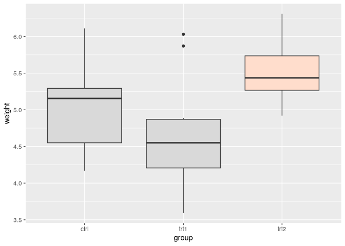

or, since there are only three

``` r
ggplot(pg_mod, aes(x = group, y = weight, fill = group)) +
  geom_boxplot() +
  scale_fill_manual(values = c("gray85", "gray85", "#ffddcc"), guide = "none")
```


## Error Bars

> `geom_errorbar()`

``` r
ce_mod <- cabbage_exp |> 
  filter(Cultivar == "c39")

p <- ggplot(ce_mod, aes(x = Date, y = Weight))
```

``` r
p +
  geom_col(fill = "white", color = "black") +
  geom_errorbar(aes(ymin = Weight - se, ymax = Weight + se), width = .2)
```

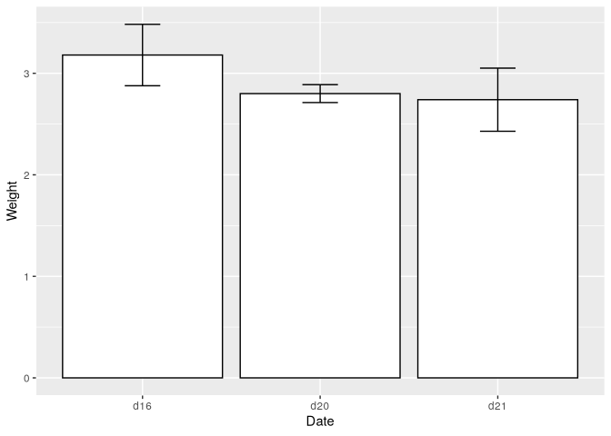

``` r
p + 
  geom_line(aes(group = 1)) +
  geom_point(size = 4) +
  geom_errorbar(aes(ymin = Weight - se, ymax = Weight + se), width = .2)
```

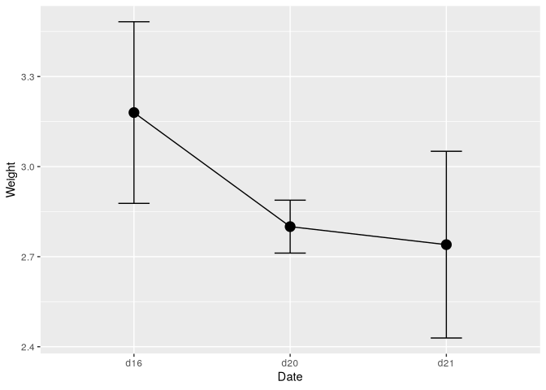

> For a bar graph with groups of bars, the error bars must also be
> *dodged*; otherwise, they’ll have the exact same *x* coordinate and
> won’t line up with the bars.

``` r
# Bad
ggplot(cabbage_exp, aes(x = Date, y = Weight, fill = Cultivar)) +
  geom_col(position = "dodge") +
  geom_errorbar(aes(ymin = Weight - se, ymax = Weight + se),
                position = "dodge", width = .2)
```

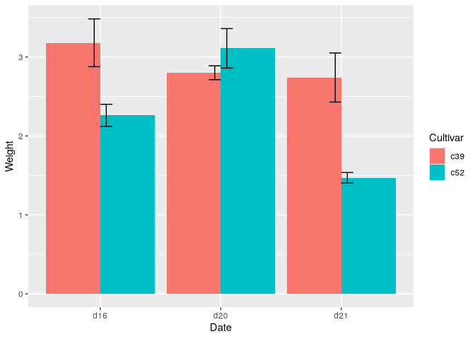

``` r
# Good
ggplot(cabbage_exp, aes(x = Date, y = Weight, fill = Cultivar)) +
  geom_col(position = "dodge") +
  geom_errorbar(aes(ymin = Weight - se, ymax = Weight + se),
                position = position_dodge(0.9), width = .2)
```


``` r
ggplot(cabbage_exp, aes(x = Date, y = Weight, fill = Cultivar)) +
  geom_col(position = "dodge") +
  geom_errorbar(aes(ymin = Weight - se, ymax = Weight + se),
                position = position_dodge(0.9), width = .2)
```


> Draw error bars first if they are a different color than the lines and
> points
>
> Make sure to dodge all geometric elements

``` r
pd <- position_dodge(.3)

ggplot(cabbage_exp, aes(x = Date, y = Weight, colour = Cultivar, group = Cultivar)) +
  geom_errorbar(
    aes(ymin = Weight - se, ymax = Weight + se),
    width = .2, 
    linewidth = 0.25, 
    color = "black",
    position = pd) +
  geom_line(position = pd) +
  geom_point(position = pd)
```


``` r
ggplot(cabbage_exp, aes(x = Date, y = Weight, colour = Cultivar, group = Cultivar)) +
  geom_errorbar(
    aes(ymin = Weight - se, ymax = Weight + se),
    width = .2,
    size = 0.25,
    colour = "black",
    position = pd
  ) +
  geom_line(position = pd) +
  geom_point(position = pd, size = 2.5)
```

    Warning: Using `size` aesthetic for lines was deprecated in ggplot2 3.4.0.
    ℹ Please use `linewidth` instead.

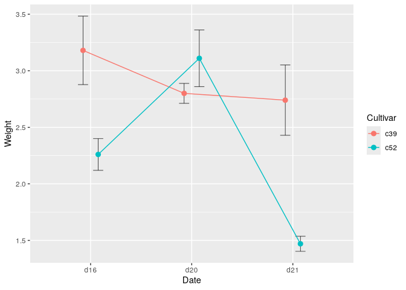

## Annotate individual facets

``` r
mpg_plot <- ggplot(mpg, aes(x = displ, y = hwy)) +
  geom_point() +
  facet_grid(. ~ drv)

f_labels <- data.frame(drv = c("4", "f", "r"),
                       label = c("4wd", "Front", "Rear"))

mpg_plot +
  geom_text(x = 6, y = 40, aes(label = label), data = f_labels)
```

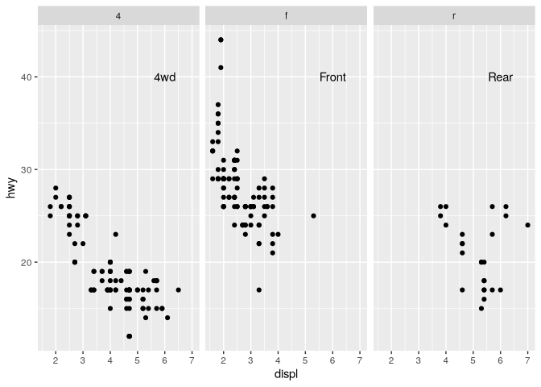

``` r
lm_labels <- function(dat) {
  mod <- lm(hwy ~ displ, data = dat)
  formula <- sprintf("italic(y) == %.2f %+.2f * italic(x)",
                     round(coef(mod)[1], 2), round(coef(mod)[2], 2))
  r <- cor(dat$displ, dat$hwy)
  r2 <- sprintf("italic(R^2) == %.2f", r^2)
  data.frame(formula = formula, r2 = r2, stringsAsFactors = FALSE)
}
```

``` r
labels <- mpg |> 
  group_by(drv) |> 
  do(lm_labels(.))
labels
```

    # A tibble: 3 × 3
    # Groups:   drv [3]
      drv   formula                              r2                 
      <chr> <chr>                                <chr>              
    1 4     italic(y) == 30.68 -2.88 * italic(x) italic(R^2) == 0.65
    2 f     italic(y) == 37.38 -3.60 * italic(x) italic(R^2) == 0.36
    3 r     italic(y) == 25.78 -0.92 * italic(x) italic(R^2) == 0.04

``` r
mpg_plot +
  geom_smooth(method = lm, se = FALSE) +
  geom_text(data = labels, aes(label = formula), 
            x = 3, y = 40, parse = TRUE, hjust = 0)
```

    `geom_smooth()` using formula = 'y ~ x'


> To just display values

``` r
labels <- mpg |> 
  group_by(drv) |> 
  summarise(r2 = cor(displ, hwy)^2)

labels$r2 <- sprintf("italic(R^2) == %.2f", labels$r2)

mpg_plot +
  geom_smooth(method = lm, se = FALSE) +
  geom_text(data = labels, aes(label = r2), 
            x = 3, y = 40, parse = TRUE, hjust = 0)
```

    `geom_smooth()` using formula = 'y ~ x'

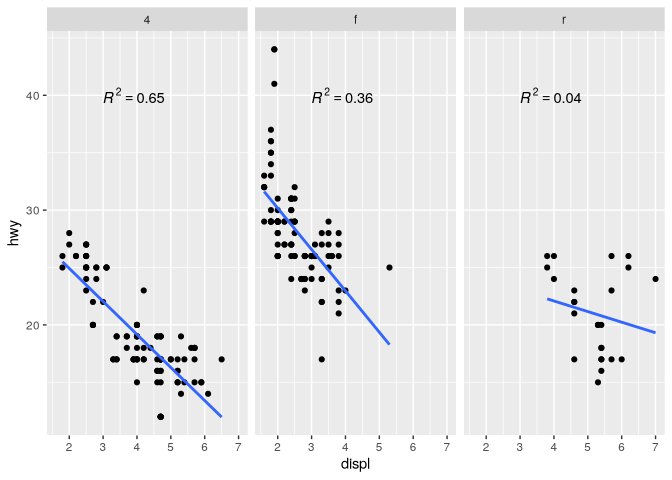
