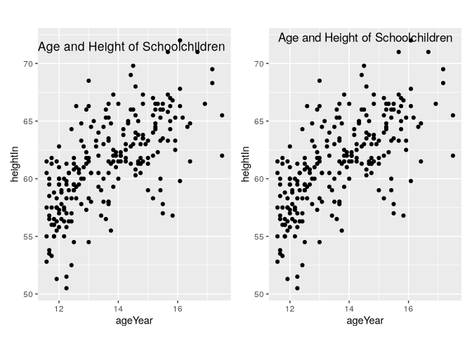
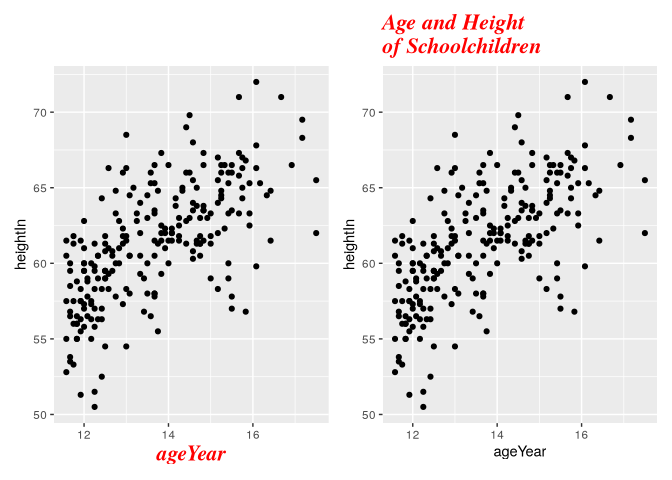
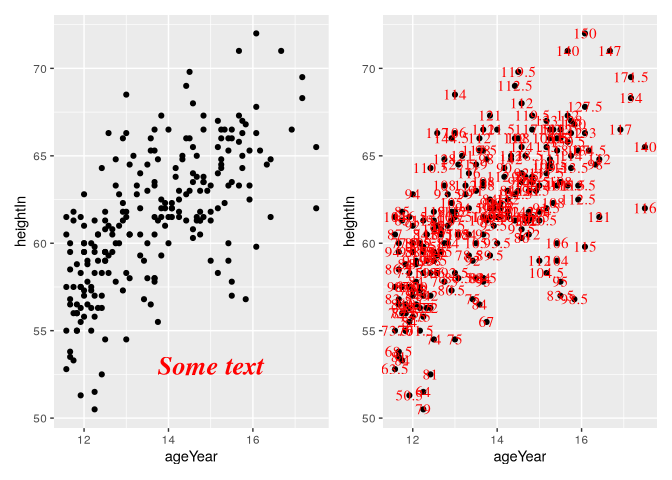
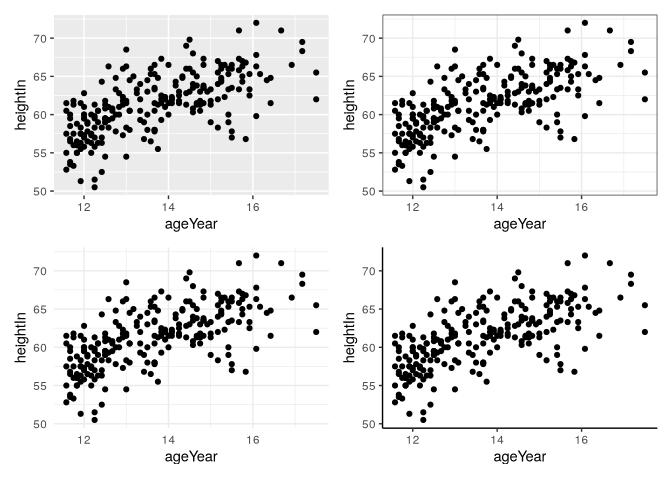
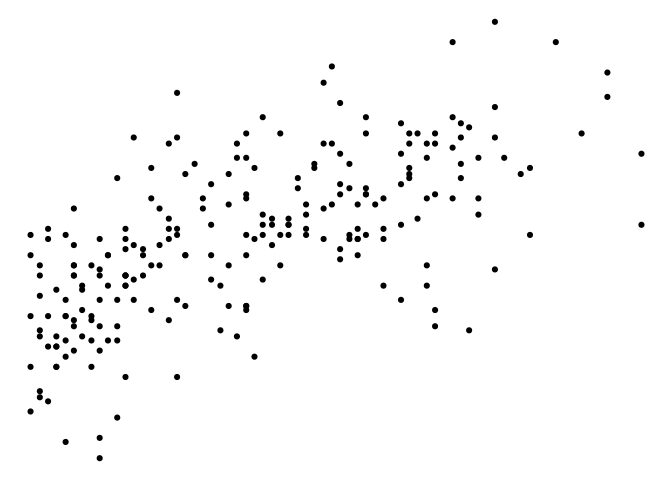
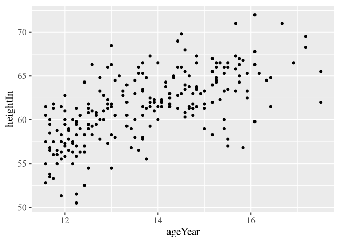
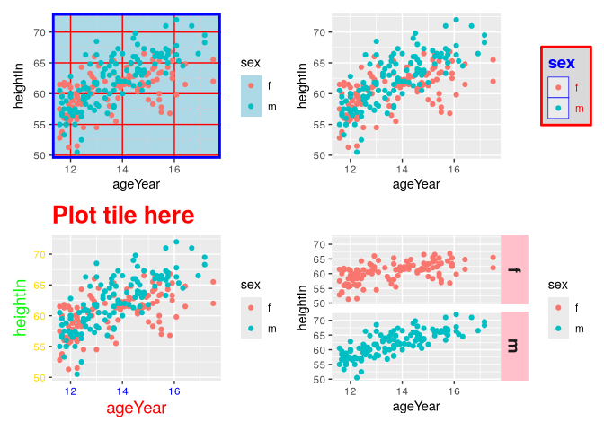
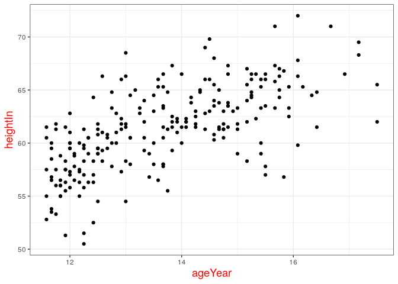
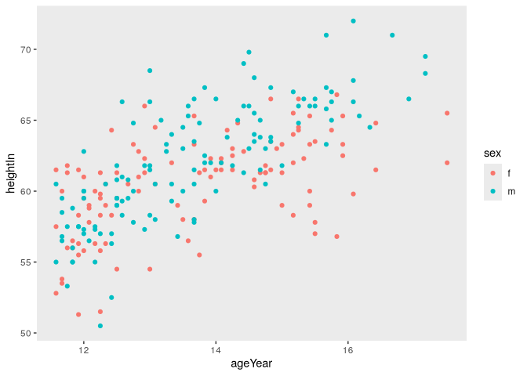
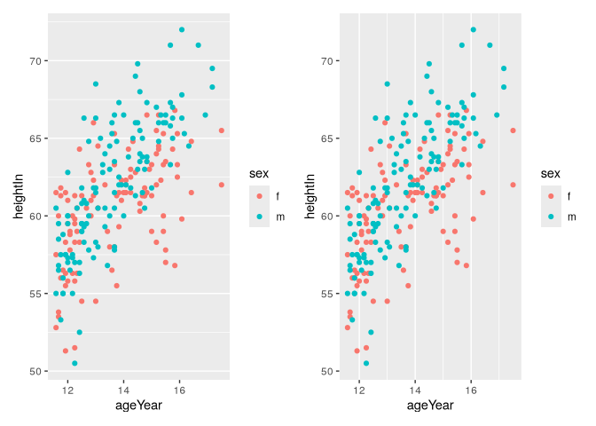

# 9 - Overall Appearance


``` r
library(tidyverse)
library(gcookbook)
library(patchwork)
```

[Source](https://r-graphics.org/)

# Overall appearance

## Title

``` r
hw_plot <- ggplot(heightweight, aes(x = ageYear, y = heightIn)) +
  geom_point()

p1 <- hw_plot +
  ggtitle("Age and Height of Schoolchildren")

p2 <- hw_plot +
  ggtitle("Age and Height\nof Schoolchildren")

p1 + p2
```


> `ggtitle()` is equivalent to `labs(title = "Something")`
>
> Add a subtitle

``` r
hw_plot +
  ggtitle("Age and Height of Schoolchildren",
          "11.5 to 17.5 years old")
```


> Moving the title inside the plot - 2 methods

``` r
p1 <- hw_plot +
  ggtitle("Age and Height of Schoolchildren") +
  theme(plot.title = element_text(vjust = -8))

p2 <- hw_plot +
  annotate("text", x = mean(range(heightweight$ageYear)), y = Inf,
           label = "Age and Height of Schoolchildren", 
           vjust = 1.5, size = 4.5)

p1 + p2
```



## Change appearence of text

> for theme elements, use `theme()`

``` r
p1 <- hw_plot +
  theme(axis.title.x = element_text(
    size = 16, lineheight = .9,
    family = "Times", face = "bold.italic", color = "red"
  ))
p2 <- hw_plot +
  ggtitle("Age and Height\nof Schoolchildren") +
  theme(plot.title = element_text(
    size = rel(1.5), lineheight = .9,
    family = "Times", face = "bold.italic", colour = "red"
  ))

p1 + p2
```



> for text geoms, use `geom_text()` or `annotate()`

``` r
p1 <- hw_plot +
  annotate("text", x = 15, y = 53, label = "Some text",
           size = 7, family = "Times", fontface = "bold.italic",
           color = "red")

p2 <- hw_plot +
  geom_text(aes(label = weightLb), size = 4, 
            family = "Times", color = "red")

p1 + p2
```



### Theme element properties text geoms

| Theme elements | Text geoms | Description |
|----|----|----|
| `family` | `family` | Helvetica, Times, Courier |
| `face` | `fontface` | `plain`, `bold`, `bold.italic` |
| `colour` | `colour` | Color (name or “\#RRGGBB”) |
| `size` | `size` | Font size (in points for theme elements; in mm for geoms) |
| `hjust` | `hjust` | Horizontal alignment: 0 = left, 0.5 = center, 1 = right |
| `vjust` | `vjust` | Vertical alignment: 0 = bottom, 0.5 = middle, 1 = top |
| `angle` | `angle` | Angle in degrees |
| `lineheight` | `lineheight` | Line spacing multiplier |

### Theme items controlled by `theme()`

| Element name | Description                                   |
|--------------|-----------------------------------------------|
| axis.title   | Appearance of axis labels on both axes        |
| axis.title.x | Appearance of x-axis label                    |
| axis.title.y | Appearance of y-axis label                    |
| axis.ticks   | Appearance of tick labels on both axes        |
| axis.ticks.x | Appearance of x tick labels                   |
| axis.ticks.y | Appearance of y tick labels                   |
| legend.title | Appearance of legend title                    |
| legend.text  | Appearance of legend items                    |
| plot.title   | Appearance of overall plot title              |
| strip.text   | Appearance of facet labels in both directions |
| strip.text.x | Appearance of horizontal facet labels         |
| strip.text.y | Appearance of vertical facet labels           |


## Using themes

> default is `theme_grey`

``` r
p1 <- hw_plot +
  theme_grey()

# Black-and-white theme
p2 <- hw_plot +
  theme_bw()

# Minimal theme without background annotations
p3 <- hw_plot +
  theme_minimal()

# Classic theme, with axis lines but no gridlines
p4 <- hw_plot +
  theme_classic()

(p1 + p2) / (p3 + p4)
```



``` r
hw_plot +
  theme_void()
```



> Adjust base font for included themes

``` r
hw_plot +
  theme_grey(base_size = 16, base_family = "Times")
```



## Change appearance of theme elements

``` r
hw_plot <- ggplot(heightweight, 
                  aes(x = ageYear, y = heightIn, colour = sex)) +
  geom_point()
```

> Plotting area options

``` r
p1 <- hw_plot +
  theme(
    panel.grid.major = element_line(color = "red"),
    panel.grid.minor = element_line(color = "pink", linetype = "dashed",
                                    size = 0.2),
    panel.background = element_rect(fill = "lightblue"),
    panel.border = element_rect(color = "blue", fill = NA, linewidth = 2)
  )
```

    Warning: The `size` argument of `element_line()` is deprecated as of ggplot2 3.4.0.
    ℹ Please use the `linewidth` argument instead.

> Legend options

``` r
p2 <- hw_plot +
  theme(
    legend.background = element_rect(fill = "grey85", color = "red",
                                     linewidth = 1),
    legend.title = element_text(color = "blue", face = "bold", size = 14),
    legend.text = element_text(color = "red"),
    legend.key = element_rect(color = "blue", size = 0.25)
  )
```

    Warning: The `size` argument of `element_rect()` is deprecated as of ggplot2 3.4.0.
    ℹ Please use the `linewidth` argument instead.

> Text item options

``` r
p3 <- hw_plot +
  ggtitle("Plot tile here") +
  theme(
    axis.title.x = element_text(colour = "red", size = 14),
    axis.text.x  = element_text(colour = "blue"),
    axis.title.y = element_text(colour = "green", size = 14, angle = 90),
    axis.text.y  = element_text(colour = "gold"),
    plot.title = element_text(colour = "red", size = 20, face = "bold")
  )
```

> Facet options

``` r
p4 <- hw_plot +
  facet_grid(sex ~ .) +
  theme(
    strip.background = element_rect(fill = "pink"),
    strip.text.y = element_text(size = 14, angle = -90, face = "bold")
  )

(p1 + p2) / (p3 + p4)
```



> Theme items that control text appearance

| Name | Description | Element type |
|----|----|----|
| text | All text elements | element_text() |
| rect | All rectangular elements | element_rect() |
| line | All line elements | element_line() |
| axis.line | Lines along axes | element_line() |
| axis.title | Appearance of both axis labels | element_text() |
| axis.title.x | X-axis label appearance | element_text() |
| axis.title.y | Y-axis label appearance | element_text() |
| axis.text | Appearance of tick labels on both axes | element_text() |
| axis.text.x | X-axis tick label appearance | element_text() |
| axis.text.y | Y-axis tick label appearance | element_text() |
| legend.background | Background of legend | element_rect() |
| legend.text | Legend item appearance | element_text() |
| legend.title | Legend title appearance | element_text() |
| legend.position | Position of the legend | “left”, “right”, “bottom”, “top”, or two-element numeric vector if you wish to place it inside the plot area (for more on legend placement, see Recipe 10.2) |
| panel.background | Background of plotting area | element_rect() |
| panel.border | Border around plotting area | element_rect(linetype=“dashed”) |
| panel.grid.major | Major grid lines element_line() |  |
| panel.grid.major.x | Major grid lines, vertical | element_line() |
| panel.grid.major.y | Major grid lines, horizontal | element_line() |
| panel.grid.minor | Minor grid lines | element_line() |
| panel.grid.minor.x | Minor grid lines, vertical | element_line() |
| panel.grid.minor.y | Minor grid lines, horizontal | element_line() |
| plot.background | Background of the entire plot | element_rect(fill = “white”, colour = NA) |
| plot.title | Title text appearance | element_text() |
| strip.background | Background of facet labels | element_rect() |
| strip.text | Text appearance for vertical and horizontal facet labels element_text() |  |
| strip.text.x | Text appearance for horizontal facet labels | element_text() |
| strip.text.y | Text appearance for vertical facet labels | element_text() |

## Creating themes

> Add elements to existing theme

``` r
mytheme <- theme_bw() +
  theme(
    text = element_text(color = "red"),
    axis.title = element_text(size = rel(1.25))
  )

ggplot(heightweight, aes(x = ageYear, y = heightIn)) +
  geom_point() +
  mytheme
```



## Hiding grid lines

``` r
hw_plot +
  theme(
    panel.grid.major = element_blank(),
    panel.grid.minor = element_blank()
  )
```



``` r
p1 <- hw_plot +
  theme(
    panel.grid.major.x = element_blank(),
    panel.grid.minor.x = element_blank()
  )

# Hide the horizontal grid lines (which intersect with the y-axis)
p2 <- hw_plot +
  theme(
    panel.grid.major.y = element_blank(),
    panel.grid.minor.y = element_blank()
  )

p1 + p2
```


