# 10 - Legends


``` r
library(tidyverse)
library(gcookbook)
library(patchwork)
```

[Source](https://r-graphics.org/)

# Legends

## Removing the legend

``` r
pg_plot <- ggplot(PlantGrowth, aes(x = group, y = weight, fill = group)) +
  geom_boxplot()

p1 <- pg_plot +
  guides(fill = "none")

# Another ways
p2 <- pg_plot +
  scale_fill_discrete(guide = "none")

p1 + p2
```

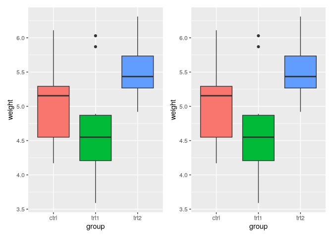

Commonly used scales include:

- `scale_fill_discrete()`
- `scale_fill_hue()`
- `scale_fill_manual()`
- `scale_fill_grey()`
- `scale_fill_brewer()`
- `scale_colour_discrete()`
- `scale_colour_hue()`
- `scale_colour_manual()`
- `scale_colour_grey()`
- `scale_colour_brewer()`
- `scale_shape_manual()`
- `scale_linetype()`

## Changing legend position

> `theme(legend.position)`

``` r
pg_plot <- ggplot(PlantGrowth, aes(x = group, y = weight, fill = group)) +
  geom_boxplot() +
  scale_fill_brewer(palette = "Pastel2")

p1 <- pg_plot +
  theme(legend.position = "top")

p2 <- pg_plot +
  theme(legend.position = "inside", legend.position.inside = c(.7, .7))

p1 + p2
```

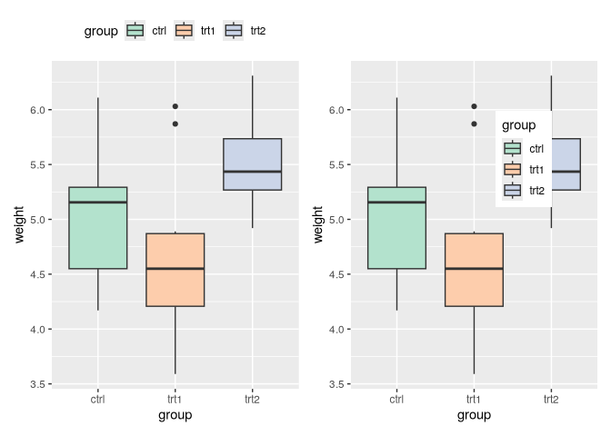

> Legend placement with justification

``` r
p1 <- pg_plot +
  theme(legend.position = c(1, 0), legend.justification = c(1, 0))
```

    Warning: A numeric `legend.position` argument in `theme()` was deprecated in ggplot2
    3.5.0.
    ℹ Please use the `legend.position.inside` argument of `theme()` instead.

``` r
p2 <- pg_plot +
  theme(legend.position = c(1, 1), legend.justification = c(1, 1))

p1 + p2
```

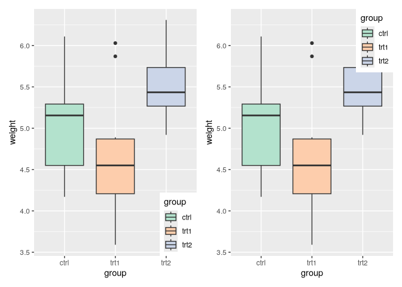

> Styling inside legends

``` r
p1 <- pg_plot +
  theme(legend.position = c(.85, .2)) +
  theme(legend.background = element_rect(fill = "white", colour = "black"))

p2 <- pg_plot +
  theme(legend.position = "inside", legend.position.inside = c(.85, .2)) +
  theme(legend.background = element_blank()) +
  theme(legend.key = element_blank())           # Remove border around each item

p1 + p2
```

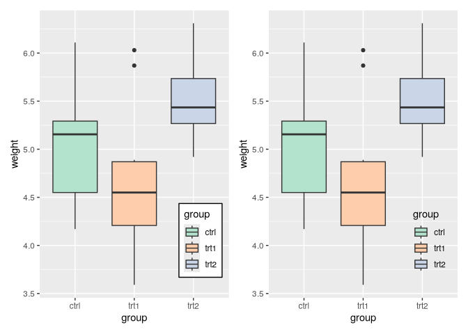

## Changing order of legend

``` r
p2 <- pg_plot +
  scale_fill_discrete(limits = c("trt1", "trt2", "ctrl"))

pg_plot + p2
```

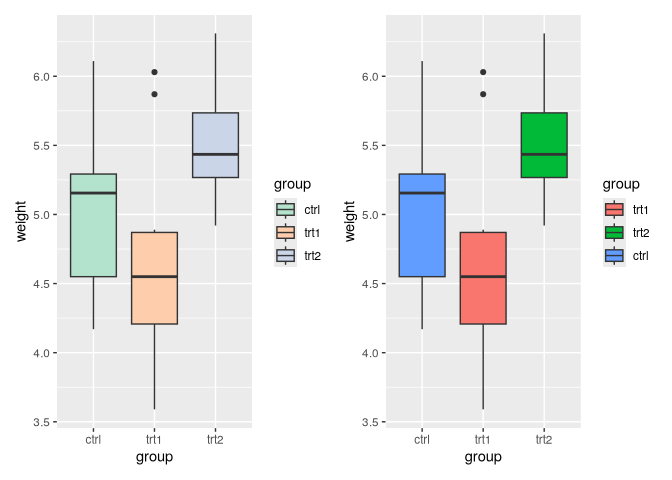

> Other palettes

``` r
p1 <- pg_plot +
  scale_fill_grey(start = .5, end = 1, limits = c("trt1", "trt2", "ctrl"))

p2 <- pg_plot +
  scale_fill_brewer(palette = "Pastel2", limits = c("trt1", "trt2", "ctrl"))

p1 + p2
```

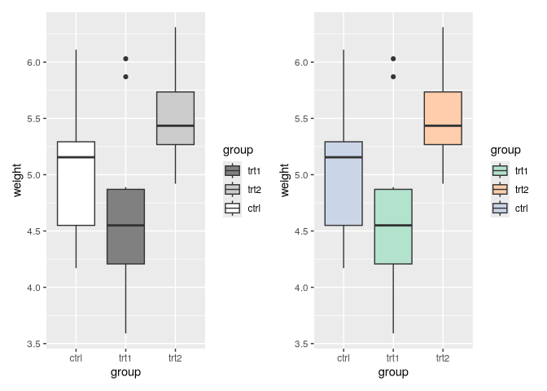

> Scales

    scale_fill_discrete()
    scale_fill_hue()
    scale_fill_manual()
    scale_fill_grey()
    scale_fill_brewer()
    scale_colour_discrete()
    scale_colour_hue()
    scale_colour_manual()
    scale_colour_grey()
    scale_colour_brewer()
    scale_shape_manual()
    scale_linetype()

## Reverse the order of items in Legend

``` r
p1 <- pg_plot +
  guides(fill = guide_legend(reverse = TRUE))

p2 <- pg_plot +
  scale_fill_hue(guide = guide_legend(reverse = TRUE))

p1 + p2
```

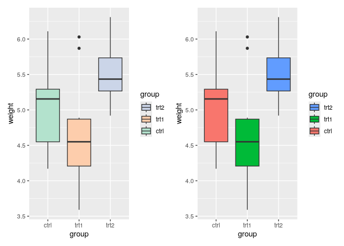

## Changing legend title

> `labs()`

``` r
p1 <- pg_plot + labs(fill = "Condition")

# or
p2 <- pg_plot + scale_fill_discrete(name = "Condition")

p1 + p2
```

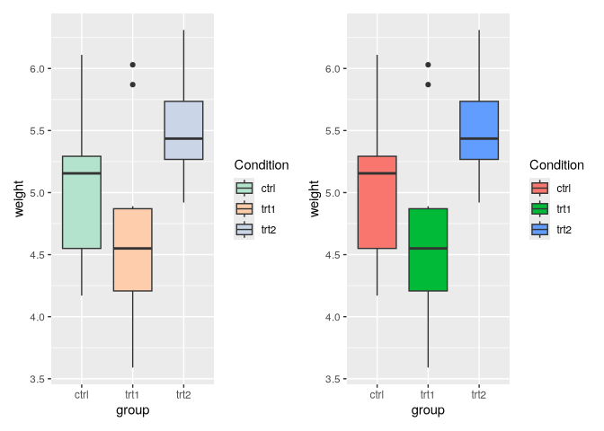

> Multiple variables/legends

``` r
hw_plot <- ggplot(heightweight, aes(x = ageYear, y = heightIn, colour = sex)) +
  geom_point(aes(size = weightLb)) +
  scale_size_continuous(range = c(1, 4))

p2 <- hw_plot +
  labs(color = "Male/Female", size = "Weight\n(pounds)")

hw_plot + p2
```

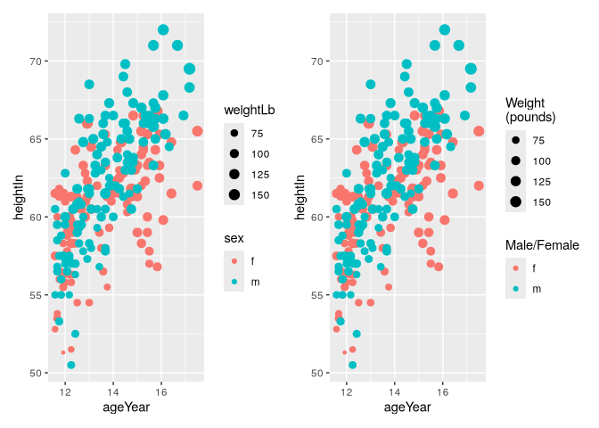

> if one variable is mapped to multiple aesthetics, default is to
> combine them. To give separate legends

``` r
hw_plot2 <- ggplot(heightweight, aes(x = ageYear, y = heightIn, shape = sex, colour = sex)) +
  geom_point()

p2 <- hw_plot2 +
  labs(shape = "Male/Female")

p3 <- hw_plot2 +
  labs(shape = "Male/Female", colour = "Male/Female")

p4 <- hw_plot +
  guides(fill = guide_legend(title = "Condition"))

(hw_plot2 + p2) / (p3 + p4)
```

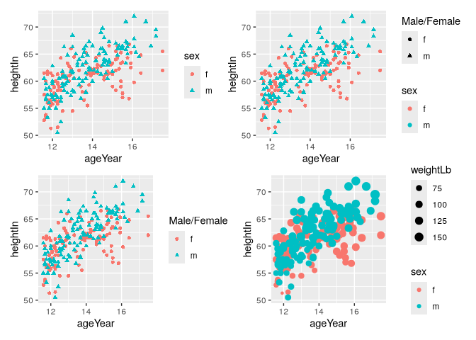

## Changing legend title appearance

``` r
p1 <- pg_plot +
  theme(legend.title = element_text(
    face = "italic",
    family = "Times",
    colour = "red",
    size = 14)
  )

# or
p2 <- pg_plot +
  guides(fill = guide_legend(title.theme = element_text(
    face = "italic",
    family = "times",
    colour = "red",
    size = 14))
  )

p1 + p2
```

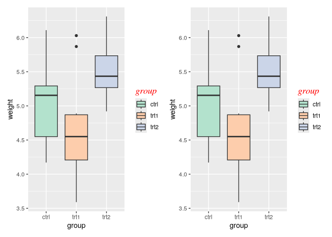

## Removing legend title

``` r
p1 <- ggplot(PlantGrowth, aes(x = group, y = weight, fill = group)) +
  geom_boxplot() +
  guides(fill = guide_legend(title = NULL))

# or
p2 <- ggplot(PlantGrowth, aes(x = group, y = weight, fill = group)) +
  geom_boxplot() +
  scale_fill_hue(guide = guide_legend(title = NULL))

p1 + p2
```

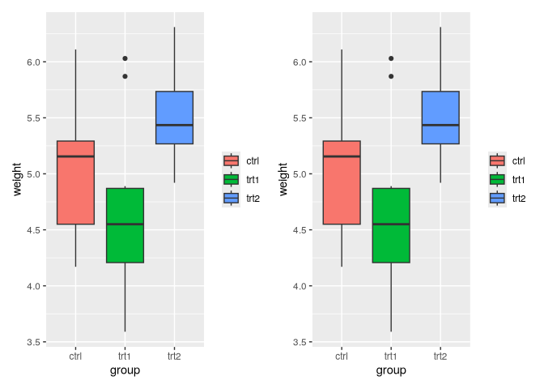

## Change labels in legend

``` r
pg_plot <- ggplot(PlantGrowth, aes(x = group, y = weight, fill = group)) +
  geom_boxplot()

# Change the legend labels
p2 <- pg_plot +
  scale_fill_discrete(labels = c("Control", "Treatment 1", "Treatment 2"))

pg_plot + p2
```

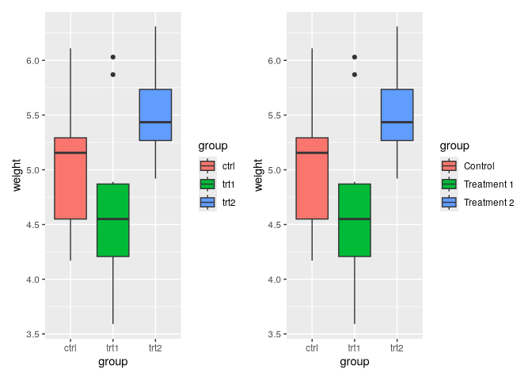

> Changing order

``` r
pg_plot +
  scale_fill_discrete(
    limits = c("trt1", "trt2", "ctrl"),
    labels = c("Treatment 1", "Treatment 2", "Control")
  )
```

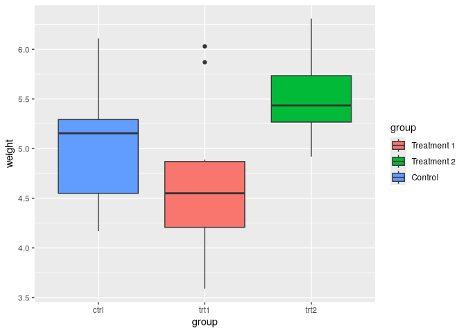

> if one variable is mapped to two aesthetics, default is to combine

``` r
hw_plot <- ggplot(heightweight, aes(x = ageYear, y = heightIn, shape = sex, colour = sex)) +
  geom_point()

# Change the labels for one scale
p2 <- hw_plot +
  scale_shape_discrete(labels = c("Female", "Male"))

# Change the labels for both scales
p3 <- hw_plot +
  scale_shape_discrete(labels = c("Female", "Male")) +
  scale_colour_discrete(labels = c("Female", "Male"))

hw_plot / (p2 + p3)
```

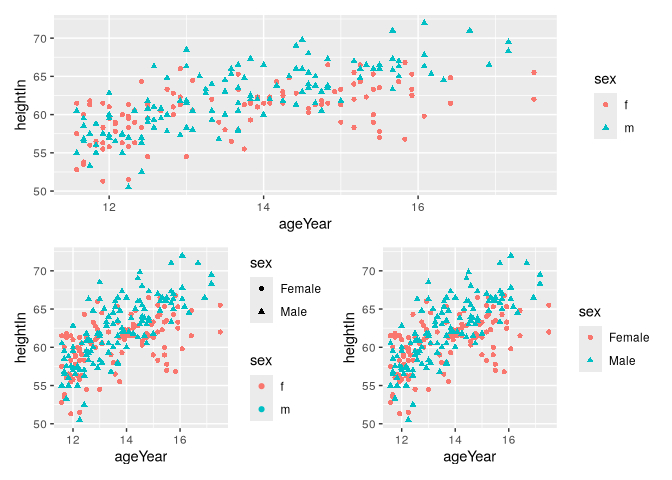

## Change appearance of legend labels

``` r
p1 <- pg_plot +
  theme(legend.text = element_text(
    face = "italic",
    family = "Times",
    colour = "red",
    size = 14)
  )

# or
p2 <- pg_plot +
  guides(fill = guide_legend(title.theme = element_text(
    face = "italic",
    family = "times",
    colour = "red",
    size = 14))
  )

p1 + p2
```

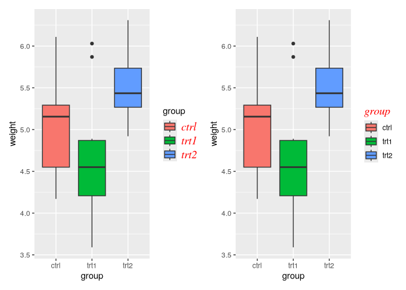

## Multi-line labels

``` r
p1 <- pg_plot +
  scale_fill_discrete(labels = c("Control", "Type 1\ntreatment", "Type 2\ntreatment"))
```

> modify legend for better spacing

``` r
library(grid)

p2 <- pg_plot +
  scale_fill_discrete(
    labels = c("Control", "Type 1\ntreatment", "Type 2\ntreatment")) +
  theme(legend.text = element_text(lineheight = .8), 
        legend.key.height = unit(1, "cm"))

p1 + p2
```

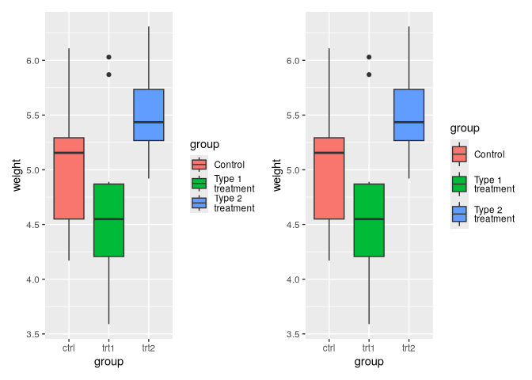
