# 11 - Facets


``` r
library(tidyverse)
library(gcookbook)
library(patchwork)
```

[Source](https://r-graphics.org/)

# Facets

``` r
mpg_plot <- ggplot(mpg, aes(x = displ, y = hwy)) +
  geom_point()

head(mpg)
```

    # A tibble: 6 × 11
      manufacturer model displ  year   cyl trans      drv     cty   hwy fl    class 
      <chr>        <chr> <dbl> <int> <int> <chr>      <chr> <int> <int> <chr> <chr> 
    1 audi         a4      1.8  1999     4 auto(l5)   f        18    29 p     compa…
    2 audi         a4      1.8  1999     4 manual(m5) f        21    29 p     compa…
    3 audi         a4      2    2008     4 manual(m6) f        20    31 p     compa…
    4 audi         a4      2    2008     4 auto(av)   f        21    30 p     compa…
    5 audi         a4      2.8  1999     6 auto(l5)   f        16    26 p     compa…
    6 audi         a4      2.8  1999     6 manual(m5) f        18    26 p     compa…

> Horizontal facet by cyl

``` r
mpg_plot +
  facet_grid(. ~ cyl)
```

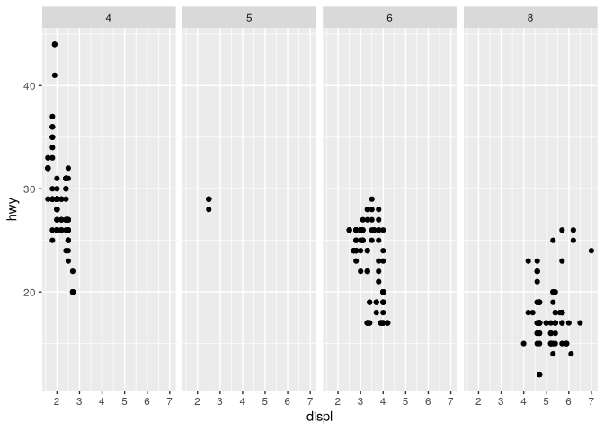

> Vertical facet by cyl

``` r
mpg_plot +
  facet_grid(cyl ~ .)
```

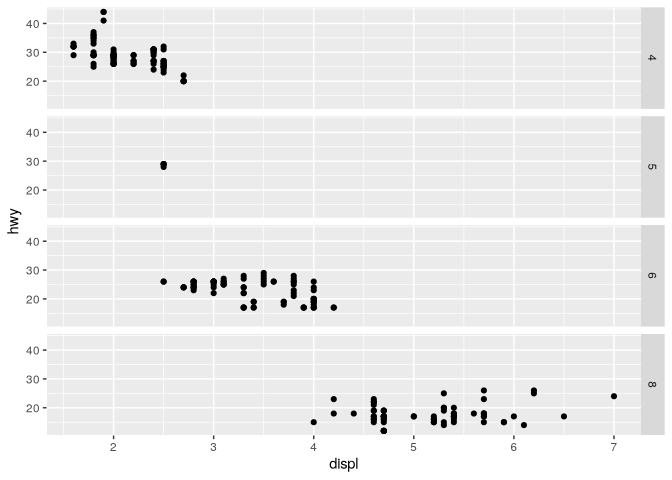

> Split by 2 variables

``` r
mpg_plot +
  facet_grid(drv ~ cyl)
```

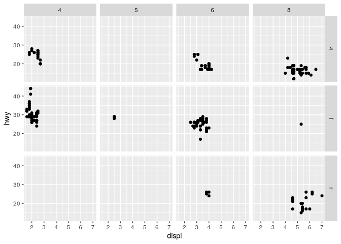

``` r
mpg_plot +
  facet_wrap( ~ class)
```

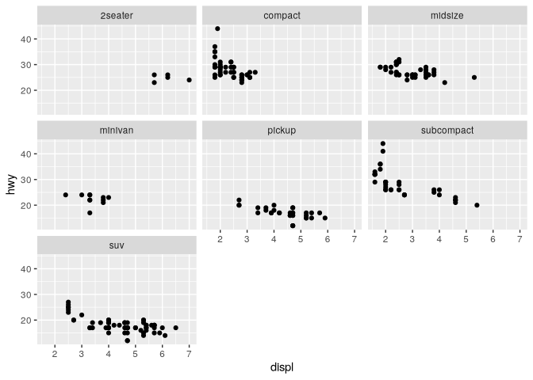

> Specify number of rows or columns

``` r
p1 <- mpg_plot +
  facet_wrap( ~ class, nrow = 2)

p2 <- mpg_plot +
  facet_wrap( ~ class, ncol = 4)

p1 / p2
```

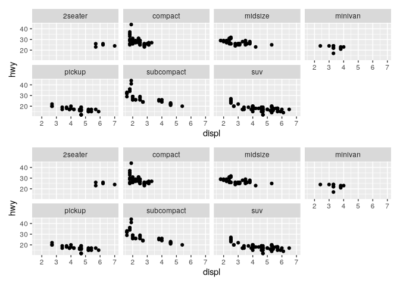

> use different axes for subplots

``` r
mpg_plot +
  facet_grid(drv ~ cyl, scales = "free_y")
```

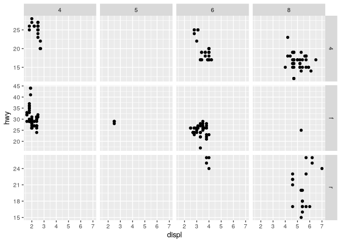

``` r
mpg_plot +
  facet_grid(drv ~ cyl, scales = "free")
```

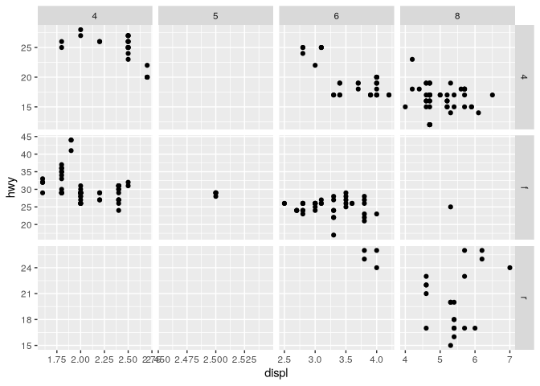

## Changing text of facet labels

``` r
mpg_mod <- mpg |> 
  mutate(drv = recode(drv, "4" = "4wd", "f" = "Fron", "r" = "Rear"))

ggplot(mpg_mod, aes(x = displ, y = hwy)) +
  geom_point() +
  facet_grid(drv ~ .)
```

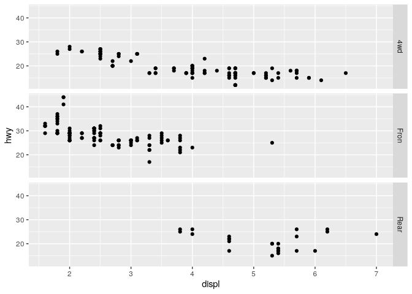

> label_both() to show variable name and value

``` r
ggplot(mpg_mod, aes(x = displ, y = hwy)) +
  geom_point() +
  facet_grid(drv ~ ., labeller = label_both)
```

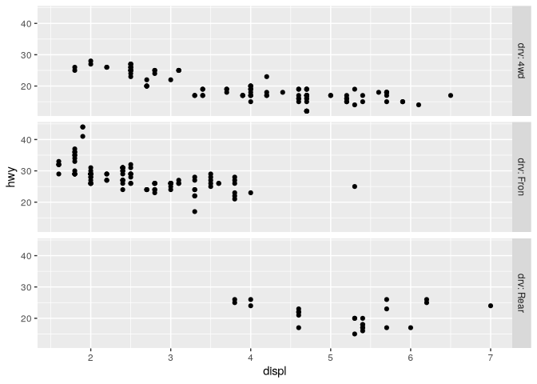

> `label_parsed()` for math expressiong

``` r
mpg_mod <- mpg |> 
  mutate(drv = recode(drv,
    "4" = "4^{wd}",
    "f" = "- Front %.% e^{pi * i}",
    "r" = "4^{wd} - Front"
  ))

ggplot(mpg_mod, aes(x = displ, y = hwy)) +
  geom_point() +
  facet_grid(drv ~ ., labeller = label_parsed)
```

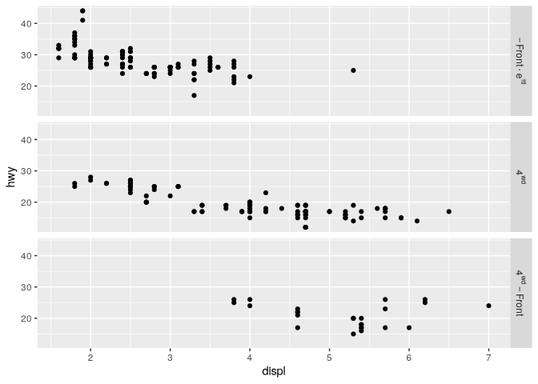

## Changing appearance of facet labels and headers

``` r
ggplot(cabbage_exp, aes(x = Cultivar, y = Weight)) +
  geom_col() +
  facet_grid(. ~ Date) +
  theme(
    strip.text = element_text(face = "bold", size = rel(1.5)),
    strip.background = element_rect(fill = "lightblue", colour = "black", size = 1)
  )
```

    Warning: The `size` argument of `element_rect()` is deprecated as of ggplot2 3.4.0.
    ℹ Please use the `linewidth` argument instead.

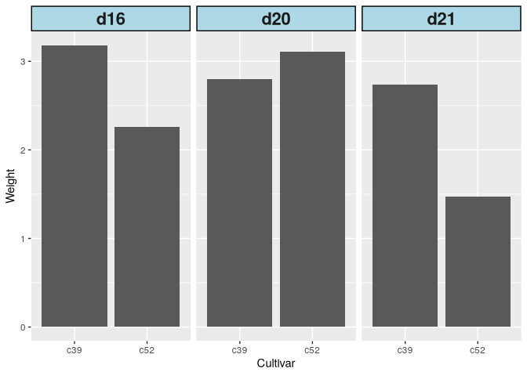
