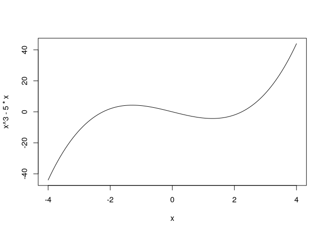

# 2-QuicklyExploringData


# Quick exploration

## Scatter plot

``` r
library(tidyverse)
```

    ── Attaching core tidyverse packages ──────────────────────── tidyverse 2.0.0 ──
    ✔ dplyr     1.1.4     ✔ readr     2.1.5
    ✔ forcats   1.0.0     ✔ stringr   1.5.1
    ✔ ggplot2   3.5.1     ✔ tibble    3.2.1
    ✔ lubridate 1.9.4     ✔ tidyr     1.3.1
    ✔ purrr     1.0.4     
    ── Conflicts ────────────────────────────────────────── tidyverse_conflicts() ──
    ✖ dplyr::filter() masks stats::filter()
    ✖ dplyr::lag()    masks stats::lag()
    ℹ Use the conflicted package (<http://conflicted.r-lib.org/>) to force all conflicts to become errors

``` r
library(gcookbook)
library(patchwork)
```

> Base graphics

``` r
plot(mtcars$wt, mtcars$mpg)
```


> With ggplot

``` r
ggplot(mtcars, aes(x = wt, y = mpg)) +
  geom_point()
```


## Line graph

> with R

``` r
plot(pressure$temperature, pressure$pressure, type = "l")
```


``` r
plot(pressure$temperature, pressure$pressure, type = "l")
points(pressure$temperature, pressure$pressure)

lines(pressure$temperature, pressure$pressure/2, col = "red")
points(pressure$temperature, pressure$pressure/2, col = "red")
```


> With ggplot

``` r
pressure |> 
  ggplot(aes(x = temperature, y = pressure)) +
  geom_line() +
  geom_point()
```


## Bar graph

> with R

``` r
barplot(BOD$demand, names.arg = BOD$Time)
```


> Counts

``` r
table(mtcars$cyl) |> barplot()
```


``` r
continuous_var_plot <- ggplot(BOD, aes(x = Time, y = demand)) +
  geom_col()
discretet_var_plot <- ggplot(BOD, aes(x = factor(Time), y = demand)) +
  geom_col()
continuous_var_plot + discretet_var_plot
```


> Counting number of rows

``` r
continuous_count_plot <- ggplot(mtcars, aes(x = cyl)) +
  geom_bar()
discrete_count_plot <- ggplot(mtcars, aes(x = factor(cyl))) +
  geom_bar()
continuous_count_plot + discrete_count_plot
```


## Histogram

> With R

``` r
hist(mtcars$mpg, breaks = 10)
```


> with ggplot

``` r
ggplot(mtcars, aes(x = mpg)) +
  geom_histogram(binwidth = 4)
```


## Boxplot

> R automatically creates a boxplot if x is a factor

``` r
plot(ToothGrowth$supp, ToothGrowth$len)
```


> or with `boxplot()`

``` r
boxplot(len ~ supp, data = ToothGrowth)
```


``` r
boxplot(len ~ supp + dose, data = ToothGrowth)
```


> With ggplot

``` r
simple_box <- ggplot(ToothGrowth, aes(x = supp, y = len)) +
  geom_boxplot()
multi_var_box <- ggplot(ToothGrowth, aes(x = interaction(supp, dose),
                                         y = len)) +
  geom_boxplot()
simple_box + multi_var_box
```


## Function curve

> with R

``` r
curve(x^3 - 5*x, from = -4, to = 4)
```



``` r
func <- function(xvar) {
  1 / (1 + exp(-xvar + 10))
}

curve(func(x), from = 0, to = 20)
curve(1 - func(x), add = T, col = "red")
```


> With ggplot

``` r
ggplot(data.frame(x = c(0, 20)), aes(x = x)) +
  stat_function(fun = func, geom = "line")
```


