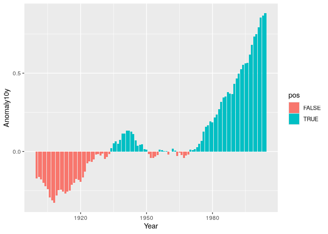

# Bar Graphs


``` r
library(tidyverse)
```

    ── Attaching core tidyverse packages ──────────────────────── tidyverse 2.0.0 ──
    ✔ dplyr     1.1.4     ✔ readr     2.1.5
    ✔ forcats   1.0.0     ✔ stringr   1.5.1
    ✔ ggplot2   3.5.1     ✔ tibble    3.2.1
    ✔ lubridate 1.9.4     ✔ tidyr     1.3.1
    ✔ purrr     1.0.4     
    ── Conflicts ────────────────────────────────────────── tidyverse_conflicts() ──
    ✖ dplyr::filter() masks stats::filter()
    ✖ dplyr::lag()    masks stats::lag()
    ℹ Use the conflicted package (<http://conflicted.r-lib.org/>) to force all conflicts to become errors

``` r
library(gcookbook)
library(patchwork)
```

# Bar graphs

## Basic

``` r
str(BOD)
```

    'data.frame':   6 obs. of  2 variables:
     $ Time  : num  1 2 3 4 5 7
     $ demand: num  8.3 10.3 19 16 15.6 19.8
     - attr(*, "reference")= chr "A1.4, p. 270"

``` r
cont_var_col <- ggplot(BOD, aes(x = Time, y = demand)) +
  geom_col()
disc_var_col <- ggplot(BOD, aes(x = factor(Time), y = demand)) +
  geom_col(fill = "lightblue", color = "black")
cont_var_col + disc_var_col
```


## Grouping by second variable

``` r
cabbage_exp
```

      Cultivar Date Weight        sd  n         se
    1      c39  d16   3.18 0.9566144 10 0.30250803
    2      c39  d20   2.80 0.2788867 10 0.08819171
    3      c39  d21   2.74 0.9834181 10 0.31098410
    4      c52  d16   2.26 0.4452215 10 0.14079141
    5      c52  d20   3.11 0.7908505 10 0.25008887
    6      c52  d21   1.47 0.2110819 10 0.06674995

``` r
ggplot(cabbage_exp, aes(x = Date, y = Weight, fill = Cultivar)) +
  geom_col(position = "dodge", color = "black")
```


``` r
ggplot(cabbage_exp, aes(x = Date, y = Weight, fill = Cultivar)) +
  geom_col()
```


``` r
ggplot(cabbage_exp, aes(x = Date, y = Weight, fill = Cultivar)) +
  geom_col(position = "dodge", color = "black") +
  scale_fill_brewer(palette = "Pastel1")
```


## Counts

``` r
ggplot(diamonds, aes(x = cut)) +
  geom_bar()
```


``` r
discrete_values <- ggplot(diamonds, aes(x = carat)) +
  geom_bar()
range_of_values <- ggplot(diamonds, aes(x = carat)) +
  geom_histogram()
discrete_values + range_of_values
```

    `stat_bin()` using `bins = 30`. Pick better value with `binwidth`.


## Colors and reorder

``` r
uspopchange
```

                State Abb        Region Change
    1         Alabama  AL         South    7.5
    2          Alaska  AK          West   13.3
    3         Arizona  AZ          West   24.6
    4        Arkansas  AR         South    9.1
    5      California  CA          West   10.0
    6        Colorado  CO          West   16.9
    7     Connecticut  CT     Northeast    4.9
    8        Delaware  DE         South   14.6
    10        Florida  FL         South   17.6
    11        Georgia  GA         South   18.3
    12         Hawaii  HI          West   12.3
    13          Idaho  ID          West   21.1
    14       Illinois  IL North Central    3.3
    15        Indiana  IN North Central    6.6
    16           Iowa  IA North Central    4.1
    17         Kansas  KS North Central    6.1
    18       Kentucky  KY         South    7.4
    19      Louisiana  LA         South    1.4
    20          Maine  ME     Northeast    4.2
    21       Maryland  MD         South    9.0
    22  Massachusetts  MA     Northeast    3.1
    23       Michigan  MI North Central   -0.6
    24      Minnesota  MN North Central    7.8
    25    Mississippi  MS         South    4.3
    26       Missouri  MO North Central    7.0
    27        Montana  MT          West    9.7
    28       Nebraska  NE North Central    6.7
    29         Nevada  NV          West   35.1
    30  New Hampshire  NH     Northeast    6.5
    31     New Jersey  NJ     Northeast    4.5
    32     New Mexico  NM          West   13.2
    33       New York  NY     Northeast    2.1
    34 North Carolina  NC         South   18.5
    35   North Dakota  ND North Central    4.7
    36           Ohio  OH North Central    1.6
    37       Oklahoma  OK         South    8.7
    38         Oregon  OR          West   12.0
    39   Pennsylvania  PA     Northeast    3.4
    40   Rhode Island  RI     Northeast    0.4
    41 South Carolina  SC         South   15.3
    42   South Dakota  SD North Central    7.9
    43      Tennessee  TN         South   11.5
    44          Texas  TX         South   20.6
    45           Utah  UT          West   23.8
    46        Vermont  VT     Northeast    2.8
    47       Virginia  VA         South   13.0
    48     Washington  WA          West   14.1
    49  West Virginia  WV         South    2.5
    50      Wisconsin  WI North Central    6.0
    51        Wyoming  WY          West   14.1

``` r
upc <- uspopchange |> 
  arrange(desc(Change)) |> 
  slice(1:10)
ggplot(upc, aes(x = Abb, y = Change, fill = Region)) +
  geom_col(color = "black") +
  scale_fill_manual(values = c("#669933", "#FFCC66")) +
  xlab("State")
```


``` r
ggplot(upc, aes(x = reorder(Abb, Change), y = Change, fill = Region)) +
  geom_col(color = "black") +
  scale_fill_manual(values = c("#669933", "#FFCC66")) +
  xlab("State")
```


## Color negative and positive

``` r
climate_sub <- climate |> 
  filter(Source == "Berkeley" & Year >= 1900) |> 
  mutate(pos = Anomaly10y >= 0)
climate_sub
```

          Source Year Anomaly1y Anomaly5y Anomaly10y Unc10y   pos
    1   Berkeley 1900        NA        NA     -0.171  0.108 FALSE
    2   Berkeley 1901        NA        NA     -0.162  0.109 FALSE
    3   Berkeley 1902        NA        NA     -0.177  0.108 FALSE
    4   Berkeley 1903        NA        NA     -0.199  0.104 FALSE
    5   Berkeley 1904        NA        NA     -0.223  0.105 FALSE
    6   Berkeley 1905        NA        NA     -0.241  0.107 FALSE
    7   Berkeley 1906        NA        NA     -0.294  0.106 FALSE
    8   Berkeley 1907        NA        NA     -0.312  0.105 FALSE
    9   Berkeley 1908        NA        NA     -0.328  0.103 FALSE
    10  Berkeley 1909        NA        NA     -0.281  0.101 FALSE
    11  Berkeley 1910        NA        NA     -0.247  0.099 FALSE
    12  Berkeley 1911        NA        NA     -0.243  0.097 FALSE
    13  Berkeley 1912        NA        NA     -0.257  0.100 FALSE
    14  Berkeley 1913        NA        NA     -0.268  0.100 FALSE
    15  Berkeley 1914        NA        NA     -0.257  0.097 FALSE
    16  Berkeley 1915        NA        NA     -0.249  0.095 FALSE
    17  Berkeley 1916        NA        NA     -0.214  0.096 FALSE
    18  Berkeley 1917        NA        NA     -0.201  0.096 FALSE
    19  Berkeley 1918        NA        NA     -0.176  0.096 FALSE
    20  Berkeley 1919        NA        NA     -0.182  0.097 FALSE
    21  Berkeley 1920        NA        NA     -0.193  0.097 FALSE
    22  Berkeley 1921        NA        NA     -0.167  0.098 FALSE
    23  Berkeley 1922        NA        NA     -0.128  0.096 FALSE
    24  Berkeley 1923        NA        NA     -0.075  0.097 FALSE
    25  Berkeley 1924        NA        NA     -0.064  0.098 FALSE
    26  Berkeley 1925        NA        NA     -0.065  0.100 FALSE
    27  Berkeley 1926        NA        NA     -0.050  0.100 FALSE
    28  Berkeley 1927        NA        NA     -0.020  0.099 FALSE
    29  Berkeley 1928        NA        NA     -0.018  0.099 FALSE
    30  Berkeley 1929        NA        NA     -0.026  0.100 FALSE
    31  Berkeley 1930        NA        NA     -0.014  0.101 FALSE
    32  Berkeley 1931        NA        NA     -0.047  0.098 FALSE
    33  Berkeley 1932        NA        NA     -0.035  0.096 FALSE
    34  Berkeley 1933        NA        NA     -0.017  0.093 FALSE
    35  Berkeley 1934        NA        NA      0.020  0.092  TRUE
    36  Berkeley 1935        NA        NA      0.053  0.089  TRUE
    37  Berkeley 1936        NA        NA      0.063  0.085  TRUE
    38  Berkeley 1937        NA        NA      0.048  0.081  TRUE
    39  Berkeley 1938        NA        NA      0.073  0.079  TRUE
    40  Berkeley 1939        NA        NA      0.113  0.076  TRUE
    41  Berkeley 1940        NA        NA      0.113  0.072  TRUE
    42  Berkeley 1941        NA        NA      0.134  0.071  TRUE
    43  Berkeley 1942        NA        NA      0.134  0.069  TRUE
    44  Berkeley 1943        NA        NA      0.127  0.070  TRUE
    45  Berkeley 1944        NA        NA      0.111  0.068  TRUE
    46  Berkeley 1945        NA        NA      0.072  0.066  TRUE
    47  Berkeley 1946        NA        NA      0.035  0.066  TRUE
    48  Berkeley 1947        NA        NA      0.042  0.064  TRUE
    49  Berkeley 1948        NA        NA      0.045  0.063  TRUE
    50  Berkeley 1949        NA        NA      0.013  0.062  TRUE
    51  Berkeley 1950        NA        NA      0.010  0.058  TRUE
    52  Berkeley 1951        NA        NA     -0.017  0.054 FALSE
    53  Berkeley 1952        NA        NA     -0.040  0.047 FALSE
    54  Berkeley 1953        NA        NA     -0.040  0.043 FALSE
    55  Berkeley 1954        NA        NA     -0.032  0.038 FALSE
    56  Berkeley 1955        NA        NA     -0.022  0.035 FALSE
    57  Berkeley 1956        NA        NA      0.012  0.031  TRUE
    58  Berkeley 1957        NA        NA      0.007  0.028  TRUE
    59  Berkeley 1958        NA        NA      0.002  0.027  TRUE
    60  Berkeley 1959        NA        NA      0.002  0.026  TRUE
    61  Berkeley 1960        NA        NA     -0.019  0.026 FALSE
    62  Berkeley 1961        NA        NA     -0.001  0.021 FALSE
    63  Berkeley 1962        NA        NA      0.017  0.018  TRUE
    64  Berkeley 1963        NA        NA      0.004  0.016  TRUE
    65  Berkeley 1964        NA        NA     -0.028  0.018 FALSE
    66  Berkeley 1965        NA        NA     -0.006  0.017 FALSE
    67  Berkeley 1966        NA        NA     -0.024  0.017 FALSE
    68  Berkeley 1967        NA        NA     -0.041  0.019 FALSE
    69  Berkeley 1968        NA        NA     -0.025  0.020 FALSE
    70  Berkeley 1969        NA        NA     -0.019  0.024 FALSE
    71  Berkeley 1970        NA        NA      0.010  0.026  TRUE
    72  Berkeley 1971        NA        NA      0.007  0.022  TRUE
    73  Berkeley 1972        NA        NA      0.015  0.015  TRUE
    74  Berkeley 1973        NA        NA      0.028  0.012  TRUE
    75  Berkeley 1974        NA        NA      0.049  0.014  TRUE
    76  Berkeley 1975        NA        NA      0.068  0.012  TRUE
    77  Berkeley 1976        NA        NA      0.128  0.011  TRUE
    78  Berkeley 1977        NA        NA      0.158  0.012  TRUE
    79  Berkeley 1978        NA        NA      0.167  0.013  TRUE
    80  Berkeley 1979        NA        NA      0.193  0.012  TRUE
    81  Berkeley 1980        NA        NA      0.186  0.016  TRUE
    82  Berkeley 1981        NA        NA      0.217  0.016  TRUE
    83  Berkeley 1982        NA        NA      0.235  0.014  TRUE
    84  Berkeley 1983        NA        NA      0.270  0.014  TRUE
    85  Berkeley 1984        NA        NA      0.318  0.014  TRUE
    86  Berkeley 1985        NA        NA      0.344  0.013  TRUE
    87  Berkeley 1986        NA        NA      0.352  0.012  TRUE
    88  Berkeley 1987        NA        NA      0.380  0.011  TRUE
    89  Berkeley 1988        NA        NA      0.370  0.013  TRUE
    90  Berkeley 1989        NA        NA      0.366  0.017  TRUE
    91  Berkeley 1990        NA        NA      0.433  0.019  TRUE
    92  Berkeley 1991        NA        NA      0.467  0.018  TRUE
    93  Berkeley 1992        NA        NA      0.496  0.017  TRUE
    94  Berkeley 1993        NA        NA      0.526  0.019  TRUE
    95  Berkeley 1994        NA        NA      0.554  0.020  TRUE
    96  Berkeley 1995        NA        NA      0.563  0.019  TRUE
    97  Berkeley 1996        NA        NA      0.565  0.022  TRUE
    98  Berkeley 1997        NA        NA      0.618  0.022  TRUE
    99  Berkeley 1998        NA        NA      0.680  0.023  TRUE
    100 Berkeley 1999        NA        NA      0.734  0.025  TRUE
    101 Berkeley 2000        NA        NA      0.748  0.026  TRUE
    102 Berkeley 2001        NA        NA      0.793  0.027  TRUE
    103 Berkeley 2002        NA        NA      0.856  0.028  TRUE
    104 Berkeley 2003        NA        NA      0.869  0.028  TRUE
    105 Berkeley 2004        NA        NA      0.884  0.029  TRUE

``` r
ggplot(climate_sub, aes(x = Year, y = Anomaly10y, fill = pos)) +
  geom_col()
```



``` r
ggplot(climate_sub, aes(x = Year, y = Anomaly10y, fill = pos)) +
  geom_col(color = "black", size = 0.25) +
  scale_fill_manual(values = c("#CCEEFF", "#FFDDDD"), guide = "none")
```

    Warning: Using `size` aesthetic for lines was deprecated in ggplot2 3.4.0.
    ℹ Please use `linewidth` instead.


## Adjusting width and spacing

``` r
def_bars <- ggplot(pg_mean, aes(x = group, y = weight)) +
  geom_col()
narrow_bars <- ggplot(pg_mean, aes(x = group, y = weight)) +
  geom_col(width = 0.5)
wider_bars <- ggplot(pg_mean, aes(x = group, y = weight)) +
  geom_col(width = 1)
def_bars /  (narrow_bars + wider_bars)
```


``` r
grouped_narrow <- ggplot(cabbage_exp, aes(x = Date, y = Weight, fill = Cultivar)) +
  geom_col(width = 0.5, position = "dodge")
grouped_with_space <- ggplot(cabbage_exp, aes(x = Date, y = Weight, fill = Cultivar)) +
  geom_col(width = 0.5, position = position_dodge(0.7))
grouped_narrow + grouped_with_space
```


## Stacked bar graphs

``` r
ggplot(cabbage_exp, aes(x = Date, y = Weight, fill = Cultivar)) +
  geom_col()
```


``` r
ggplot(cabbage_exp, aes(x = Date, y = Weight, fill = Cultivar)) +
  geom_col() +
  guides(fill = guide_legend(reverse = TRUE))
```


``` r
ggplot(cabbage_exp, aes(x = Date, y = Weight, fill = Cultivar)) +
  geom_col(position = position_stack(reverse = TRUE)) +
  guides(fill = guide_legend(reverse = TRUE))
```


## Proportional stacked

``` r
ggplot(cabbage_exp, aes(x = Date, y = Weight, fill = Cultivar)) +
  geom_col(position = "fill", color = "black") +
  scale_y_continuous(labels = scales::percent) +
  scale_fill_brewer(palette = "Pastel1")
```


> Manually calculate percentages

``` r
ce <- cabbage_exp |> 
  group_by(Date) |> 
  mutate(percent_weight = Weight / sum(Weight) * 100)
ce
```

    # A tibble: 6 × 7
    # Groups:   Date [3]
      Cultivar Date  Weight    sd     n     se percent_weight
      <fct>    <fct>  <dbl> <dbl> <int>  <dbl>          <dbl>
    1 c39      d16     3.18 0.957    10 0.303            58.5
    2 c39      d20     2.8  0.279    10 0.0882           47.4
    3 c39      d21     2.74 0.983    10 0.311            65.1
    4 c52      d16     2.26 0.445    10 0.141            41.5
    5 c52      d20     3.11 0.791    10 0.250            52.6
    6 c52      d21     1.47 0.211    10 0.0667           34.9

``` r
ggplot(ce, aes(x = Date, y = percent_weight, fill = Cultivar)) +
  geom_col()
```


## Labels

``` r
below_top <- ggplot(cabbage_exp, aes(x = interaction(Date, Cultivar), y = Weight)) +
  geom_col() +
  geom_text(aes(label = Weight), vjust = 1.5, colour = "white")

above_top <- ggplot(cabbage_exp, aes(x = interaction(Date, Cultivar), y = Weight)) +
  geom_col() +
  geom_text(aes(label = Weight), vjust = -0.2)
below_top + above_top
```


> Adding “count” labels

``` r
ggplot(mtcars, aes(x = factor(cyl))) +
  geom_bar() +
  geom_text(aes(label = ..count..), stat = "count",
            vjust = 1.5, color = "white")
```

    Warning: The dot-dot notation (`..count..`) was deprecated in ggplot2 3.4.0.
    ℹ Please use `after_stat(count)` instead.


> Adjust y limits to avoid going above or too close to the top of the
> graph

``` r
p1 <- ggplot(cabbage_exp, aes(x = interaction(Date, Cultivar), y = Weight)) +
  geom_col() +
  geom_text(aes(label = Weight, vjust = -0.2))
p2 <- ggplot(cabbage_exp, aes(x = interaction(Date, Cultivar), y = Weight)) +
  geom_col() +
  geom_text(aes(label = Weight, vjust = -0.2)) +
  ylim(0, max(cabbage_exp$Weight) * 1.05)
# or
p3 <- ggplot(cabbage_exp, aes(x = interaction(Date, Cultivar), y = Weight)) +
  geom_col() +
  geom_text(aes(y = Weight + 0.1, label = Weight))
p1 / (p2 + p3)
```


> For grouped bar graphs, specify `position = position_dodge()` and
> possibly the size.

``` r
ggplot(cabbage_exp, aes(x = Date, y = Weight, fill = Cultivar)) +
  geom_col(position = "dodge") +
  geom_text(aes(label = Weight),
            color = "white", size = 3,
            vjust = 1.5, position = position_dodge(.9))
```


> For stacked bar graphs, need to calculate cumulative sum

``` r
ce <- cabbage_exp |> 
  arrange(Date, rev(Cultivar)) |> 
  group_by(Date) |> 
  mutate(label_y = cumsum(Weight))

ce
```

    # A tibble: 6 × 7
    # Groups:   Date [3]
      Cultivar Date  Weight    sd     n     se label_y
      <fct>    <fct>  <dbl> <dbl> <int>  <dbl>   <dbl>
    1 c52      d16     2.26 0.445    10 0.141     2.26
    2 c39      d16     3.18 0.957    10 0.303     5.44
    3 c52      d20     3.11 0.791    10 0.250     3.11
    4 c39      d20     2.8  0.279    10 0.0882    5.91
    5 c52      d21     1.47 0.211    10 0.0667    1.47
    6 c39      d21     2.74 0.983    10 0.311     4.21

``` r
ggplot(ce, aes(x = Date, y = Weight, fill = Cultivar)) +
  geom_col() +
  geom_text(aes(y = label_y, label = Weight),
            vjust = 1.5, color = "white")
```


> When using labels, changes to the stacking order are best done by
> modifying the order of levels in the factor (see Recipe
> [15.8](https://r-graphics.org/RECIPE-DATAPREP-FACTOR-REORDER.html#RECIPE-DATAPREP-FACTOR-REORDER))
> before taking the cumulative sum.
>
> Place labels in the middle of each bar

``` r
ce <- cabbage_exp |> 
  arrange(Date, rev(Cultivar)) |> 
  group_by(Date) |> 
  mutate(label_y = cumsum(Weight) - 0.5 * Weight)

ggplot(ce, aes(x = Date, y = Weight, fill = Cultivar)) +
  geom_col() +
  geom_text(aes(y = label_y, label = Weight), color = "white")
```


> Formatting

``` r
ggplot(ce, aes(x = Date, y = Weight, fill = Cultivar)) +
  geom_col(color = "black") +
  geom_text(aes(y = label_y, label = paste(format(Weight, nsmall = 2), "kg")),
            size = 4) +
  scale_fill_brewer(palette = "Pastel1")
```


## Cleveland dot plot - alternative to bar graph

``` r
tophit <- tophitters2001[1:25,]

ggplot(tophit, aes(x = avg, y = name)) +
  geom_point()
```


``` r
str(tophit)
```

    'data.frame':   25 obs. of  26 variables:
     $ id   : Factor w/ 144 levels "abreubo01","alfoned01",..: 138 128 41 3 59 4 13 17 24 69 ...
     $ first: chr  "Larry" "Ichiro" "Jason" "Roberto" ...
     $ last : chr  "Walker" "Suzuki" "Giambi" "Alomar" ...
     $ name : chr  "Larry Walker" "Ichiro Suzuki" "Jason Giambi" "Roberto Alomar" ...
     $ year : int  2001 2001 2001 2001 2001 2001 2001 2001 2001 2001 ...
     $ stint: int  1 1 1 1 1 1 1 1 1 1 ...
     $ team : Factor w/ 30 levels "ANA","ARI","ATL",..: 10 25 21 9 10 13 13 25 29 3 ...
     $ lg   : Factor w/ 2 levels "AL","NL": 2 1 1 1 2 2 2 1 1 2 ...
     $ g    : int  142 157 154 157 159 136 156 158 133 159 ...
     $ ab   : int  497 692 520 575 587 513 577 623 463 572 ...
     $ r    : int  107 127 109 113 132 79 110 118 77 113 ...
     $ h    : int  174 242 178 193 197 170 191 206 153 189 ...
     $ 2b   : int  35 34 47 34 54 31 55 37 31 33 ...
     $ 3b   : int  3 8 2 12 2 1 5 3 5 5 ...
     $ hr   : int  38 8 38 20 49 27 34 37 11 38 ...
     $ rbi  : int  123 69 120 100 146 108 126 141 54 102 ...
     $ sb   : int  14 56 2 30 7 5 7 5 15 9 ...
     $ cs   : int  5 14 0 6 5 1 9 5 5 10 ...
     $ bb   : int  82 30 129 80 98 57 92 40 39 98 ...
     $ so   : int  103 53 83 71 104 57 121 110 55 82 ...
     $ ibb  : int  6 10 24 5 15 14 5 5 3 20 ...
     $ hbp  : int  14 8 13 4 5 3 13 9 8 2 ...
     $ sh   : int  0 4 0 9 1 0 0 5 1 0 ...
     $ sf   : int  8 4 9 9 5 8 6 13 1 5 ...
     $ gidp : int  9 3 17 9 14 18 8 11 5 13 ...
     $ avg  : num  0.35 0.35 0.342 0.336 0.336 ...

> Sorted

``` r
ggplot(tophit, aes(x = avg, y = reorder(name, avg))) +
  geom_point(size = 3) +
  theme_bw() +
  theme(
    panel.grid.major.x = element_blank(),
    panel.grid.minor.x = element_blank(),
    panel.grid.major.y = element_line(color = "grey60", linetype = "dashed")
  )
```


> Swapped axes

``` r
ggplot(tophit, aes(x = reorder(name, avg), y = avg)) +
  geom_point(size = 3) +
  theme_bw() +
  theme(
    panel.grid.major.y = element_blank(),
    panel.grid.minor.y = element_blank(),
    panel.grid.major.x = element_line(color = "grey60", linetype = "dashed"),
    axis.text.x = element_text(angle = 60, hjust = 1)
  )
```


> Grouping by another variable

``` r
name_order <- tophit$name[order(tophit$lg, tophit$avg)]
tophit$name <- factor(tophit$name, levels = name_order)

ggplot(tophit, aes(x = avg, y = name)) +
  geom_segment(aes(yend = name), xend = 0, color = "grey50") +
  geom_point(size = 3, aes(color = lg)) +
  scale_color_brewer(palette = "Set1", limits = c("NL", "AL")) +
  theme_bw() +
  theme(
    panel.grid.major.y = element_blank(),   # No horizontal grid lines
    legend.position.inside = c(7, 7)           # Put legend inside plot area
  )
```


> or use facets

``` r
ggplot(tophit, aes(x = avg, y = name)) +
  geom_segment(aes(yend = name), xend = 0, color = "grey50") +
  geom_point(size = 3, aes(color = lg)) +
  scale_color_brewer(palette = "Set1", limits = c("NL", "AL"), guide = F) +
  theme_bw() +
  theme(panel.grid.major.y = element_blank()) +
  facet_grid(lg ~ ., scales = "free_y", space = "free_y")
```

    Warning: The `guide` argument in `scale_*()` cannot be `FALSE`. This was deprecated in
    ggplot2 3.3.4.
    ℹ Please use "none" instead.


