# 4-LineGraphs


``` r
library(tidyverse)
library(gcookbook)
library(patchwork)
```

[Source](https://r-graphics.org/RECIPE-LINE-GRAPH-LINE-APPEARANCE.html)

# Line graphs

## Basic

``` r
ggplot(BOD, aes(x = Time, y = demand)) +
  geom_line()
```

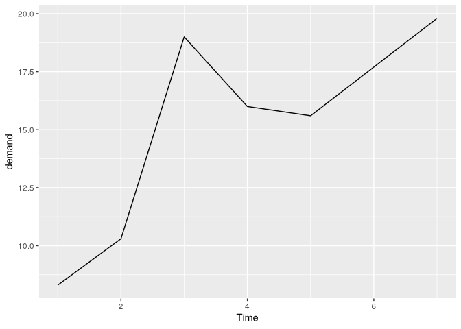

> A continuous (numeric) variable can be treated as a discrete
> (categorical) one. When x is a factor, must use `group = 1`

``` r
BOD1 <- BOD
BOD1$Time <- factor(BOD1$Time)

ggplot(BOD1, aes(x = Time, y = demand, group = 1)) +
  geom_line()
```

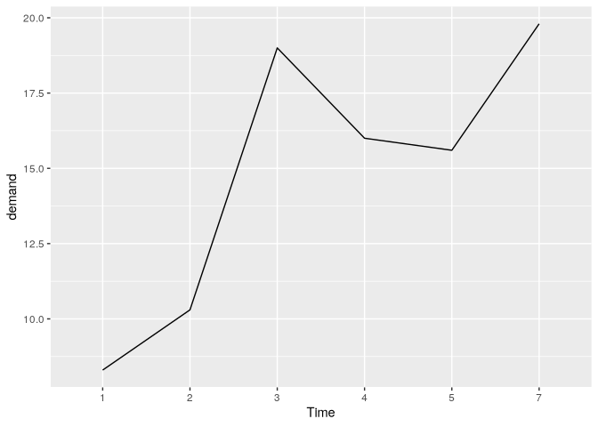

> Setting range with `ylim()` or `expand_limits()`

``` r
p1 <- BOD |> 
  ggplot(aes(x = Time, y = demand)) +
  geom_line() +
  ylim(0, max(BOD$demand))
p2 <- BOD |> 
  ggplot(aes(x = Time, y = demand)) +
  geom_line() +
  expand_limits(y = 0)
p1 + p2
```

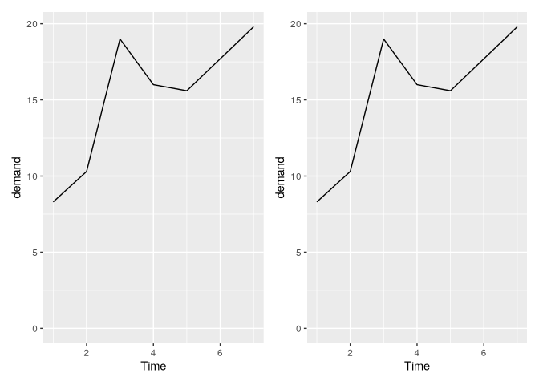

## Adding points to lines

``` r
p1 <- ggplot(worldpop, aes(x = Year, y = Population)) +
  geom_line() +
  geom_point()
p2 <- ggplot(worldpop, aes(x = Year, y = Population)) +
  geom_line() +
  geom_point() +
  scale_y_log10()
p1 + p2
```


## Multiple lines

``` r
ggplot(tg, aes(x = dose, y = length, colour = supp, linetype = supp)) +
  geom_line()
```

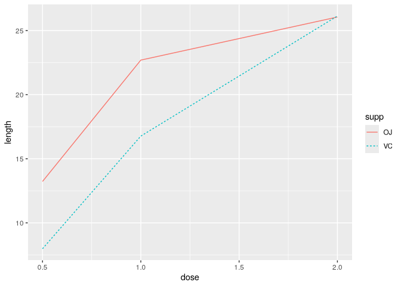

> With categorical variable must use `group`

``` r
ggplot(tg, aes(x = factor(dose), y = length, colour = supp, group = supp)) +
  geom_line()
```

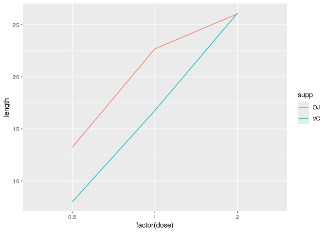

``` r
p1 <- ggplot(tg, aes(x = dose, y = length, shape = supp)) +
  geom_line() +
  geom_point(size = 4)
p2 <- ggplot(tg, aes(x = dose, y = length, fill = supp)) +
  geom_line() +
  geom_point(size = 4, shape = 21)
p1 + p2
```

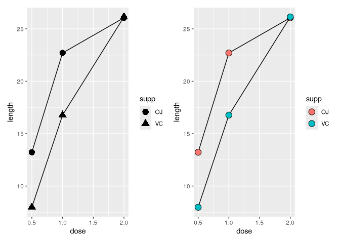

> Adjust for overlapping points

``` r
ggplot(tg, aes(x = dose, y = length, shape = supp)) +
  geom_line(position = position_dodge(0.2)) +
  geom_point(size = 4, position = position_dodge(0.2))
```

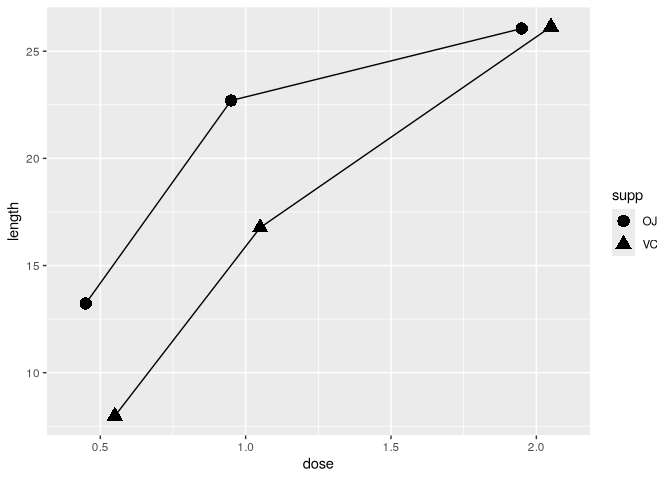

## Line appearance

``` r
ggplot(BOD, aes(x = Time, y = demand)) +
  geom_line(linetype = "dashed", size = 1, colour = "blue")
```

    Warning: Using `size` aesthetic for lines was deprecated in ggplot2 3.4.0.
    ℹ Please use `linewidth` instead.

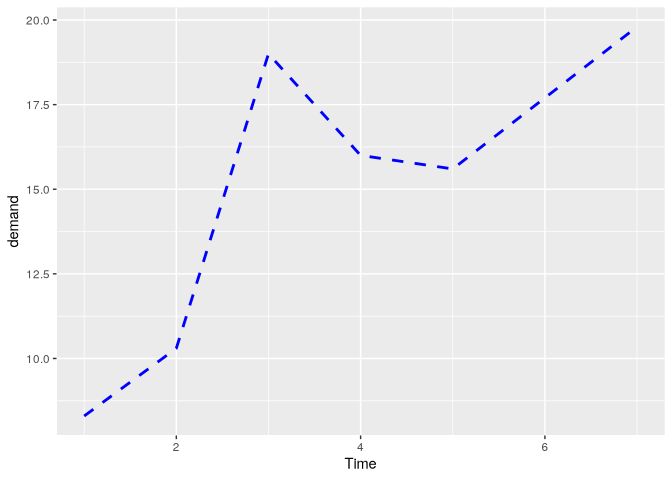

``` r
ggplot(tg, aes(x = dose, y = length, colour = supp)) +
  geom_line() +
  scale_colour_brewer(palette = "Set1")
```

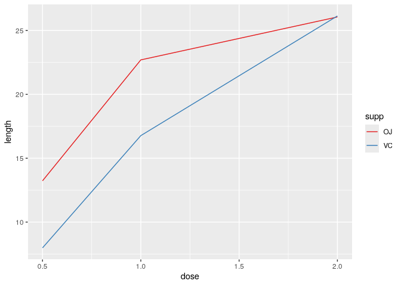

> Grouping must be specified if both lines have the same property

``` r
p1 <- ggplot(tg, aes(x = dose, y = length, group = supp)) +
  geom_line(colour = "darkgreen", size = 1.5)

# This will be automatically grouped by color
p2 <- ggplot(tg, aes(x = dose, y = length, colour = supp)) +
  geom_line(linetype = "dashed") +
  geom_point(shape = 22, size = 3, fill = "white")
p1 + p2
```

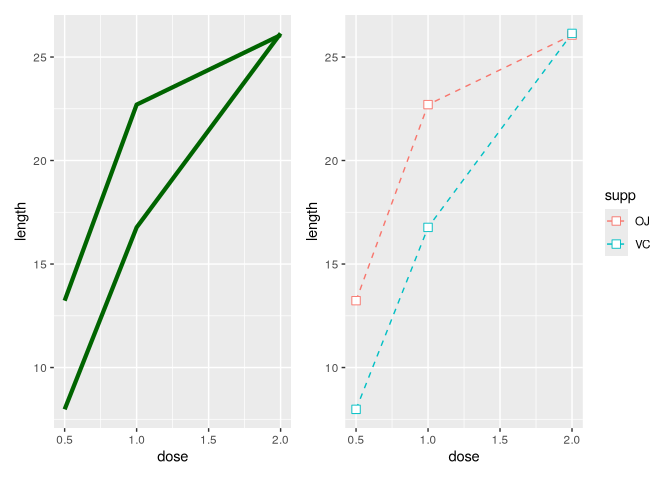

## Point appearance

``` r
ggplot(BOD, aes(x = Time, y = demand)) +
  geom_line() +
  geom_point(size = 4, shape = 22, colour = "darkred", fill = "pink")
```

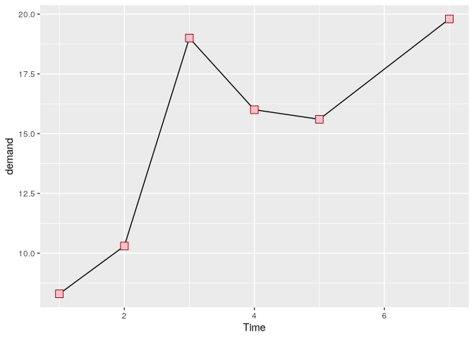

> Multi-line

``` r
ggplot(tg, aes(x = dose, y = length, fill = supp)) +
  geom_line(position = position_dodge(0.2)) +
  geom_point(shape = 21, size = 3, position = position_dodge(0.2)) +
  scale_fill_manual(values = c("black","white"))
```

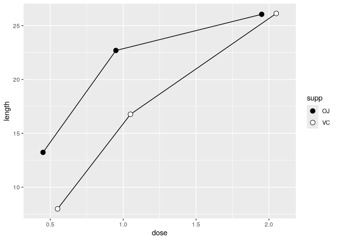

## Shaded area

``` r
sunspot_year <- data.frame(
  Year = as.numeric(time(sunspot.year)),
  Sunspots = as.numeric(sunspot.year)
)

p1 <- ggplot(sunspot_year, aes(x = Year, y = Sunspots)) +
  geom_area(color = "black", fill = "blue", alpha = 0.2)

p2 <- ggplot(sunspot_year, aes(x = Year, y = Sunspots)) +
  geom_area(fill = "blue", alpha = .2) +
  geom_line()

p1 + p2
```

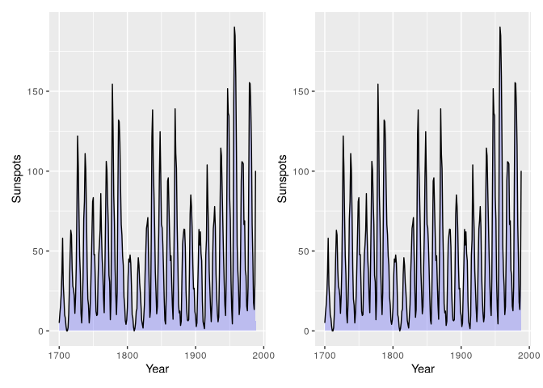

## Stacked area graph

> map a factor to `fill`

``` r
ggplot(uspopage, aes(x = Year, y = Thousands, fill = AgeGroup)) +
  geom_area()
```


> `ggplot` requires data to be in long format, so may need to be
> converted from wide

``` r
ggplot(uspopage, aes(x = Year, y = Thousands, fill = AgeGroup)) +
  geom_area(colour = "black", size = .2, alpha = .4) +
  scale_fill_brewer(palette = "Blues")
```

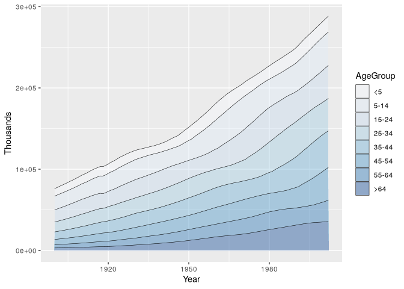

``` r
ggplot(uspopage, aes(x = Year, y = Thousands, 
                     fill = AgeGroup, order = dplyr::desc(AgeGroup))) +
  geom_area(colour = NA, alpha = .4) +
  scale_fill_brewer(palette = "Blues") +
  geom_line(position = "stack", size = .2)
```

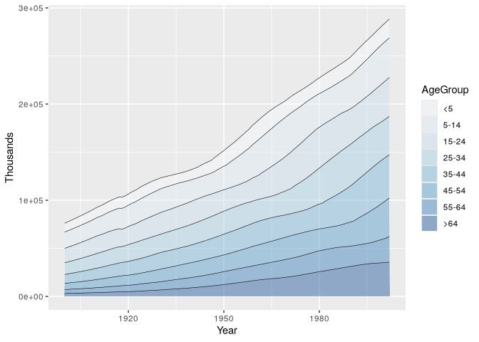

## Proportional stacked area graph

> use `position = "fill"`

``` r
p1 <- ggplot(uspopage, aes(x = Year, y = Thousands, fill = AgeGroup)) +
  geom_area(position = "fill", colour = "black", size = .2, alpha = .4) +
  scale_fill_brewer(palette = "Blues")

# labels as percent
p2 <- ggplot(uspopage, aes(x = Year, y = Thousands, fill = AgeGroup)) +
  geom_area(position = "fill", colour = "black", size = .2, alpha = .4) +
  scale_fill_brewer(palette = "Blues") +
  scale_y_continuous(labels = scales::percent)

p1 + p2
```

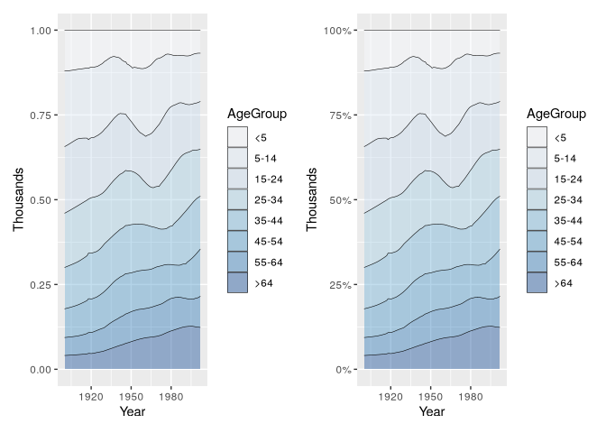

## Adding a confidence region

> `geom_ribbon()...` place before `geom_line()`

``` r
climate_mod <- climate |> 
  filter(Source == "Berkeley") |> 
  select(Year, Anomaly10y, Unc10y)
climate_mod |> head()
```

      Year Anomaly10y Unc10y
    1 1800     -0.435  0.505
    2 1801     -0.453  0.493
    3 1802     -0.460  0.486
    4 1803     -0.493  0.489
    5 1804     -0.536  0.483
    6 1805     -0.541  0.475

``` r
ggplot(climate_mod, aes(x = Year, y = Anomaly10y)) +
  geom_ribbon(aes(ymin = Anomaly10y - Unc10y, ymax = Anomaly10y + Unc10y), alpha = 0.2) +
  geom_line()
```

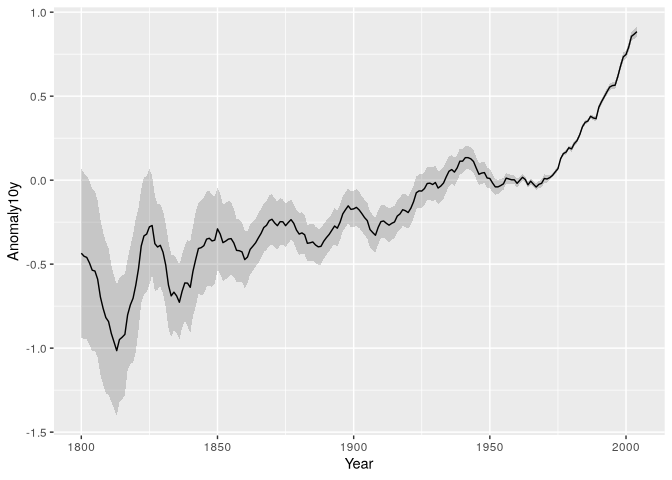

> Dotted lines instead of shaded regions

``` r
ggplot(climate_mod, aes(x = Year, y = Anomaly10y)) +
  geom_line(aes(y = Anomaly10y - Unc10y), colour = "grey50", linetype = "dotted") +
  geom_line(aes(y = Anomaly10y + Unc10y), colour = "grey50", linetype = "dotted") +
  geom_line()
```

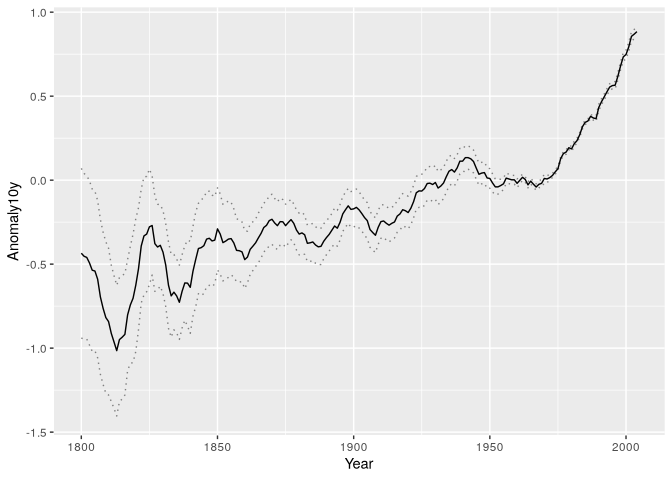
