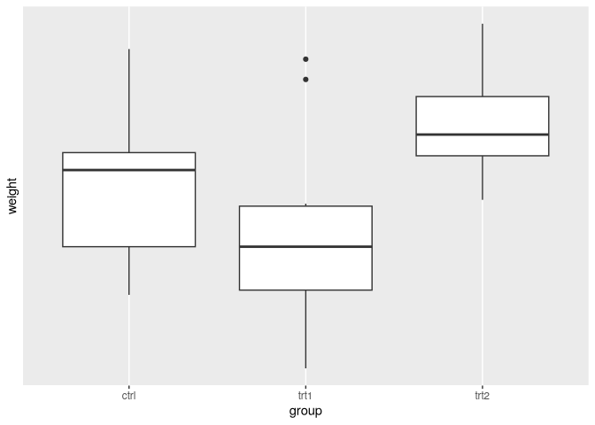

# 8 - Axes


``` r
library(tidyverse)
library(gcookbook)
library(patchwork)
```

[Source](https://r-graphics.org/RECIPE-LINE-GRAPH-LINE-APPEARANCE.html)

# Axes

## Swapping x and y axes

> `coord_flip()` For geometries that treat x and y axes differently

``` r
p1 <- ggplot(PlantGrowth, aes(x = group, y = weight)) +
  geom_boxplot()

p2 <- ggplot(PlantGrowth, aes(x = group, y = weight)) +
  geom_boxplot() +
  coord_flip()

p1 + p2
```


> sometimes the order needs to be reversed

``` r
ggplot(PlantGrowth, aes(x = group, y = weight)) +
  geom_boxplot() +
  coord_flip() +
  scale_x_discrete(limits = rev(levels(PlantGrowth$group)))
```


## Setting the range of a continuous axis

``` r
pg_plot <- ggplot(PlantGrowth, aes(x = group, y = weight)) +
  geom_boxplot()

p1 <- pg_plot
p2 <- pg_plot + ylim(0, max(PlantGrowth$weight))
p1 + p2
```


> The following are equivalent
>
>     ylim(0, 10)
>     scale_y_continuous(limits = c(0, 10))
>
> scaling clips data outside of range, coordinate transform zooms in

``` r
p1 <- pg_plot +
  scale_y_continuous(limits = c(5, 6.5))
p2 <- pg_plot +
  coord_cartesian(ylim = c(5, 6.5))
p1 + p2
```

    Warning: Removed 13 rows containing non-finite outside the scale range
    (`stat_boxplot()`).


> Expanding limits

``` r
pg_plot +
  expand_limits(y = 0)
```


## Reversing a continuous axis

> These are similar

``` r
p1 <- ggplot(PlantGrowth, aes(x = group, y = weight)) +
  geom_boxplot() +
  scale_y_reverse()
p2 <- ggplot(PlantGrowth, aes(x = group, y = weight)) +
  geom_boxplot() +
  ylim(6.5, 3.5)
p1 + p2
```


## Changing order of categorical axis

``` r
pg_plot <- ggplot(PlantGrowth, aes(x = group, y = weight)) +
  geom_boxplot()

p1 <- pg_plot +
  scale_x_discrete(limits = c("trt1", "ctrl", "trt2"))

p2 <- pg_plot +
  scale_x_discrete(limits = c("trt1", "ctrl"))

p1 + p2
```

    Warning: Removed 10 rows containing missing values or values outside the scale range
    (`stat_boxplot()`).


> Reverse order

``` r
pg_plot +
  scale_x_discrete(limits = rev(levels(PlantGrowth$group)))
```


## Setting scaling ratio

> `coord_fixed()`

``` r
m_plot <- ggplot(marathon, aes(x = Half, y = Full)) +
  geom_point()

p1 <- m_plot
p2 <- m_plot +
  coord_fixed()
p1 + p2
```


> set tick spacing the same

``` r
p3 <- m_plot +
  coord_fixed() +
  scale_y_continuous(breaks = seq(0, 420, 30)) +
  scale_x_continuous(breaks = seq(0, 420, 30))
p2 + p3
```


> set a manual ratio

``` r
m_plot +
  coord_fixed(ratio = .5) +
  scale_y_continuous(breaks = seq(0, 420, 30)) +
  scale_x_continuous(breaks = seq(0, 420, 15))
```


## Setting tick mark position

> `breaks`

``` r
p1 <- ggplot(PlantGrowth, aes(x = group, y = weight)) +
  geom_boxplot()

p2 <- ggplot(PlantGrowth, aes(x = group, y = weight)) +
  geom_boxplot() +
  scale_y_continuous(breaks = c(4, 4.25, 4.5, 5, 6, 8))

p1 + p2
```


> Setting breaks and labels for discrete axis

``` r
ggplot(PlantGrowth, aes(x = group, y = weight)) +
  geom_boxplot() +
  scale_x_discrete(limits = c("trt2", "ctrl"), breaks = "ctrl")
```

    Warning: Removed 10 rows containing missing values or values outside the scale range
    (`stat_boxplot()`).


## Removing tick marks and labels

``` r
pg_plot <- ggplot(PlantGrowth, aes(x = group, y = weight)) +
  geom_boxplot()

p1 <- pg_plot +
  theme(axis.text.y = element_blank())

p2 <- pg_plot +
  theme(axis.text.y = element_blank(), axis.ticks = element_blank())

p1 + p2
```


> Remove tick marks, labels, and grid

``` r
pg_plot +
  scale_y_continuous(breaks = NULL)
```



## Change tick label text

``` r
hw_plot <- ggplot(heightweight, aes(x = ageYear, y = heightIn)) +
  geom_point()

p1 <- hw_plot
```

> Set arbitrary labels

``` r
p2 <- hw_plot +
  scale_y_continuous(
    breaks = c(50, 56, 60, 66, 72),
    labels = c("Tiny", "Really\nshort", "Short", "Medium", "Tallish")
  )

p1 + p2
```


> To convert from one format to another, use a formatter function

``` r
footinch_formatter <- function(x) {
  foot <- floor(x/12)
  inch <- x %% 12
  paste(foot, "'", inch, "\"", sep = "")
}
```

``` r
footinch_formatter(56:64)
```

    [1] "4'8\""  "4'9\""  "4'10\"" "4'11\"" "5'0\""  "5'1\""  "5'2\""  "5'3\"" 
    [9] "5'4\"" 

``` r
p1 <- hw_plot +
  scale_y_continuous(labels = footinch_formatter)

# set regular tick marks
p2 <- hw_plot +
  scale_y_continuous(breaks = seq(48, 72, 4), labels = footinch_formatter)

p1 + p2
```


## Converting time measurements

``` r
timeHMS_formatter <- function(x) {
  h <- floor(x/60)
  m <- floor(x %% 60)
  s <- round(60*(x %% 1))                   # Round to nearest second
  lab <- sprintf("%02d:%02d:%02d", h, m, s) # Format the strings as HH:MM:SS
  lab <- gsub("^00:", "", lab)              # Remove leading 00: if present
  lab <- gsub("^0", "", lab)                # Remove leading 0 if present
  lab
}
```

``` r
timeHMS_formatter(c(.33, 50, 51.25, 59.32, 60, 60.1, 130.23))
```

    [1] "0:20"    "50:00"   "51:15"   "59:19"   "1:00:00" "1:00:06" "2:10:14"

The scales package, which is installed with ggplot2, comes with some
built-in formatting functions:

- `comma()` adds commasto numbers, in the thousand, million, billion,
  etc. places.
- `dollar()` adds a dollar sign and rounds to the nearest cent.
- `percent()` multiplies by 100, rounds to the nearest integer, and adds
  a percent sign.
- `scientific()` gives numbers in scientific notation, like `3.30e+05`,
  for large and small numbers

## Change appearance of tick labels

``` r
pg_plot <- ggplot(PlantGrowth, aes(x = group, y = weight)) +
  geom_boxplot() +
  scale_x_discrete(
    breaks = c("ctrl", "trt1", "trt2"),
    labels = c("Control", "Treatment 1", "Treatment 2")
  )

pg_plot
```


> Rotate text

``` r
p1 <- pg_plot +
  theme(axis.text.x = element_text(angle = 90, hjust = 1, vjust = .5))

p2 <- pg_plot +
  theme(axis.text.x = element_text(angle = 30, hjust = 1, vjust = 1))

p1 + p2
```


> size, color font

``` r
pg_plot +
  theme(axis.text.x = element_text(
    family = "Times", face = "italic",
    colour = "darkgreen", size = rel(0.9)
  ))
```


## Change axis label text

> `xlab()`, `ylab()`

``` r
hw_plot <- ggplot(heightweight, aes(x = ageYear, y = heightIn, colour = sex)) +
  geom_point()

p2 <- hw_plot +
  xlab("Age in years") +
  ylab("Height in inches")

hw_plot + p2
```


> Alternatively

``` r
p1 <- hw_plot +
  labs(x = "Age in years", 
       y = "Height in inches")

p2 <- hw_plot +
  scale_x_continuous(name = "Age in\nyears") +
  scale_y_continuous(name = "Height in inches")

p1 + p2
```


## Removing axis labels

``` r
pg_plot <- ggplot(PlantGrowth, aes(x = group, y = weight)) +
  geom_boxplot()

pg_plot +
  xlab(NULL)
```


## Changing axis label appearance

``` r
hw_plot <- ggplot(heightweight, aes(x = ageYear, y = heightIn)) +
  geom_point()

hw_plot +
  theme(axis.title.x = element_text(
    face = "italic", 
    colour = "darkred", 
    size = 14)
    )
```


``` r
p1 <- hw_plot +
  ylab("Height\n(inches)") +
  theme(axis.title.y = element_text(angle = 0, face = "italic", size = 14))

p2 <- hw_plot +
  ylab("Height\n(inches)") +
  theme(axis.title.y = element_text(angle = 90, face = "italic", 
                                    color = "darkred", size = 14))

p1 + p2
```


## Showing lines along the axes

``` r
hw_plot <- ggplot(heightweight, aes(x = ageYear, y = heightIn)) +
  geom_point()

p2 <- hw_plot +
  theme(axis.line = element_line(colour = "black"))

p1 + p2
```


> Remove panel border if using `theme_bw()`

``` r
p3 <- hw_plot +
  theme_bw() +
  theme(panel.border = element_blank(),
        axis.line = element_line(color = "blue"))

p2 + p3
```


> To make border fully overlap, use `lineend = "square"`

``` r
p1 <- hw_plot +
  theme_bw() +
  theme(
    panel.border = element_blank(),
    axis.line = element_line(colour = "black", linewidth = 4)
  )

p2 <- hw_plot +
  theme_bw() +
  theme(
    panel.border = element_blank(),
    axis.line = element_line(colour = "black", linewidth = 4,
                             lineend = "square")
  )

p1 + p2
```


## Logarithmic axes

``` r
library(MASS)
animals_plot <- ggplot(Animals, aes(x = body, y = brain, label = rownames(Animals))) +
  geom_text(size = 3)

p2 <- animals_plot +
  scale_x_log10() +
  scale_y_log10()

animals_plot + p2
```


> Setting breaks

``` r
animals_plot +
  scale_x_log10(breaks = 10^(-1:5)) +
  scale_y_log10(breaks = 10^(0:3))
```


> format as exponential

``` r
library(scales)
animals_plot +
  scale_x_log10(breaks = 10^(-1:5),
                labels = trans_format("log10", math_format(10^.x))) +
  scale_y_log10(breaks = 10^(0:3),
                labels = trans_format("log10", math_format(10^.x)))
```


> Alternatively, transform the data first

``` r
ggplot(Animals, aes(x = log10(body), y = log10(brain),
                    label = rownames(Animals))) +
  geom_text(size = 3)
```


> Natural and base 2 logs

``` r
animals_plot +
  scale_x_continuous(
    trans = log_trans(),
    breaks = trans_breaks("log", function(x) exp(x)),
    labels = trans_format("log", math_format(e^.x))
  ) +
  scale_y_continuous(
    trans = log2_trans(),
    breaks = trans_breaks("log2", function(x) 2^x),
    labels = trans_format("log2", math_format(2^.x))
  )
```


> one axis log

``` r
p1 <- ggplot(aapl, aes(x = date,y = adj_price)) +
  geom_line()

p2 <- ggplot(aapl, aes(x = date,y = adj_price)) +
  geom_line() +
  scale_y_log10(breaks = c(2,10,50,250))

p1 / p2
```


## Adding tick marks to logarithmic axes

> `annotate_logticks()`

``` r
breaks_log10 <- function(x) {
  low <- floor(log10(min(x)))
  high <- ceiling(log10(max(x)))
  
  10^(seq.int(low, high))
}
breaks_log10(c(.12, 6))
```

    [1]  0.1  1.0 10.0

``` r
p1 <- ggplot(Animals, aes(x = body, y = brain, label = rownames(Animals))) +
  geom_text(size = 3) +
  annotation_logticks() +
  scale_x_log10(breaks = breaks_log10,
                labels = trans_format(log10, math_format(10^.x))) +
  scale_y_log10(breaks = breaks_log10,
                labels = trans_format(log10, math_format(10^.x)))

p2 <- ggplot(Animals, aes(x = body, y = brain, label = rownames(Animals))) +
  geom_text(size = 3) +
  annotation_logticks() +
  scale_x_log10(breaks = breaks_log10,
                labels = trans_format(log10, math_format(10^.x))) +
  scale_y_log10(breaks = breaks_log10,
                labels = trans_format(log10, math_format(10^.x))) +
  theme_bw()

p1 + p2
```


> To align the gridlines with the axes ticks

``` r
breaks_5log10 <- function(x) {
  low <- floor(log10(min(x)/ 5))
  high <- ceiling(log10(max(x)/5))
  
  5 * 10^(seq.int(low,high))
}
breaks_5log10(c(0.12, 6))
```

    [1]  0.05  0.50  5.00 50.00

``` r
ggplot(Animals, aes(x = body, y = brain, label = rownames(Animals))) +
  geom_text(size = 3) +
  annotation_logticks() +
  scale_x_log10(breaks = breaks_log10,
                minor_breaks = breaks_5log10,
                labels = trans_format(log10, math_format(10^.x))) +
  scale_y_log10(breaks = breaks_log10,
                minor_breaks = breaks_5log10,
                labels = trans_format(log10, math_format(10^.x))) +
  coord_fixed() +
  theme_bw()
```


## Circular plot

> `coord_polar()`

``` r
wind |> head()
```

      TimeUTC Temp WindAvg WindMax WindDir SpeedCat DirCat
    3       0 3.54    9.52   10.39      89    10-15     90
    4       5 3.52    9.10    9.90      92     5-10     90
    5      10 3.53    8.73    9.51      92     5-10     90
    6      15 3.63    8.97    9.90      94     5-10     90
    7      20 3.71    8.51    9.41      97     5-10     90
    8      25 3.73    8.43    9.02      95     5-10     90

``` r
ggplot(wind, aes(x = DirCat, fill = SpeedCat)) +
  geom_histogram(binwidth = 15, boundary = -7.5) +
  coord_polar() +
  scale_x_continuous(limits = c(0, 360))
```

    Warning: Removed 8 rows containing missing values or values outside the scale range
    (`geom_bar()`).


> Modify the appearance

``` r
ggplot(wind, aes(x = DirCat, fill = SpeedCat)) +
  geom_histogram(binwidth = 15, boundary = -7.5, colour = "black", size = .25) +
  guides(fill = guide_legend(reverse = TRUE)) +
  coord_polar() +
  scale_x_continuous(limits = c(0,360),
                     breaks = seq(0, 360, by = 45),
                     minor_breaks = seq(0, 360, by = 15)) +
  scale_fill_brewer()
```

    Warning: Using `size` aesthetic for lines was deprecated in ggplot2 3.4.0.
    ℹ Please use `linewidth` instead.

    Warning: Removed 8 rows containing missing values or values outside the scale range
    (`geom_bar()`).


``` r
mdeaths_mod <- data.frame(
  deaths = as.numeric(mdeaths),
  month = as.numeric(cycle(mdeaths))
) |> 
  group_by(month) |> 
  summarise(deaths = mean(deaths))

mdeaths_mod |> head()
```

    # A tibble: 6 × 2
      month deaths
      <dbl>  <dbl>
    1     1  2130.
    2     2  2081.
    3     3  1970.
    4     4  1657.
    5     5  1314.
    6     6  1187.

``` r
mdeaths_p <- ggplot(mdeaths_mod, aes(x = month, y = deaths)) +
  geom_line() +
  scale_x_continuous(breaks = 1:12)

p2 <- mdeaths_p + coord_polar()

mdeaths_p + p2
```


> to avoid the smallest value being mapped to zero

``` r
p3 <- mdeaths_p + 
  coord_polar() +
  ylim(0, NA)

p2 + p3
```


> Avoid displying low and high points together

``` r
mdeaths_p +
  coord_polar() +
  ylim(0, max(mdeaths_mod$deaths)) +
  xlim(0, 12)
```

    Scale for x is already present.
    Adding another scale for x, which will replace the existing scale.


> Connect the beginning and end

``` r
mdeaths_x <- mdeaths_mod[mdeaths_mod$month == 12, ]
mdeaths_x$month <- 0
mdeaths_new <- rbind(mdeaths_x, mdeaths_mod)
```

> Note the syntax to replace with new data

``` r
mdeaths_p %+%
  mdeaths_new +
  coord_polar() +
  ylim(0, NA)
```


## Dates on axes

``` r
economics |> head()
```

    # A tibble: 6 × 6
      date         pce    pop psavert uempmed unemploy
      <date>     <dbl>  <dbl>   <dbl>   <dbl>    <dbl>
    1 1967-07-01  507. 198712    12.6     4.5     2944
    2 1967-08-01  510. 198911    12.6     4.7     2945
    3 1967-09-01  516. 199113    11.9     4.6     2958
    4 1967-10-01  512. 199311    12.9     4.9     3143
    5 1967-11-01  517. 199498    12.8     4.7     3066
    6 1967-12-01  525. 199657    11.8     4.8     3018

``` r
ggplot(economics, aes(x = date, y = psavert)) +
  geom_line()
```


``` r
econ_mod <- economics |> 
  filter(date >= as.Date("1992-05-01") & date < as.Date("1993-06-01"))

econ_plot <- ggplot(econ_mod, aes(x = date, y = psavert)) +
  geom_line()
econ_plot
```


> set breaks

``` r
datebreaks <- seq(as.Date("1992-06-01"), as.Date("1993-06-01"),
                  by = "2 month")

econ_plot +
  scale_x_date(breaks = datebreaks) +
  theme(axis.text.x = element_text(angle = 30, hjust = 1))
```


> Format the dates

``` r
econ_plot +
  scale_x_date(breaks = datebreaks, labels = date_format("%Y %b")) +
  theme(axis.text.x = element_text(angle = 30, hjust = 1))
```


## Relative times on an axis

``` r
www <- data.frame(
  minute = as.numeric(time(WWWusage)),
  users = as.numeric(WWWusage)
)
```

> Define formatter function

``` r
timeHM_formatter <- function(x) {
  h <- floor(x/60)
  m <- floor(x %% 60)
  sprintf("%d:%02d", h, m)
}
```

``` r
p1 <- ggplot(www, aes(x = minute, y = users)) +
  geom_line()

p2 <- p1 +
  scale_x_continuous(
    name = "time",
    breaks = seq(0, 100, by = 10),
    labels = timeHM_formatter
  )

p1 / p2
```


